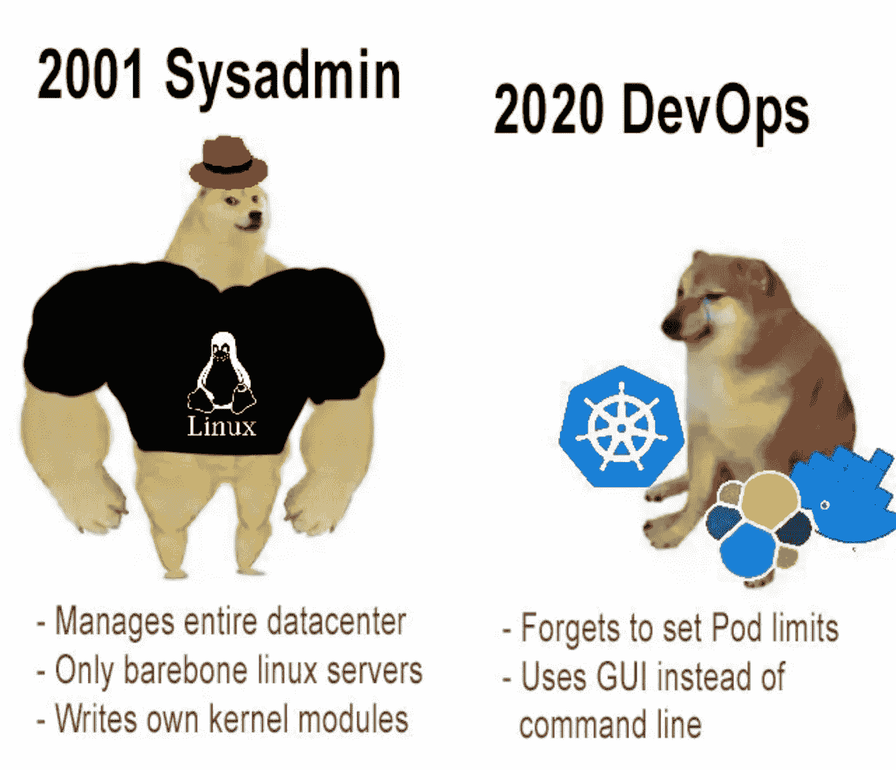

# Node.js 中的 Cron 作业

> 原文：<https://medium.com/geekculture/cron-jobs-in-node-js-8df170445588?source=collection_archive---------2----------------------->

每个开发人员迟早都会面临如何处理 cron 作业的问题。cron 作业用例的列表非常庞大:缓存失效、报告生成、从外部源刷新数据、通知、备份等。当然，还有我最喜欢的一个:每天晚上在内存泄漏的情况下重启服务:)今天，我们将从开发和基础设施的角度来看几个预定任务的实现。

历史上，Cron 作业有一种特殊的调度定义格式[https://en.wikipedia.org/wiki/Cron](https://en.wikipedia.org/wiki/Cron)。我觉得有点可笑的是，我们仍然在使用 70 年代开发的格式，这一点也不直观。但是不要害怕，有很多在线工具可以将星号、斜线和数字转换成人类可读的格式。比如这个:[https://www . free formatter . com/cron-expression-generator-quartz . html](https://www.freeformatter.com/cron-expression-generator-quartz.html)。

好了，歌词够了，我们动起来练吧！

# 老方法(Linux 方法)

每台 Linux 机器都安装并运行 cron 守护进程。所以你只需要为你的任务写一个脚本，执行所有需要的操作和退出，然后用 Ansible 或者 Puppet 添加到 cron。这是一个经典的解决方案，但有几个缺点。

*   首先，它与服务器的操作系统紧密结合，开发者不应该担心服务器的环境。
*   负载平衡。对于每个新的 cron 任务，Linux 管理员需要找到一个有足够空闲资源的服务器。这可能非常困难，因为 cron 作业按计划运行，并且 Linux 管理员必须在过去的计划时间检查有关服务器负载的历史监控数据。
*   同时执行。如果你只有一台服务器，那根本不是问题。但是如果有多台服务器，就需要确保 cron 作业只部署在一台服务器上，否则就会同时执行。您的客户不会乐意收到两封相同的电子邮件，因为您的通知 cron 作业被部署了两次。

正如我之前所说，这是一个经典的久经考验的解决方案。如果您在一台 Linux 服务器上部署了一个小项目，这是一个不错的选择。

# Node.js 端的 Cron

这种方法与前一种方法相反。我们可以用像 https://www.npmjs.com/package/node-cron 的[这样的库将 cron 调度放到 Node.js 中，而不是依赖于基础设施。这里有一个例子:](https://www.npmjs.com/package/node-cron)

这个脚本永远不会结束，它就像一个守护进程。这个解决方案不依赖于基础设施，它可以在任何地方运行，包括 Docker。您还可以在一个脚本中组合几个 cron 作业，此外，您还可以在运行时动态创建新的 cron 作业。这非常方便和灵活，但就像前面的解决方案一样，您需要确保您的应用程序只在一个实例中执行。

# 公牛模块

Bull 是一个 Node.js 库，用于任务队列[https://www.npmjs.com/package/bull](https://www.npmjs.com/package/bull)，支持 cron 作业。与前两种解决方案不同，它不保证同时执行作业。它非常容易使用:

您可能已经注意到，Bull 使用 Redis 作为任务存储。但是如果我们重启这个脚本会发生什么呢？会不会再次调度`testQueue`每分钟执行两个任务？不，布尔会处理的。让我们安排相同的任务许多任务:

它仍然每分钟打印一条消息。如果已经存储在 Redis 中，Bull 不会创建新作业。如果我们同时运行这个脚本两次或更多次会怎么样？你猜怎么着？Bull 将在脚本之间分割任务，这对于繁重的 cron 任务非常有用。此外，Bull 支持延迟作业，就像它们被调度的 cron 作业一样，但是它只会被执行一次。

关于公牛的最后一个想法:

*   不依赖于基础架构，除非它需要 Redis
*   防止同时执行作业
*   完全动态
*   可攀登的

依我拙见，公牛是对付克隆乔布斯的最佳选择。

# 库伯内特·克朗乔布

这是 Kubernetes 的一个新功能，你可以在这里阅读文档[https://Kubernetes . io/docs/concepts/workloads/controllers/cron-jobs/](https://kubernetes.io/docs/concepts/workloads/controllers/cron-jobs/)。

Kubernetes CronJob 做了一件非常简单的事情，它按计划运行您的 docker 映像。这意味着您应该首先用它建立一个 docker 映像。Kubernetes CronJob 是 Bull 的一个很好的替代品，因为它节省了您的 Kubernetes 资源。Bull 应该像守护进程一样运行，它会永久消耗服务器资源。Kubernetes CronJob 启动一个 pod，等待它退出，然后移除该 pod。

我不想写结论，你已经阅读了 4 种不同的方法及其利弊，你可以自己决定哪种更适合你:)

*下次见！Servus！*