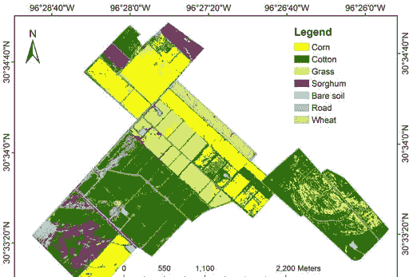
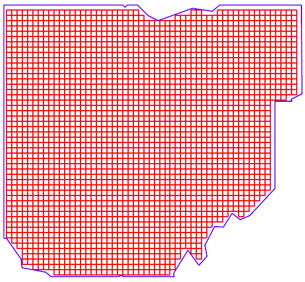
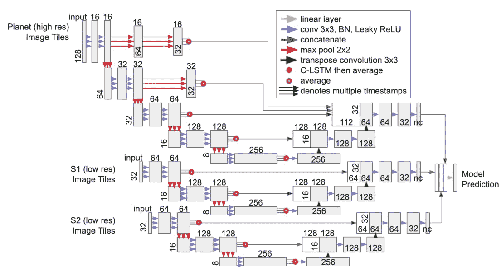
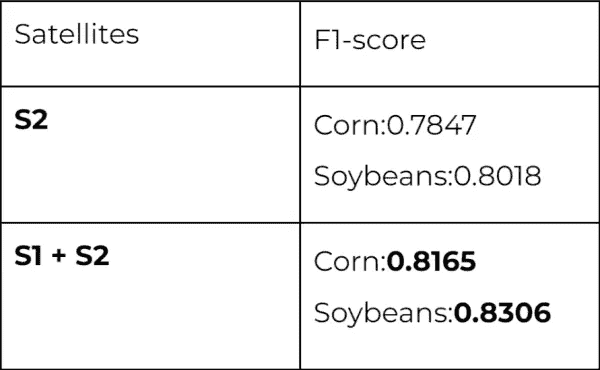
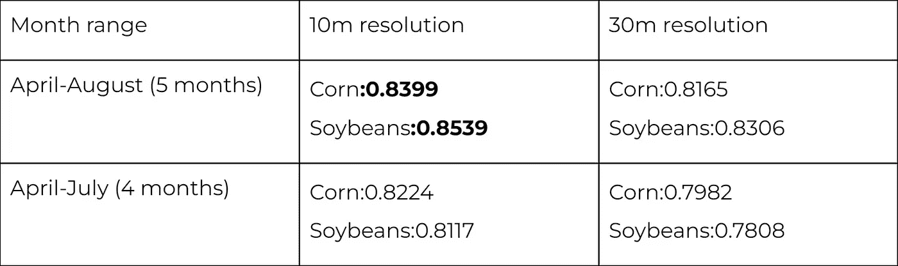
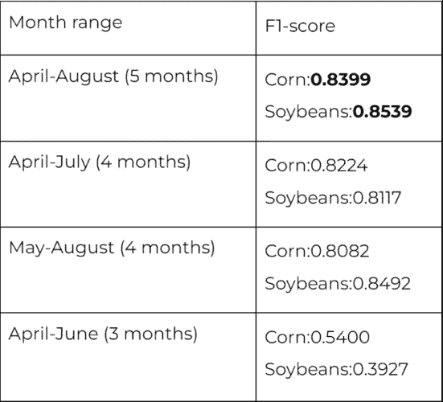

# 利用卫星图像进行作物类型分类

> 原文：<https://medium.com/geekculture/crop-type-classification-with-satellite-imagery-dfc200f82927?source=collection_archive---------3----------------------->

## 了解我们的作物类型分类方法

作物类型分类是农业中的一项常见任务。作物类型分类的主要目标是创建一个地图/图像，其中每个点都有一类生长在那里的作物，如下图所示。有很多方法可以解决这个问题。然而，探索最多的方法之一是利用遥感数据。

Figure 1 — Example of crop-type classification map

**有许多关于作物类型分类的文章** —其中一些[研究使用多时相图像的可能性](https://www.mdpi.com/2072-4292/12/24/4052) —这意味着拍摄图像的时间序列而不是一个日期的图像。其他人使用多光谱图像研究[的机会，结合来自不同卫星](https://www.researchgate.net/publication/280945828_Land_Cover_and_Crop_Type_Classification_along_the_Season_Based_on_Biophysical_Variables_Retrieved_from_Multi-Sensor_High-Resolution_Time_Series)的[图像，并改进](https://www.semanticscholar.org/paper/Deep-Learning-Classification-of-Land-Cover-and-Crop-Kussul-Lavreniuk/7a9e471e31ac156cf22a5e2a5c1463697df866ab)[模型](https://www.semanticscholar.org/paper/Semantic-Segmentation-of-Crop-Type-in-Africa%3A-A-and-Rustowicz-Cheong/87f0cffad2d7527273a25a945736c1e813c08312)本身。

在我们的案例中，我们使用来自 Sentinel-1 和 Sentinel-2 卫星的多时相图像作为模型输入数据。至于模型，我们使用了一个更常见的模型架构来完成细分任务——Unet，以及 Conv-LSTM。

# 数据集准备

> *用于训练模型的数据集包括:*
> 
> *1。标签-来自 2019 年生长季节* [*作物景观*](https://nassgeodata.gmu.edu/CropScape/) *的数据。*
> 
> *2。模型输入-哨兵-1 和哨兵-2 卫星图像的时间序列。*
> 
> 我们选择俄亥俄州作为研究地区。

# 农作物景观

1.  前 10 个最常见的类被用作目标，所有其他类被标记为背景。大豆和玉米是这十大类中的一部分，也是我们研究的主要作物。
2.  一些不太常见的类别必须合并为一个类别以获得更高的准确性，例如，几种类型的森林(混合林、落叶林、常绿林)必须合并为一个类别。不同强度的城市地区也遵循同样的程序。
3.  在训练、验证和测试过程中使用的最后一组类如下:玉米、大豆、休闲/闲置耕地、城市地区、森林、草地/牧场和背景。

# 哨兵-1

1.  我们只下载了 GRD 生产的哨兵-1 图像。
2.  使用了具有 VV 和 VH 偏振的两个 S1 波段。
3.  我们使用 ESA SNAP 工具箱对 Sentinel-1 图像进行预处理。这种预处理的主要目的是对 Sentinel-1 图像进行地形校正，同时去除噪声。
4.  在快照预处理后，Sentinel-1 图像被归一化，使值从 0 到 1。

关于使用 Sentinel-1 图像的更多细节，你可以阅读我们关于 Sentinel-1 预处理的博客。

# 哨兵-2

1.  仅下载了哨兵-2 图像的 L2A 产品。
2.  使用了十个 S2 波段(蓝、绿、红、近红外(NIR)、四个红边波段和两个短波红外(SWIR)波段)，并计算了遥感中常用的另外两个波段——NDVI 和 NDMI。
3.  所有 12 个波段都进行了归一化，使值在 0 到 1 的范围内。

如果你对 Sentinel-2 图像感兴趣，你可以阅读[我们的博客](https://quantumobile.com/rd-blog/sentinel2tools-simple-lib-for-downloading-sentinel-2-satellite-images/)关于我们下载 Sentinel-2 图像的工具。

# 数据平铺

在卫星图像被下载和预处理以用于训练之后。大的哨兵图像必须被分割成更小的图像(平铺)(图。1).我们过滤掉了云百分比高于 20%的 Sentinel-2 瓦片。哨兵-1 号瓷砖保持原样。在训练循环期间，如果几幅 Sentinel-2 图像重叠，并且只有一个采集日期，则只拍摄其中一幅图像，以避免数据重复。俄亥俄州的最终版本如图 1 所示。

Figure 2 — Tile coverage of Ohio

# 建模

## 输入特征

如上所述，我们使用了 Sentinel-2 的十个波段、两个额外的索引波段和 Sentinel-1 的两个波段。我们在实验中使用它们，没有使用子集进行实验。图像拼贴是 192x192 像素，在训练期间，对它们应用了一些基本的增强，如裁剪、翻转、旋转和调整大小。数据集以 70/20/10 的比例分为训练集、验证集和测试集。必须实施一种采样策略来对成批的图像时间序列进行训练。这将允许我们将相似长度的序列归入一批。

## 模型架构

本文[中描述的架构之一](https://openaccess.thecvf.com/content_CVPRW_2019/papers/cv4gc/Rustowicz_Semantic_Segmentation_of_Crop_Type_in_Africa_A_Novel_Dataset_CVPRW_2019_paper.pdf) — 2D U-Net + CLSTM 被使用。每颗卫星都有自己的编码器-解码器-CLSTM 模型，随后每颗卫星的输出被连接起来并传递到最终的线性层。文章中模型的架构如图 3 所示。

Figure 3 — Model architecture

## 超参数

使用[交叉熵损失](https://machinelearningmastery.com/cross-entropy-for-machine-learning/)和[骰子损失](/ai-salon/understanding-dice-loss-for-crisp-boundary-detection-bb30c2e5f62b#:~:text=Dice%20loss%20originates%20from%20S%C3%B8rensen,for%203D%20medical%20image%20segmentation.)的加权组合来训练模型。Adam 用于参数优化，学习率的起始值为 0.003，在 20 个时期的训练后降低到 0.0003。所有的模型总共被训练了 40 个时期。

# 实验

[F1-score](https://en.wikipedia.org/wiki/F-score) 分别对每个类别的像素级别计算度量，以评估在所进行的实验期间训练的模型。我们只选择了作物类的指标，因为它们是我们的主要类，而其他类是辅助类，以提高作物类的模型性能。

## 使用不同的卫星图像组合

Table 1 — Comparison of the model performance based on what satellite combinations were used, 5-months of satellite data were used at 30m resolution.

如您所见，Sentinel-1 和 Sentinel-2 的组合为我们的作物类别提供了比仅使用 Sentinel-2 稍好的结果。

## 使用不同的输入分辨率

Table 2 — Comparison of the model performance based on the input resolution. Both Sentinel-1 and Sentinel-2 images were used.

我们在两个不同的日期范围内比较了两种输入分辨率。在这两种情况下，10m 分辨率比 30m 分辨率给出的结果更好，而最好的结果是从 4 月初到 8 月底的 5 个月的覆盖范围。

## 使用不同的时间框架

Table 3 — Comparison of the model performance based on how many months of data were taken, both Sentinel-1 and Sentinel-2 were used at 10m resolution.

并且进行最后的实验以确认所有的夏季生长季节都给出了最好的结果，并且如果时间间隔减少，则匹配模型性能。结果表明，4 个月的范围变化降低了准确性，但没有 3 个月范围的情况差，这意味着植物实际上准备好收获的月份远不如植物正在积极生长的月份重要。

# 结论

因此，我们的数据集准备和建模的方法进行了描述。以下是我们得到的实验结果:

1.  光学图像(Sentinel-2)和合成孔径雷达图像(Sentinel-1)的结合比仅使用光学图像的效果更好。
2.  分辨率较高的图像(10 米)比分辨率为 30 米的图像效果更好。
3.  涵盖生长季节的日期范围比较短的日期范围好得多。

希望您对我们解决作物类型分类方法的描述感兴趣。如果你有任何问题或意见，请在下面的评论区留言。