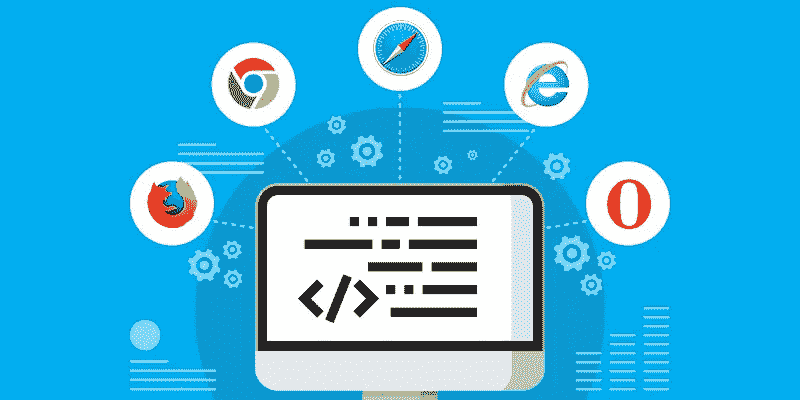

# 使用 Cypress & BrowserStack 进行跨浏览器测试

> 原文：<https://medium.com/geekculture/cross-browser-testing-with-cypress-browserstack-efc2361826ca?source=collection_archive---------5----------------------->

使用 BrowserStack 自动进行跨浏览器测试！

# 什么是跨浏览器测试？

你在开发网络应用吗？那么你**必须**注意跨浏览器测试！！！这肯定是您在测试周期中涵盖的范围！为什么？

*   你不能限制你的最终用户坚持使用一种浏览器。他们会你…