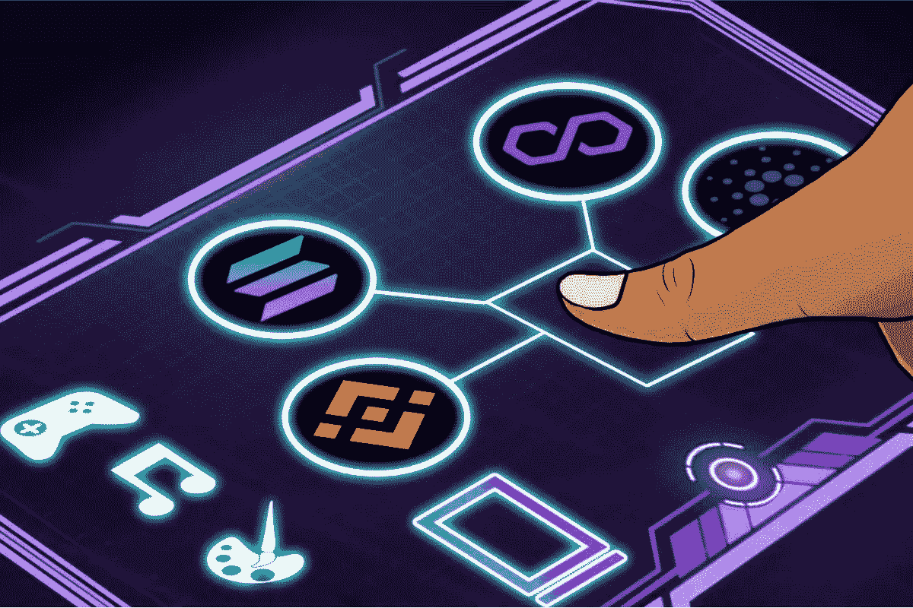
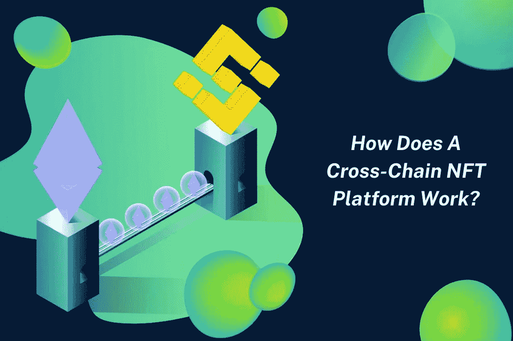
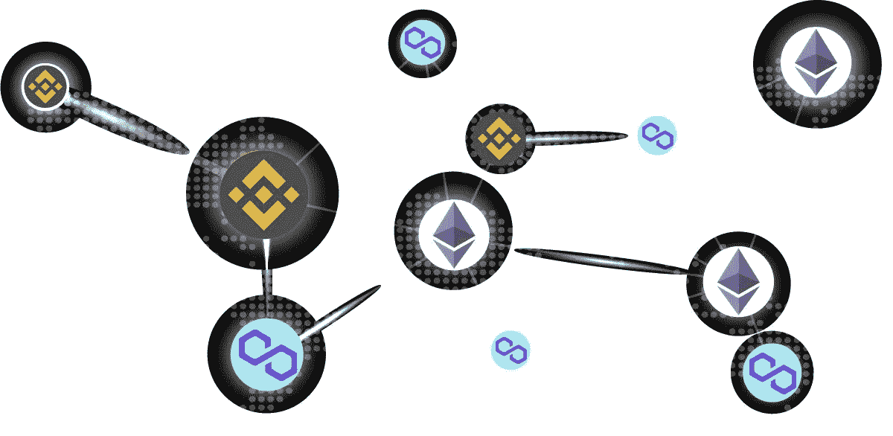

# 跨链 NFT 市场开发:为什么 NFT 平台需要跨链桥？

> 原文：<https://medium.com/geekculture/cross-chain-nft-marketplace-development-why-cross-chain-bridge-is-required-for-nft-platform-6b8349030943?source=collection_archive---------6----------------------->

近年来，NFT 市场一直在飙升，这突然让企业家们四处寻找最佳选择，以便在这个利润丰厚的市场建立自己的品牌。NFT 的销量在 2021 年飙升到了一个很高的数字，这是人们对 NFTs 极度理解的结果。企业家们正在整理他们的想法，以便在市场上实现它们。由于市场正在经历巨大的转变，多链 NFT 市场是吸引大量用户加入平台的最佳方式。

众所周知，NFT 市场在区块链技术的支持下运作；它们在保护 NFT 和交易方面发挥着重要作用。但市场尚未探索多种区块链网络的变化。这里是一个博客，将处理 [**跨链 NFT 市场发展**](https://www.appdupe.com/nft-marketplace-development) 。

# **什么是跨链 NFT 市场平台？**

跨链 NFT 市场已经成为 NFT 市场的热门话题。企业家想探索一些独特的东西，以吸引用户的注意。就区块链网络而言，每个网络都是按照特定的规范开发的。那么当所有的区块链都被带到平台的一个区域时会发生什么呢？它将为人们交易他们的数字收藏品创造一个伟大的平台。

一些 NFT 企业已经站出来应对这一挑战，跨链 NFT 平台是实现这一目标的最佳方式之一。多链 NFT 平台将使用户能够通过暴露多个区块链来开发他们的 NFT。互操作性是促使人们选择跨链 NFT 平台的主要因素。

试想一个情况，如果一个移动网络品牌允许其用户只与相似网络的人联系？很难想象，对吧？跨链 NFT 市场试图弥合这一差距，使用户能够交易 NFT，而不管他们的区块链网络。此外，用户将能够使用任何适合他们的非本地货币来铸造、购买和出售他们的非本地货币。

# **为什么市场上更青睐跨链 NFT 平台？**

分散式财务公司是最先重视发展 [**多链 NFT**](https://www.cnbctv18.com/technology/explained--what-are-multi-chain-nft-platforms-12424742.htm) 平台的公司。跨链 NFT 市场开发关注 NFT 平台功能中涉及的几个痛点。跨链 NFT 市场将解决互操作性、可持续性和能源效率等挑战。关注跨链 NFT 平台将引领我们踏上元宇宙的转型之旅。

K2M，元宇宙的钥匙，是经常用来描述向元宇宙过渡的术语。这些密钥将有助于对进入元宇宙的各种应用程序进行访问控制。以元宇宙为例，它们不仅限于一个区块链网络，而是所有区块链网络的统称。即使那些在以太坊区块链有密钥的用户也应该能够将他们的密钥从以太坊转移到 Solana 或任何其他区块链网络。这就是市场需要跨链 NFT 平台的原因。

受欢迎的 NFT 市场 OpenSea 也处于在其平台中引入跨链合规性的初始阶段。

## **跨链 NFT 平台用户享有的美德**

正如我们已经讨论过的，互操作性是跨链 NFT 市场中需要解决的最佳因素。但是 [**创建跨链 NFT 平台**](https://www.appdupe.com/nft-marketplace-development) 将为用户提供更多便利。

*   互操作性将允许区块链网络与其他用户通信，而不需要任何中介。
*   该平台将在多个区块链征求跨链交易。
*   平台的安全特性通过加密得到了增强。
*   平台的交易和效率将在跨链 NFT 平台中得到保证。
*   该平台将为多令牌钱包系统提供支持。
*   数据的所有权在多链法规遵从性中得以保留。

## **跨链 NFT 平台如何运作？**

跨链 NFT 平台将涉及多个方面，他们的交易将在市场上取得成功。多链 NFT 平台将通过以下方式发挥作用。

*   原子交换系统是促进一个以上区块链网络交叉的主谋。让两个区块链与其他区块链网络通信的可能性是根本不可能的。然而，原子交换系统将对此进行授权。
*   接力是跨链 NFT 平台的下一件大事，在这个平台上，主链是由股权凭证来验证的。
*   简化支付验证(SPV)是一种不跟踪交易的无状态支付系统。但是，它将允许智能合同验证工作证明共识的子集。

## **NFT 平台在跨链兼容性方面的特征**

跨链 NFT 平台的设计具有某些特定的特征，使其与其他平台截然不同。看看跨链 NFT 平台的重要特征。

**交易速度**

在 NFT 平台上，交易的速度是吸引用户的重要因素。在跨链 NFT 平台，交易速度可以得到保证，他们可以很容易地进行交易。在提供高速交易的同时，该平台不会降低安全性和交易成本。

**交易成本**

尽管有区块链网络，交易成本对所有用户来说应该是可行的，以便他们可以和平地交易他们的非功能性交易。作为 NFT 平台的所有者，你不仅应该关注百万美元的交易，还应该关注微交易。这些微交易将计入 NFT 博彩资产的购买。所以跨链 NFT 平台应该设定最低交易成本，让你的 NFT 平台更有趣。

**智能合约**

智能合约是沉迷于 NFT 市场平台的最重要的功能。它们在展示交易成功所需满足的条件方面起着重要作用。智能合约应该足够坚固，能够承受区块链的功能。当智能合约更强大时，平台的安全性不会受到妨碍。

## **跨链 NFT 平台采用的区块链技术**

尽管跨链平台支持一个以上的区块链网络运行，但只有少数区块链技术可以用于相同的功能。深入了解可用于 NFT 平台开发的区块链网络，

**以太坊**

以太坊网络是在 NFTs 方面最常采用的区块链网络。网络的独占性、智能合约和令牌标准是 NFT 开发在这个区块链变得容易的原因。

**多边形**

这不是一个典型的区块链网络，它被称为以太坊的第二层协议。因此，这个区块链网络将执行一个典型的以太坊区块链在其规模上执行的所有活动。区块链巨大的可伸缩性也将让交易在每秒钟内高效处理。

**币安智能链**

BSC 具有与币安链并行运行的能力，通过它也将实现其可伸缩性。与其他网络相比，BSC 拥有业内最低的交易成本，并提供快捷的交易流程。

## **总结**

当 NFT 市场上涨时，适应变化的情景将帮助你跟上市场的步伐。所以这将是你 [**在市场上推出跨链 NFT 平台**](https://www.appdupe.com/nft-marketplace-development) 的绝佳时机。赶快开始计划你的 NFT 创业吧！