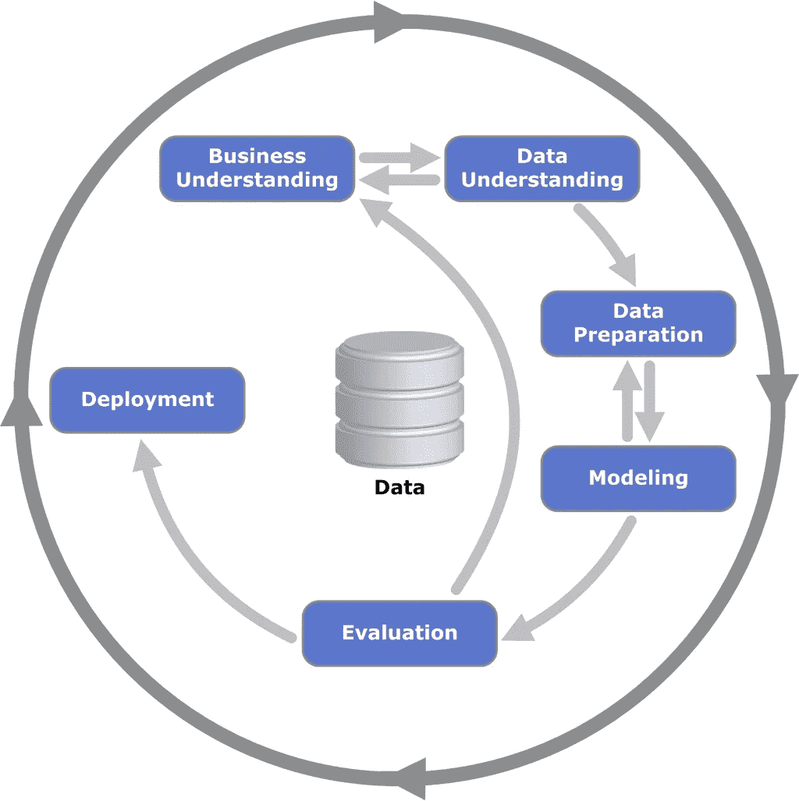

# 数据科学/机器学习项目的跨行业标准流程

> 原文：<https://medium.com/geekculture/cross-industry-standard-process-for-data-science-machine-learning-projects-52a885074474?source=collection_archive---------27----------------------->

你将如何系统地规划一个机器学习/数据科学项目？作为一名数据科学家/ML 工程师，你不希望在没有首先理解手头的问题和目标的情况下就直接投入到设计解决方案/建模中去。此外，在数据本身上花费更多时间也非常重要。如果你喜欢框架，并希望围绕构建你的数据科学/机器学习过程建立一些规则， *CRISP-DM(数据挖掘的跨行业标准过程)*可以帮助你。CRISM-DM 是众所周知且广泛使用的行业标准流程之一，可以帮助将您的数据科学/机器学习项目模块化为迭代步骤。CRISM-DM 将机器学习项目分为六个迭代阶段:

1.  **业务理解:**这包括理解问题陈述和目标用户。想想你在解决什么，为什么它很重要。找出当前状态中的差距，并了解问题目前是如何解决的。然后，量化一旦您为目标用户解决了问题，您期望实现的业务影响。将这种业务影响转化为结果和产出指标至关重要。在深入研究数据之前，请确保您定义了成功和失败的衡量标准。您应该了解您的问题，收集领域专业知识，并确定相关因素。
2.  **数据理解:**这包括收集数据、验证数据和执行探索性数据分析。收集数据需要从已确定的来源获取相关数据，如果数据尚未标注，则标注数据，并创建相关要素。验证数据包括决定您/企业希望如何处理缺失/空/错误的数据和异常值。这一步还包括对数据进行质量控制，以确保值符合您的预期，并适当地清理数据。最后，EDA 涉及探索数据、执行统计分析和可视化、识别任何关系和模式以及降维。
3.  **数据准备:**数据准备包括特征工程和选择，以及随后为建模准备数据的步骤。这包括对数据集进行缩放/标准化，将数据分成训练集和测试集，解决任何类别不平衡，以及可选地对分类特征进行编码。
4.  **建模:**建模包括模型选择和调优。建模过程包括通过交叉验证、超参数优化/调整、模型的文档化和版本化来评估各种算法，并随后重新训练模型。这还包括在选择模型时选择最佳算法时进行必要的权衡(性能、可解释性和计算成本)。
5.  **评估:**这是您在测试集上对模型进行评分、解释模型输出并评估其性能的地方。编写单元和集成测试来测试您的模型并使其更加健壮是一个好主意。随后，用户测试将在操作您的模型之前建立更多的信心。
6.  **部署:**在评估了模型的性能并测试了解决方案之后，是时候按照软件部署流程和已建立的安全措施部署模型了。您的最终模型可以作为 API 公开，也可以集成到当前的产品/服务中。确保您有一个计划来监控您的模型的性能，如果有必要，可能会重新训练模型。

再次提醒，记住这是一个迭代的过程，所以如果项目需求发生变化和/或您对结果不满意，您可能会发现自己来回切换。您可能希望根据项目需求和时间表修改一些步骤。总的来说，CRISP-DM 是一个与领域无关的过程，可以帮助您围绕执行您的数据科学/机器学习项目建立规程和框架。希望这有帮助！