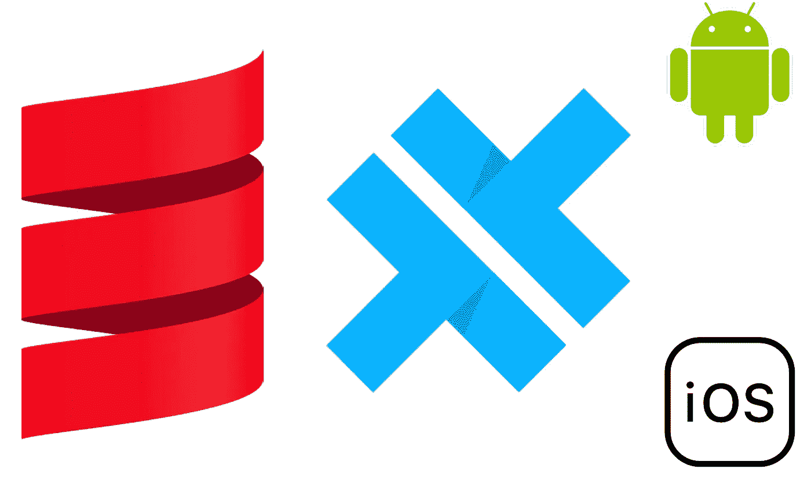

# 带 Scala 和电容器的跨平台移动开发

> 原文：<https://medium.com/geekculture/cross-platform-mobile-dev-with-scala-and-capacitor-54e69b62b50c?source=collection_archive---------13----------------------->



T 最近几年，趋势是将 web 技术从浏览器输出到桌面(例如[electronic](https://www.electronjs.org/))以及越来越多的移动应用程序(例如 [Ionic](https://ionicframework.com/) )。不管我们喜不喜欢这种趋势，无论如何，对于任何能产生 HTML、CSS 和 JavaScript 的技术来说，这都是划算的。其中一项技术是 [Scala](https://www.scala-lang.org/) ，通过其 Scala-to-JavaScript 编译器 [Scala.js](https://www.scala-js.org/) 。

在这篇博文中，我们将从零开始，使用 Scala 和[电容器](https://capacitorjs.com/)实现一个构建跨平台移动应用的便捷设置。不过，如果你更喜欢 TLDR，你可以直接查看[最终结果](https://github.com/sherpal/scala-capacitor-blog)。

# 步骤 1:Scala . js 的 sbt 项目

我们需要做的第一件事是设置使用 Scala.js 的准系统项目。我们将使用 sbt，在这种情况下，最小的项目结构如下所示:

```
root
├── build.sbt
├── project
|   ├── plugins.sbt
|   └── build.properties
└── src
    └── main
        └── scala
            └── main
                └── Main.scala
```

其中`build.properties`的内容是`sbt.version=1.5.4`(今天的最新版本)`build.sbt`的内容是

```
**val** theScalaVersion = **"2.13.6"**

**lazy val** root = project
  .in(*file*(**"."**))
  .enablePlugins(ScalaJSPlugin)
  .settings(
    *name* := **"ScalaJS-Capacitor"**,
    *version* := **"0.1.0"**,
    *scalaVersion* := theScalaVersion,
    *scalaJSUseMainModuleInitializer* := **true,**
    *scalaJSLinkerConfig* ~= { _.withModuleKind(*ModuleKind*.ESModule) },)
```

在`plugins.sbt`文件中，我们需要

```
addSbtPlugin(**"org.scala-js"** % **"sbt-scalajs"** % **"1.6.0"**)
```

最后，`Main.scala`文件的内容可能是

```
package mainobject Main {
  def main(args: Array[String]): Unit = {
    println("Hello!")
  }
}
```

有了这个设置，我们可以做`sbt run`，我们将看到“你好！”打印到控制台。我们在这里没有看到的是，实际上是 Node.js 进程运行了这行代码。注意:你需要在你的机器上安装 [Node.js](https://nodejs.org/en/) 。生成的 JavaScript 代码将在`target/scala-2.13/scalajs-Capacitor-fastopt/main.js`可用。

# 步骤 2:设置 Snowpack(或任何其他打包程序)

Scala-js 生成对应于 Scala 代码的 JavaScript。然而，为了通过 JavaScript 生态系统进行集成，拥有一个专用的节点打包器是一件好事。事实上，如果我们想使用一些电容插件(我们确实这样做了！)，依靠这样的工具更方便。

最著名的可能是 Webpack，但是特别适合与 Scala-js 一起工作的是 [Snowpack](https://www.snowpack.dev/) 。Snowpack 的设置非常小。我们需要 Snowpack 本身的两个附加文件(一个`package.json`和一个`snowpack.config.js`),内容如下。

在`package.json`:

```
{
  "name": "snowpack-capacitor",
  "devDependencies": {
    "snowpack": "3.1.0"
  }
}
```

而在`snowpack.config.js`:

```
module.exports = {
  buildOptions: {
    out: **"./target/build"**,
  },
  mount: {
    public: **"/"**,
    **"target/scala-2.13/scalajs-capacitor-fastopt"**: **"/"**,
    **"src/main/resources"**: **"/"** },
}
```

我们刚刚在第一个文件中做的是告诉 [npm](https://www.npmjs.com/) 使用 Snowpack 的 3.1.0 版本(仅作为开发依赖，因为我们在发布代码时不需要它)。因此，我们需要运行`npm install`来安装 Snowpack。在第二个文件中，我们指示 Snowpack 将公共目录中的所有文件视为根目录，即我们的 Scala 代码被编译的目录，同时也是我们项目的 resources 文件夹(因此在这点上，它*感觉*像一个 JVM Scala 项目)。

在 Snowpack 设置完成之前，我们需要做的最后一件事是创建一个 HTML 文件，名为`public/index.html`，并用以下(最少)内容填充它:

```
<!DOCTYPE **html**>
<**html lang="en"**>
<**head**>
    <**meta charset="utf-8"** />
    <**meta
       name="viewport"
       content="width=device-width, initial-scale=1, shrink-to-fit=no"** />
    <**meta name="theme-color" content="#000000"** />
    <**title**>Test Capacitor</**title**>
</**head**>
<**body**>
  <**div id="root"**></**div**><**script src="/main.js" type="module"**></**script**></**body**>
</**html**>
```

之后，我们可以执行`sbt fastLinkJS`，然后执行`npx snowpack dev`，浏览器将打开一个空白页面，其中“hello”已在 JS 控制台中打印出来。

# 步骤 3:添加 UI 框架

Web 技术就是操纵用户将在屏幕上看到的 HTML 和 CSS。为此，我们需要一个 UI 框架(现在，没有人手工操作 dom)。Scala.js 生态系统中最好的可能是[层流](https://laminar.dev/)。

向项目添加层流是通过添加以下行来完成的

```
*libraryDependencies* += **"com.raquo"** %%% **"laminar"** % **"0.13.0"**
```

在`build.sbt`文件中，在项目设置中。我们现在可以更改`Main.scala`文件，以便在屏幕上实际看到一些东西。我们可以添加线条

```
import com.raquo.laminar.api.L._
import org.scalajs.dom
val app = h1("Hello world!")
render(dom.document.getElementById("root"), app)
```

如果 Snowpack dev 服务器仍在运行，我们可以再次发出`sbt fastLinkJS`，浏览器页面应该会刷新，显示问候消息。

# 步骤 4:添加电容器

直到知道，我们还没有做任何移动。我们有一个很好的在浏览器中制作应用程序的设置，但是我们不能在手机上使用它。为此，我们需要将 npm 依赖性添加到电容器中。我们通过在`package.json`文件中添加以下几行来实现

```
**"dependencies"**: {
  **"@capacitor/cli"**: **"3.0.0"**,
  **"@capacitor/core"**: **"3.0.0"** },
```

然后再次运行`npm install`。之后，我们可以使用电容器 cli 来配置应用程序的准系统。在这里的[之后](https://capacitorjs.com/docs/getting-started)，我们需要运行`npx cap init`(默认是好的，除了“Web 资产目录”，它需要是`target/build`，因为这是我们如何配置 Snowpack 的)。该命令将仅仅创建一个包含最少内容的文件`capacitor.config.json`。

# 步骤 5:添加 Android 支持

我们仍然没有实现实际的移动开发。这就是这一步要做的，按照[这里](https://capacitorjs.com/docs/android)的指示。在`package.json`文件的`dependencies`中，我们添加了行`"@capacitor/android": "3.0.0"`并再次运行`npm install`。

最后，我们可以在手机上运行我们的应用程序。我们需要运行最后三个命令

```
npx cap add android
npx snowpack build
npx cap run android
```

他们的角色是将 Android 应用程序添加到项目中，使用 snowpack 构建应用程序，最后运行 Android 模拟器(您需要安装 [Android Studio](https://developer.android.com/studio) )。

> 注意:为 iOS 构建应用程序需要类似的步骤，但我参考了官方文档[中的内容。](https://capacitorjs.com/docs/ios)

这太棒了！然而，在简单地制作一个响应性网页方面，我们仍然没有赢得任何东西。在最后两个步骤中，我们将使用 Capacitor 的一个插件来访问我们设备的本地特性。

# 步骤 6:添加可伸缩类型

电容器插件作为类型脚本模块分发。为了使用它们，我们需要告诉 Scala 它们的存在(以及它们包含的类/函数/东西)。这可以通过[scalable typed](https://scalablytyped.org/docs/readme.html)自动完成。

> 注意:如果你愿意，你也可以[手写这个](https://www.scala-js.org/doc/interoperability/facade-types.html)，但是依赖 ScalablyTyped 有很多优点，比如确保正确性、可发现性…

为此我们需要三样东西。首先是插件。在`project/plugins.sbt`中我们添加了一行

```
addSbtPlugin(**"org.scalablytyped.converter"** % **"sbt-converter"** % **"1.0.0-beta32"**)
```

然后，我们需要打字稿。我们可以将其作为`devDependencies`添加到`package.json`文件中(当然也需要安装):

```
**"typescript"**: **"4.1.3"**
```

然后我们需要通过以下方式将插件添加到我们的项目中

```
.enablePlugins(ScalablyTypedConverterExternalNpmPlugin)
```

再加上几行我们项目里面的设置`build.sbt`

```
**import** scala.sys.process.Process
*[...]
externalNpm* := {
  Process(**"npm"**, *baseDirectory*.value).!
  *baseDirectory*.value
},
*stIgnore* ++= *List*(
  **"@capacitor/android"**,
  **"@capacitor/cli"**,
  **"@capacitor/core"** )
```

我们都准备好了。您可以通过运行`sbt compile`来验证一切就绪。

> 注意:在 MacOS 上，如果你试图刷新 IntelliJ 中的项目，你可能会点击 [this](https://github.com/ScalablyTyped/SlinkyDemos/issues/12) ，但是修复工作正常。

# 步骤 7:使用地理定位插件

作为使用电容插件的一个例子，我们将在页面加载时显示设备的位置。这将需要[地理定位插件](https://capacitorjs.com/docs/apis/geolocation)。

将以下内容添加到`package.json`的`dependencies`(并安装):

```
**"@capacitor/geolocation"**: **"1.0.0"**
```

为了让 ScalablyTyped 生效，你可以使用一次`sbt compile`,这需要一点时间，但是之后，你就可以自由地使用这个插件了。例如，让我们添加在页面加载时显示用户坐标的功能。为此，我们可以用下面几行修改我们的`Main.scala`文件:

```
**import** typings.capacitorGeolocation.definitionsMod.PositionOptions
**import** typings.capacitorGeolocation.mod.*Geolocation
[...]* **val** app = *div*(
  *h1*(**"Hello world!"**),
  *child <-- EventStream* .*fromJsPromise*(*Geolocation*.getCurrentPosition(*PositionOptions*().setEnableHighAccuracy(**true**))
    )
    .map { position =>
      **s"Your position: $**{position.*coords*.*latitude*}**, $**{position.*coords*.*longitude*}**"** }
)
```

如果您再次运行`sbt fastLinkJS`和`npx snowpack dev`，您应该会看到您的位置显示在浏览器中(它可能会请求您的许可)。

然而，对于 Android 应用程序来说，这还不够。我们需要告诉`AndroidManifest.xml`(在`android/app/src/main`内部)我们将使用地理定位功能，这是通过添加行来完成的

```
*<!-- Geolocation API -->* <**uses-permission android:name="android.permission.ACCESS_COARSE_LOCATION"** />
<**uses-permission android:name="android.permission.ACCESS_FINE_LOCATION"** />
<**uses-feature android:name="android.hardware.location.gps"** />
```

现在，我们可以使用以下命令结束:

```
npx snowpack build
npx cap sync
npx cap run android
```

瞧！我们有一个工作的 Android 应用程序，完全用 Scala 编写，使用设备的原生功能。

# 其他改进

我们可以改进许多事情来增强这个设置。其中，以下是一些想法:

*   具有热重装(例如，参见此处的)
*   目前，构建是使用 Scala.js 的“快速优化”模式进行的，我们可以/应该改为使用“全面优化”
*   直接在 sbt 中处理电容器命令

# 结束语及相关作品

我们现在处于在 Scala 中进行移动开发的有利位置！这是一个相对简单和最少的恶作剧设置。我们唯一强有力的依赖是电容器，这是一个开源和独立的(从谷歌和苹果)项目。其他方面，这是一个普通的 Scala 项目，提供了我们喜欢的所有好东西..

在结束之前，我们想提一下[这篇博客文章](/geekculture/scala-on-android-74874d056c1a)对 Scala 移动开发的历史进行了概述，同时也展示了一个使用 React Native 的替代方案。

这篇博文的结果可以在[附带的回购](https://github.com/sherpal/scala-capacitor-blog)中找到。