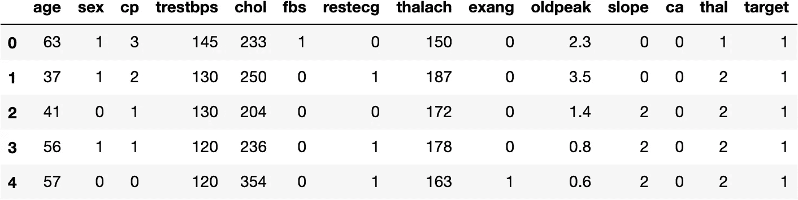
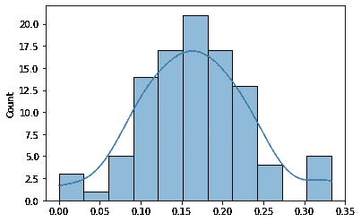

# 在 Python 中使用 StatsModels 和 Sklearn 进行交叉验证，并使用逻辑回归示例

> 原文：<https://medium.com/geekculture/cross-validation-f05b885f2d70?source=collection_archive---------15----------------------->

在本教程中，我们将学习什么是机器学习中的交叉验证，以及如何使用`StatsModels`和`Sklearn`包在 python 中实现。


Cross validation in Machine Learning

## 什么是交叉验证，为什么我们需要它？

交叉验证是机器学习中的一种重采样方法。为了理解交叉验证，我们需要首先回顾训练错误率和测试错误率之间的区别。

**训练错误率**是由相同数据产生的平均错误(分类问题中的错误分类),模型就是根据这些数据进行训练的。

相比之下，**测试错误率**是在看不见的测试数据集(也称为验证数据集)上使用训练好的模型所产生的平均错误。

在没有测试数据的情况下，我们无法判断我们的模型在看不见的数据上是否同样有效，这是任何机器学习问题的最终目标。当拟合/训练的模型用于看不见的数据时，使用测试数据来估计平均误差的过程被称为交叉验证。简而言之，我们在看不见的数据上交叉验证我们的预测，因此命名为“交叉验证”。

## 交叉验证的类型

*   验证集方法

这种方法是最简单的。只需将数据分为两部分，即训练数据集和测试数据集。在训练数据集上训练您的模型，并在测试数据集上运行验证。这种方法可能会有问题，因为我们假设我们的测试数据代表整个数据，这在实践中可能会被违反。因此，我们的测试误差估计可能非常不稳定。此外，由于机器学习方法往往在较少的观察值上训练时表现更差，因此它可能会设置验证错误率以高估测试错误率。

*   留一交叉验证:

顾名思义，我们在训练模型时会从训练数据中留下一个观察值。从技术上讲，这种方法和上面的一样，但是在我们的测试数据集中，我们只有一行。不同的是，我们通过运行 for 循环来重复这个实验，并在每次迭代中取 1 行作为测试数据，得到尽可能多的行的测试误差，最后取误差的平均值。理想情况下，我们应该运行 for 循环 n 次(其中 n =样本大小)。此时，我们已经可以识别这里的问题了。当您的数据很大时，这种方法可能非常低效。

*   k 倍交叉验证:

这是上述两种类型的混合体。我们将数据分成 k 个折叠，并运行 k 次 for 循环，在每次迭代中将其中一个折叠作为测试数据集。

我们将在本教程中使用验证集方法和 k-Fold。

# 应用

让我们动手做一些编码吧。你兴奋吗？

我也是！

## 问题设置

我们将使用心脏数据集，使用数据集中的所有预测因子来预测心脏病发作的概率。在这样做的时候，我们还想使用交叉验证来估计该部分中描述的逻辑回归模型的测试误差。

## 数据集信息:

我从机器学习和智能系统中心获取了这个数据集

https://archive.ics.uci.edu/ml/datasets/Heart+Disease

。该数据库包含 76 个属性，但所有发表的实验都提到使用其中 14 个属性的子集。特别是，克利夫兰数据库是迄今为止唯一被 ML 研究人员使用的数据库。“目标”字段是指患者是否存在心脏病。它是从 0(不存在)到 4 的整数值。“目标”字段是指患者是否存在心脏病。如果整数值为 0 =表示没有/较少心脏病发作的机会，如果整数值为 1 =则表示更多心脏病发作的机会。

患者的姓名和社会安全号码最近也被从数据库中删除，并被替换为虚拟值。

所有四个未处理的文件也存在于该目录中。一个被“处理”的文件是包含克利夫兰数据库的文件。

要查看测试费用(由 Peter Turney 捐赠)，请查看“费用”文件夹。

使用的属性:

1.  第三名(年龄)
2.  #4(性)
3.  #9 (cp)
4.  第十名(trestbps)
5.  #12 (chol)
6.  第 16 位
7.  第 19 名(休息心电图)
8.  第 32 位(塔拉奇)
9.  第 38 名(exang)
10.  第 40 名(旧峰)
11.  #41(坡度)
12.  第 44 名(加拿大)
13.  第 51 名
14.  #58(目标)(预测属性)

请注意，该数据集有一些缺失数据。为了简单起见，我们将尝试完整的案例分析。

```
import pandas as pd
import numpy as npdf = pd.read_csv('heart.csv')df.head()
```



## 使用统计模型的物流回归模型

查看初始模型拟合的最简单和更优雅的方式(与`sklearn`相比)是使用`statsmodels`。我很欣赏它只用一行代码就生成的总结报告。

```
from statsmodels.formula.api import logit
fit_logit = logit("target ~ age + sex + cp + trestbps +	chol + 	fbs + 	restecg +	thalach +	exang	 + oldpeak	+ slope + 	ca +	thal", df).fit()
print(fit_logit.summary())Optimization terminated successfully.
         Current function value: 0.348904
         Iterations 7
                           Logit Regression Results                           
==============================================================================
Dep. Variable:                 target   No. Observations:                  303
Model:                          Logit   Df Residuals:                      289
Method:                           MLE   Df Model:                           13
Date:                Sat, 03 Jul 2021   Pseudo R-squ.:                  0.4937
Time:                        14:47:19   Log-Likelihood:                -105.72
converged:                       True   LL-Null:                       -208.82
Covariance Type:            nonrobust   LLR p-value:                 7.262e-37
==============================================================================
                 coef    std err          z      P>|z|      [0.025      0.975]
------------------------------------------------------------------------------
Intercept      3.4505      2.571      1.342      0.180      -1.590       8.490
age           -0.0049      0.023     -0.212      0.832      -0.050       0.041
sex           -1.7582      0.469     -3.751      0.000      -2.677      -0.839
cp             0.8599      0.185      4.638      0.000       0.496       1.223
trestbps      -0.0195      0.010     -1.884      0.060      -0.040       0.001
chol          -0.0046      0.004     -1.224      0.221      -0.012       0.003
fbs            0.0349      0.529      0.066      0.947      -1.003       1.073
restecg        0.4663      0.348      1.339      0.181      -0.216       1.149
thalach        0.0232      0.010      2.219      0.026       0.003       0.044
exang         -0.9800      0.410     -2.391      0.017      -1.783      -0.177
oldpeak       -0.5403      0.214     -2.526      0.012      -0.959      -0.121
slope          0.5793      0.350      1.656      0.098      -0.106       1.265
ca            -0.7733      0.191     -4.051      0.000      -1.147      -0.399
thal          -0.9004      0.290     -3.104      0.002      -1.469      -0.332
==============================================================================
```

## 简要模型解释

我们发现性别、cp、thalach、exang、oldpeak、ca 和 thal 变量与心脏病发作显著相关(我们并没有推断出这个问题中的因果关系)。

## 使用验证数据集方法的交叉验证

让我们将数据分成两组，即训练和测试

```
from sklearn.model_selection import train_test_split
train, test = train_test_split(df, test_size = 0.3, random_state = 1)
```

让我们在训练数据上拟合模型，并查看测试错误率以进行比较。

```
fit_logit_train = logit("target ~ age + sex + cp + trestbps +	chol + 	fbs + 	restecg +	thalach +	exang	 + oldpeak	+ slope + 	ca +	thal", train).fit()
train_pred = fit_logit_train.predict(test)

# converting probability to labels
def convert_prob_to_label(prob, cutoff = 0.5):
    label = None
    if prob > cutoff:
        label = 1
    else:
        label = 0
    return label

pred_labels = list(map(convert_prob_to_label, train_pred))
pred_labels = np.asarray(pred_labels)Optimization terminated successfully.
         Current function value: 0.317208
         Iterations 8from sklearn.metrics import confusion_matrix
conf_matrix = confusion_matrix(test.target, pred_labels)
```

从上面的混淆矩阵，我们可以计算错误分类率为

```
mis_rate = (conf_matrix[[1],[0]].flat[0] + conf_matrix[[0],[1]].flat[0])/len(test)print(f"Misclassification rate = {mis_rate :.3f}")Misclassification rate = 0.220
```

我们已经有了很好的模型。请注意，我们还没有进行任何型号选择。然而，这种错误分类率可能是由于偶然，并可能取决于测试数据。因此，我们可能高估了测试错误率。为了获得更稳定的测试误差/错误分类率的估计，我们可以使用 k-fold 交叉验证。

## **使用 Sklearn 进行 k 倍交叉验证**

```
from sklearn.model_selection import RepeatedKFold
from sklearn.linear_model import LogisticRegression
from sklearn.model_selection import cross_val_score
X = df.loc[ : , ['age', 'sex', 'cp', 'trestbps', 'chol', 'fbs', 'restecg', 'thalach', 'exang', 'oldpeak', 'slope', 'ca', 'thal']]
y = df[['target']]

cv = RepeatedKFold(n_splits=10, n_repeats= 10, random_state=1)
model = LogisticRegression()
scores = 1 - cross_val_score(model, X, y, scoring='accuracy', cv=cv, n_jobs=-1)import seaborn as sns
ax = sns.histplot(x=scores, kde=True)
```



上面的直方图清楚地向我们展示了测试误差的可变性。提供测试误差的平均值和标准误差，而不是提供测试误差的单个数字估计值，对于决策来说总是更好。

## 结论

```
print(f"Mean of misclassification error rate in test date is, {np.mean(scores) : .3f} with standard deviation = {np.std(scores) : .4f} ")Mean of misclassification error rate in test date is,  0.165 with standard deviation =  0.0693
```

我们看到交叉验证有助于我们获得稳定的、更稳健的测试误差估计。在下一篇博客中，我们将使用 bootstrap 方法做同样的事情。