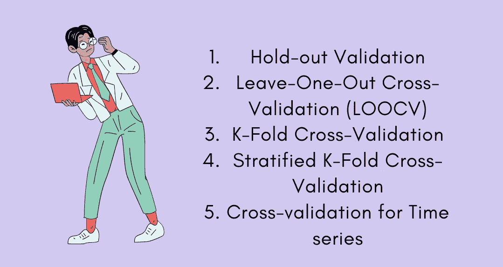
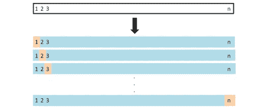
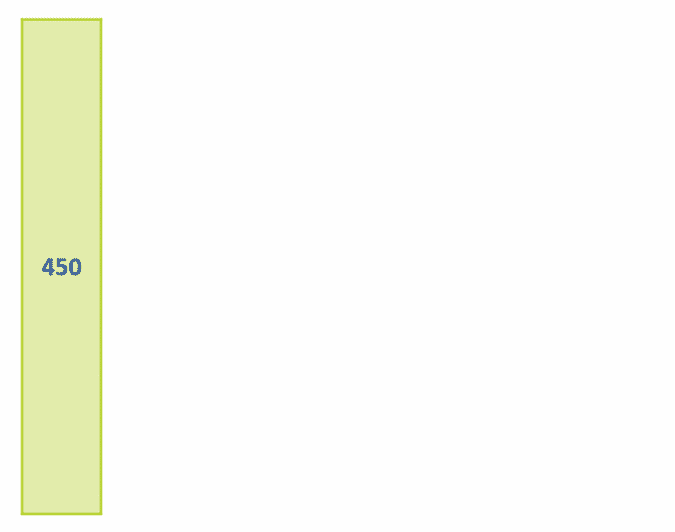
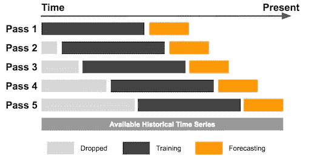

# 数据科学中的交叉验证！

> 原文：<https://medium.com/geekculture/cross-validation-in-data-science-8fdb237940a9?source=collection_archive---------9----------------------->

**“交叉验证是一种评估和比较学习算法的统计方法，将数据分为两部分，一部分用于学习或训练我们的模型，另一部分用于验证我们的模型。”**

以上台词你看懂了吗？

让我们用简单的话来看，

当使用一些数据集时，我们正在创建一个机器学习模型，我们经常将数据集分成训练集和测试集。训练数据集通常用于学习/训练我们的模型，测试数据集用于验证我们的模型。假设我们使用某种算法在给定的数据集上训练我们的模型，并且我们试图找出我们的模型的准确性。我们模型的准确性可能是 90%或 95%或 100%。这是什么意思…

我们的模式好吗？

我们的模型准备好预测未来数据了吗？

答案是否定的。

为什么我们的模型不好，为什么我们的模型在给了我们 100%的准确率之后，还没有做好预测未来数据的准备。因为我们的模型已经在给定的数据集上训练了自己，它已经知道了数据，并且已经很好地概括了数据。当我们试图预测新数据时，它给我们的准确性很差，因为它以前没有见过新数据。它不能给我们良好的精度和一个通用的模型。

当训练数据集为我们提供良好的准确性时，每当新数据出现时，它就不能为我们提供良好的准确性，在这种情况下，我们的模型将会过度拟合。

为了处理这类问题，需要交叉验证。它将数据集分为两部分(训练和测试)。在一个部分，即训练部分，它将尝试训练模型，在第二部分，即测试部分，它将对我们的模型进行预测，这是看不到的数据。之后，我们将检查我们的模型工作得如何。如果模型在测试数据上给我们很好的准确性，这意味着我们的模型是好的，我们可以信任它。

交叉验证是一个非常强大的工具，因为它帮助我们更好地使用我们的数据。

当我们构建模型时，我们需要评估模型的性能。此外，使用交叉验证的一个最常见的原因是参数调整。

让我们看看，什么是不同类型的交叉验证技术，以及交叉验证是如何工作的。

## **交叉验证的类型:**

1.  坚持方法
2.  遗漏一项交叉验证(LOOCV)
3.  k 倍交叉验证
4.  分层交叉验证
5.  时间序列交叉验证

1.  **撑出方法**

坚持法是最基本的交叉验证技术。它只是将数据集分为训练集和测试集。训练数据集用于训练模型，然后将测试数据集拟合到训练好的模型中以进行预测。使用这种方法是因为它的计算成本较低。

**2。遗漏一个交叉验证(LOOCV)**

留一个交叉验证是交叉验证技术的特例，它不是创建两个子集，而是选择单个观察值作为测试数据，其余数据作为训练数据。这种交叉验证发生了 N 次，其中 N 是观察的总数。

LOOCV 的主要缺点是，由于我们有很多记录，如数百万条记录，因此它需要更长的计算时间。

**3。k 倍交叉验证**

K-Fold 交叉验证的思想很简单，它将整个数据集分成“K”个大小相等的子集。划分数据集后，选择第一组作为测试数据，剩余的“k-1”组用于训练数据。针对该特定数据集计算误差。然后选择第二组作为测试数据，剩余的“k-1”组用于训练数据。再次计算误差。类似地，该过程持续‘K’次。最后，我们取所有误差的平均值。

K = 10

K-Fold 交叉验证的主要缺点是，假设我们有一个二元分类问题语句(比如 0 或 1 类)，在这种情况下，有时在训练数据集中我们有很高的几率得到 1。所以我们的模型只在一个类上训练，而不能预测另一个类。

**4。分层交叉验证**

分层交叉验证与 K 倍交叉验证技术相同。为了解决 k 倍交叉验证的缺点，分层交叉验证出现了。在每次迭代中，它都会处理训练数据集中出现的类的数量。

**5。时间序列交叉验证**

在时序交叉验证中，我们不能将数据集分为训练数据集和测试数据集。时间序列交叉验证从一小部分训练数据开始，对未来数据点进行预测，然后检查预测数据点的准确性。

在此之后，相同的预测数据点然后被包括作为下一个训练数据集的一部分，并且未来的数据点被预测。类似地，该过程在时间序列交叉验证中继续。

# 常见问题:

1.  **什么是交叉验证？**

交叉验证是一种评估和比较学习算法的统计方法，它将数据分为两部分，一部分用于学习或训练我们的模型，另一部分用于验证我们的模型。

**2。交叉验证的目的是什么？**

交叉验证的目的是测试机器学习模型预测新数据的能力。

**3。交叉验证的类型有哪些？**

*   坚持方法
*   遗漏一项交叉验证(LOOCV)
*   k 倍交叉验证
*   分层交叉验证
*   时间序列交叉验证

**4。我们为什么需要它？**

因为我们的模型已经在给定的数据集上训练了自己，它已经知道了数据，并且已经很好地概括了数据。当我们试图预测新数据时，它给我们的准确性很差，因为它以前没有见过新数据。它不能给我们良好的精度和一个通用的模型。

**5。交叉验证能减少过度拟合吗？**

是的。交叉验证用于避免过度拟合。

## **结论:**

在本文中，我们了解了什么是交叉验证，交叉验证在数据科学中的重要性，不同类型的交叉验证技术，以及一些一般性问题…

**请随时留下您的评论、建议或任何错误。😊**

**帮我接通:**[**LinkedIn**](https://www.linkedin.com/in/sagar-dhandare-a401271a3/)**|**[**GitHub**](https://github.com/SagarDhandare)**|**[**邮箱**](mailto:%20sagardhandare3@gmail.com)

快乐学习！！！❤🥀