# 交叉验证技术

> 原文：<https://medium.com/geekculture/cross-validation-techniques-33d389897878?source=collection_archive---------4----------------------->

## 本文旨在解释不同的交叉验证技术以及它们是如何工作的。

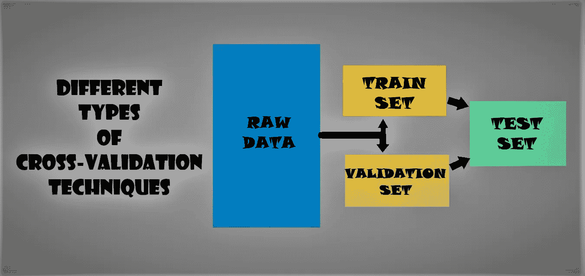

# 内容:

**→简介
→什么是交叉验证？
→不同类型的交叉验证**
*1。保持方法
2。k 折法
3。重复 K 折法
4。分层 K 折法
5。组 K 折法
6。洗牌拆分法
7。分层洗牌拆分法
8。分组洗牌拆分方法
9。留一法
10。排除法
11。留一组法
12。离开 P 组方法
13。时间序列交叉验证方法
14。受阻交叉验证方法
15。嵌套交叉验证法* **→结论
→参考**

# 介绍

想象一下，在数据集上建立一个模型，但在看不见的数据上却失败了。我们不能只是让模型适合我们的训练数据，然后就指望它能在真实的未知数据中表现出色。
这是一个 ***过拟合*** 的情况，其中我们的模型已经学习了训练数据的所有模式和噪声，为了避免这种情况，我们需要某种方式来保证我们的模型已经捕获了大多数模式，并且没有拾取数据中的每个噪声(低偏差和低方差)，处理这种情况的许多技术之一是**交叉验证**。

# 什么是交叉验证？


*   在机器学习中，交叉验证是一种通过在输入数据的子集上训练几个 ML 模型并在数据的互补子集上评估它们来评估任何 ML 模型的技术。
*   它主要用于估计适合数据和模型的任何定量度量。
*   在交叉验证方法中，测试结果通常不会有偏差，因为用于训练和测试的数据大多是不重叠的。

**让我们首先创建两个变量，我将用它们来进一步演示:**

```
data = ['Subset1', 'Subset2', 'Subset3', 'Subset4', 'Subset5', 'Subset6', 'Subset7', 'Subset8', 'Subset9', 'Subset10']Y = [1, 0, 1, 0, 0, 1, 1, 0, 1, 0]df = {"data":data, "Y":Y}df = pd.DataFrame(df)df
```

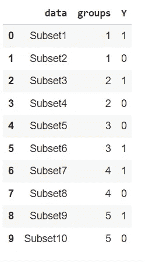

# 交叉验证的不同方法有:

## →保持方法:

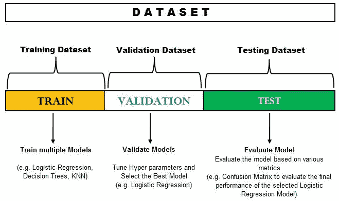

*   这是一种简单的训练测试分割方法。
*   一旦训练测试分割完成，我们可以进一步将测试数据分割成验证数据和测试数据。
    例如:
    1。假设有 1000 个数据，我们将数据分成 80%的训练和 20%的测试。
    2。我的训练数据由 800 个数据点组成，测试将包含 200 个数据点。
    3。然后我们将测试数据分成 50%的验证数据和 50%的测试数据。

```
x_train, x_test, y_train, y_test = model_selection.train_test_split(df.data, df.Y, test_size = 0.2)for i,n in zip(x_train, y_train):
  print(i, "::", n)
for i, n in zip(x_test, y_test):
  print(i, "::", n)
```

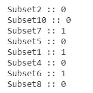

Train Set

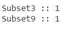

Test Set

> * *注意:测试集只有一个类，这会导致有偏差的结果

**使用分层参数**

> **分层是重新排列数据的过程，以确保每个折叠都是整体的良好代表。** 例如，**在每个类包含 50%数据的二元分类问题中，最好安排数据，使得在每个文件夹中，每个类包含大约一半的实例。**

```
x_train, x_test, y_train, y_test = model_selection.train_test_split(df.data, df.Y, test_size = 0.2, stratify = df.Y)for i,n in zip(x_train, y_train):
  print(i, "::", n)
for i, n in zip(x_test, y_test):
  print(i, "::", n)
```

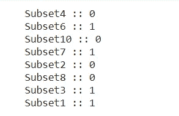

Train Set

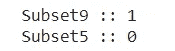

Test Set

## → K 折叠法:


*   在这种方法中，我们将数据集分成 k 个子集(称为折叠)，然后对所有子集进行训练，但留下一个(k-1)子集用于评估训练的模型。
*   我们迭代 k 次，每次为测试目的保留不同的子集。
*   它确保原始数据集中的每个观察值都有机会出现在训练和测试集中。
*   来自折叠的 k 个结果然后可以被平均(或以其他方式组合)以产生单个估计。这种方法的优点是，所有的观察值都用于训练和验证，并且每个观察值只用于验证一次。

```
kfold = model_selection.KFold(n_splits=5)print("Train", "||", "Test")
for train, test in kfold.split(df.data, df.Y):
  print(train, "||", test)
```

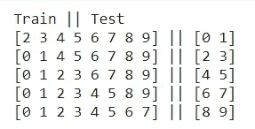

```
tn = []
tt = []
for train, test in kfold.split(data):
  tn.append(np.take(data,train))
  tt.append(np.take(data,test))kfold_df = pd.DataFrame({"train":tn, "test":tt})
kfold_df
```

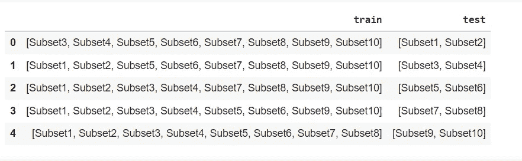

现在，如果我们传入`shuffle`参数:

```
kfold = model_selection.KFold(n_splits=5, shuffle=True, random_state=1)
print("Train", "||", "Test")
for train, test in kfold.split(data):
  print(train, "||", test)
```

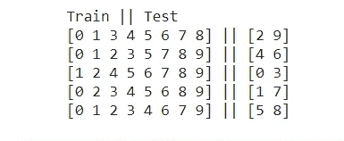

我们可以看到，拆分不再是有序的，这是因为数据被打乱，然后被分开。

```
tn = []
tt = []
for train, test in kfold.split(data):
  tn.append(np.take(data,train))
  tt.append(np.take(data,test))kfold_df = pd.DataFrame({"train":tn, "test":tt})
kfold_df
```

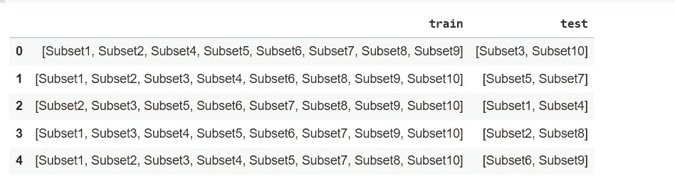

## →重复 K 折法:

*   重复 K-fold 方法使用 K-fold 交叉验证，并根据用户的需要重复 n 次。
*   单次运行 k-fold 交叉验证程序可能会导致模型性能的高噪声估计。不同的数据分割可能会产生完全不同的结果。
*   对模型性能的有噪声的估计导致混乱，不知道应该使用哪个模型来比较和选择最终模型来解决问题。
*   降低估计模型性能中的噪声的一个解决方案是增加 k 值。但是，它会增加方差。
*   多次重复 k 折叠交叉验证过程，并报告所有折叠和所有重复的平均性能。

```
Rkfold = model_selection.RepeatedKFold(n_splits=5, n_repeats=5, random_state=2)print("Train", "||", "Test")
for train, test in Rkfold.split(data):
  print(train, "||", test)
```

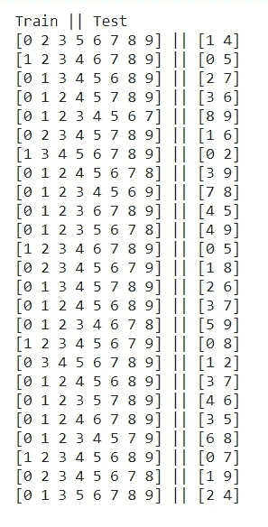

我们可以看到，数据被分成 12 组(5 n_splits * 5 重复)，没有两个测试集是重复的

```
tn = []
tt = []
for train, test in Rkfold.split(data):
  tn.append(np.take(data,train))
  tt.append(np.take(data,test))Rkfold_df = pd.DataFrame({"train":tn, "test":tt})
Rkfold_df
```

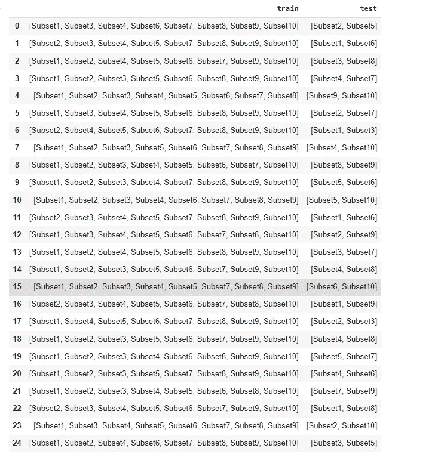

## →分层 K 折法:

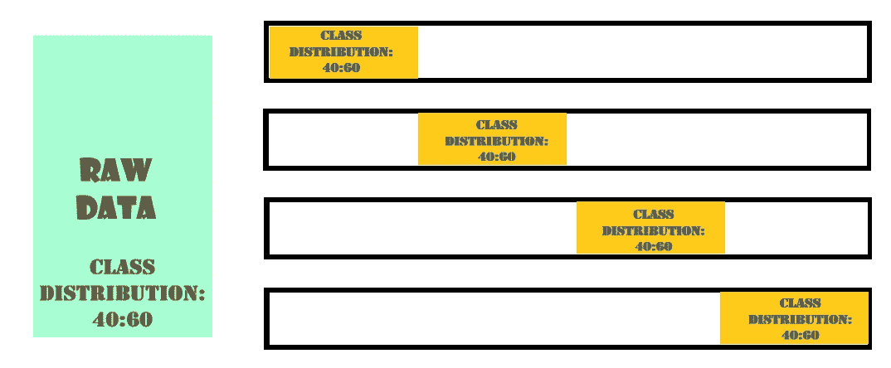

*   K-Fold 交叉验证和分层 K-Fold 之间的区别在于，K-Fold 将数据分成 K 个“随机”折叠，这意味着子集由随机选取和放置的数据点组成。
    然而，在分层交叉验证中，将数据分成 k 个折叠，确保每个折叠都是原始数据的适当代表。(类别分布、均值、方差等)。
*   任何分类问题的最大问题是由于不平衡的分类而产生的问题。如果我们对不平衡数据使用 K-Fold CV 方法，我们可能会导致训练偏向某一类。在 K-Fold 中，我们随机取出 K 个子集，并且我们很有可能得到由多数类组成的折叠。为了处理这种类型的问题， ***分层 K-Fold 在分层过程的帮助下被使用*** 。

```
strkfold = model_selection.StratifiedKFold(n_splits=5)tn_x = []
tn_y = []
tt_x = []
tt_y = []
for train, test in strkfold.split(data, Y):
  tn_x.append(np.take(data,train))
  tn_y.append(np.take(Y,train))
  tt_x.append(np.take(data,test))
  tt_y.append(np.take(Y,test))strkfold_train = pd.DataFrame({"train_x":tn_x, "train_y":tn_y})
strkfold_test = pd.DataFrame({'test_x':tt_x, "test_y":tt_y})
```


Train Set

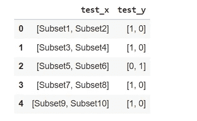

Test Set

## →K 倍分组法:

*   K-Folds 组是一种考虑到作为参数传递的组的方法。
*   每隔一个 K 倍和分组 K 倍之间的区别在于当数据被分成两组时。它为训练集取出单独的组。

```
grpkfold = model_selection.GroupKFold(n_splits=5)
print("Train", "||", "Test")
for train, test in grpkfold.split(data, Y, groups=groups):
  print(train, "||", test)
```

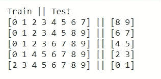

> →比较上面两幅图像，我们可以看到位于索引 8 和 9 的组首先被取出。
> →之后是索引 6 和 7，依此类推。

这种分割是以单个组为基础的

```
tn = []
tt = []
for train, test in grpkfold.split(data, Y, groups=groups):
  tn.append(np.take(data,train))
  tt.append(np.take(data,test))grpkfold_df = pd.DataFrame({"train":tn, "test":tt})
grpkfold_df
```

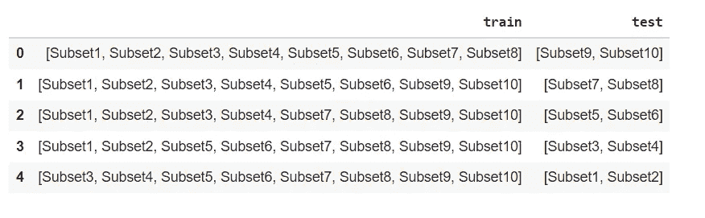

## →洗牌拆分法:

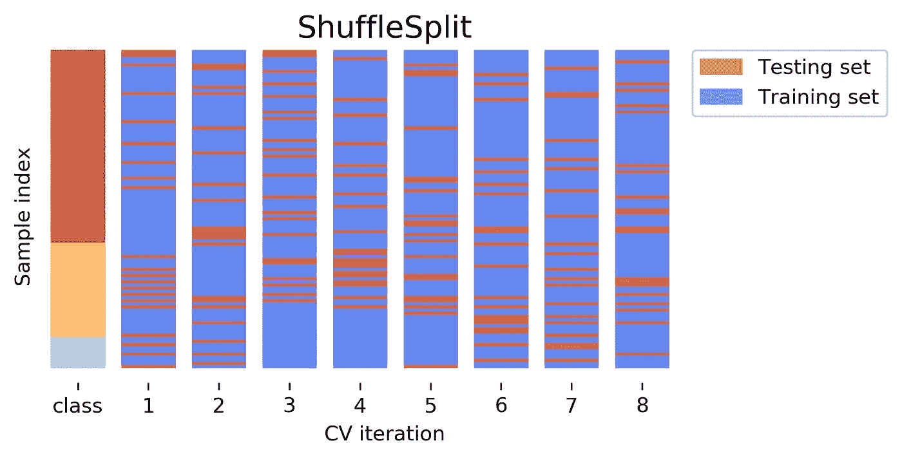

*   **重复随机子采样验证**也称为 ***蒙特卡洛交叉验证*** 将数据集随机分为训练和验证。不太可能将数据集 k 倍交叉验证拆分为非分组或折叠，但在这种情况下是随机拆分。
*   迭代的次数不是固定的，而是由分析决定的。然后对分割的结果进行平均。
*   当您欠采样或者当您有上述情况时，您不希望每个观察值出现在 k-1 个折叠中，随机子采样(例如，bootstrap 采样)是更可取的。
*   训练和验证分割的比例不依赖于迭代或分区的数量。
*   有些样本可能不会被选择用于训练或验证。
*   不适合不平衡的数据集。

```
shsplit = model_selection.ShuffleSplit(n_splits=5, test_size=0.2, random_state=3)print("Train", "||", "Test")
for train, test in shsplit.split(data):
  print(train, "||", test)
```

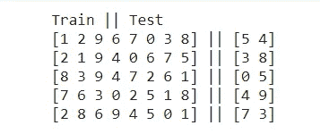

随机子集被提取和分离

```
tn = []
tt = []
for train, test in shsplit.split(data):
  tn.append(np.take(data,train))
  tt.append(np.take(data,test))shsplit_df = pd.DataFrame({"train":tn, "test":tt})
shsplit_df
```

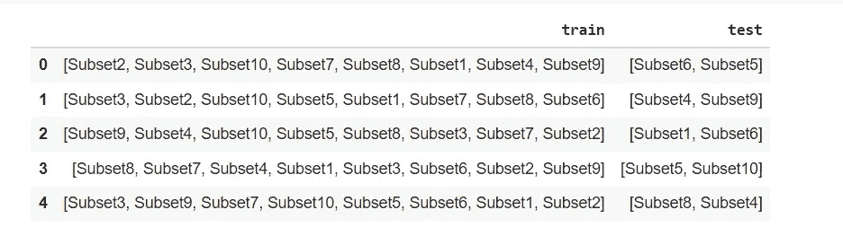

## →分层洗牌拆分法:


```
strshsplit = model_selection.StratifiedShuffleSplit(n_splits=5, test_size=0.2)
print("Train", "||", "Test")
for train, test in strshsplit.split(data, Y):
  print(train, "||", test)
```


```
tn_x = []
tn_y = []
tt_x = []
tt_y = []
for train, test in strshsplit.split(data, Y):
  tn_x.append(np.take(data,train))
  tn_y.append(np.take(Y,train))
  tt_x.append(np.take(data,test))
  tt_y.append(np.take(Y,test))strshsplit_train = pd.DataFrame({"train_x":tn_x, "train_y":tn_y})
strshsplit_test = pd.DataFrame({'test_x':tt_x, "test_y":tt_y})
```

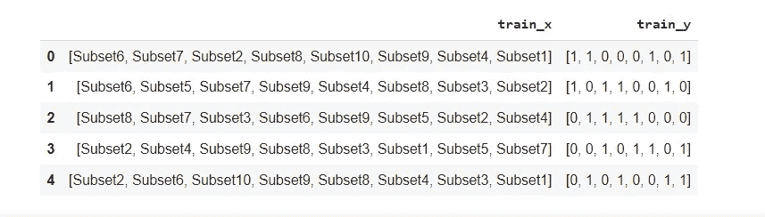

Train Set

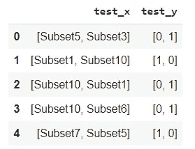

Test Set

## →分组洗牌拆分法:

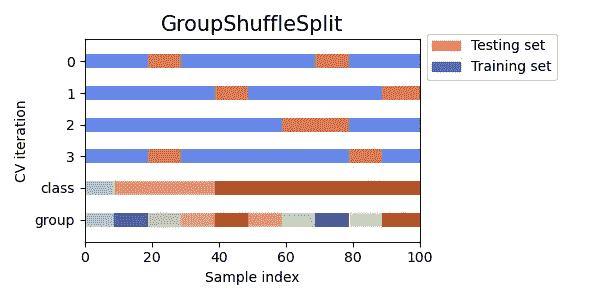

```
grpshsplit = model_selection.GroupShuffleSplit(n_splits=5)
print("Train", "||", "Test")
for train, test in grpshsplit.split(data, groups=groups):
  print(train, "||", test)
```

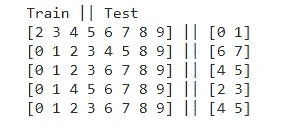

> →分组混洗分割倾向于重复相同的分割，因为分割是在混洗数据后选择的。
> →这种重复行为可能会使模型一般化。

分组混洗分割产生重复的验证集

```
tn = []
tt = []
for train, test in grpshsplit.split(data, groups=groups):
  tn.append(np.take(data,train))
  tt.append(np.take(data,test))grpshsplit_df = pd.DataFrame({"train":tn, "test":tt})
grpshsplit_df
```

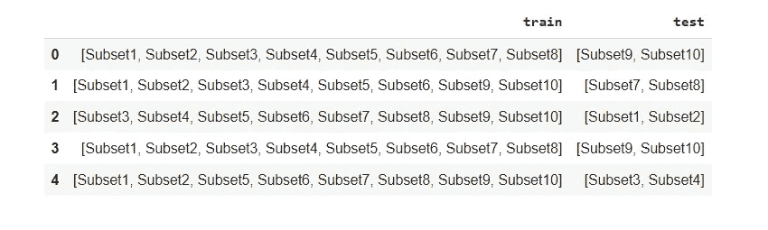

## →留一法:


*   **留一交叉验证**或 **LOOCV** ，当机器学习算法用于对未用于训练模型的数据进行预测时，该程序用于评估机器学习算法的性能。
*   这种方法在训练数据中留出 1 个数据点，即，如果原始样本中有 n 个数据点，则 n-1 个样本用于训练模型，p 个点用作验证集。
*   对原始样本可以这样分离的所有组合重复这一过程，然后对所有试验的误差进行平均，以给出总体有效性。

```
loo = model_selection.LeaveOneOut()print("Train", "||", "Test")
for train, test in loo.split(data):
  print(train, "||", test)
```

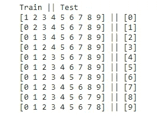

每次分离都将一个特定的子集作为验证集，因此，如果将数据分成 n 个子集，将会进行 n 次拆分。

```
tn = []
tt = []
for train, test in loo.split(data):
  tn.append(np.take(data,train))
  tt.append(np.take(data,test))loo_df = pd.DataFrame({"train":tn, "test":tt})
loo_df
```

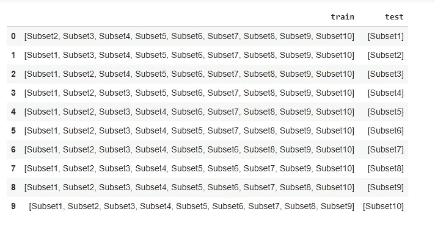

## →留 P 法:

*   这与 ***留一法*** 类似，但是，在这种方法中，我们从包含 n 个数据点的数据集中的数据点总数中取出 p 个数据点。
*   该模型在(n-p)个数据点上训练，并在 p 个数据点上测试。

```
lpo = model_selection.LeavePOut(2)tn = []
tt = []
for train, test in lpo.split(data):
  tn.append(np.take(data,train))
  tt.append(np.take(data,test))lpo_df = pd.DataFrame({"train":tn, "test":tt})
lpo_df
```

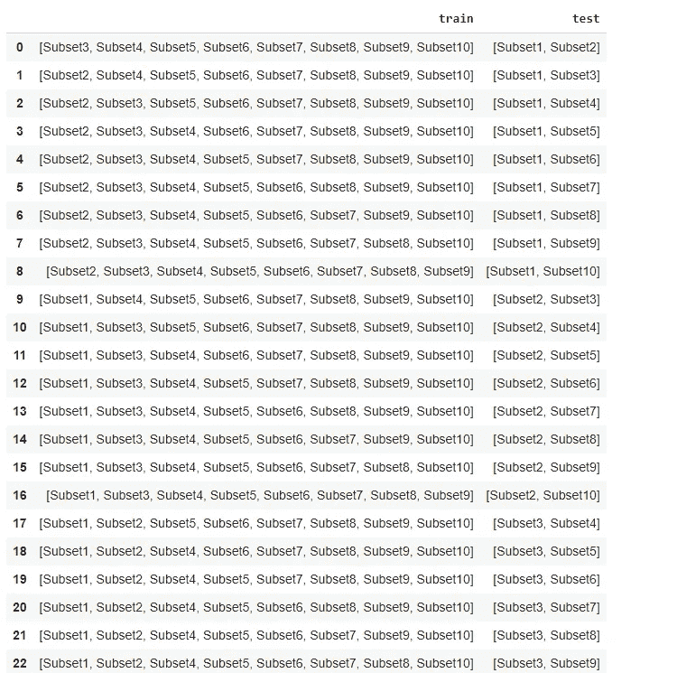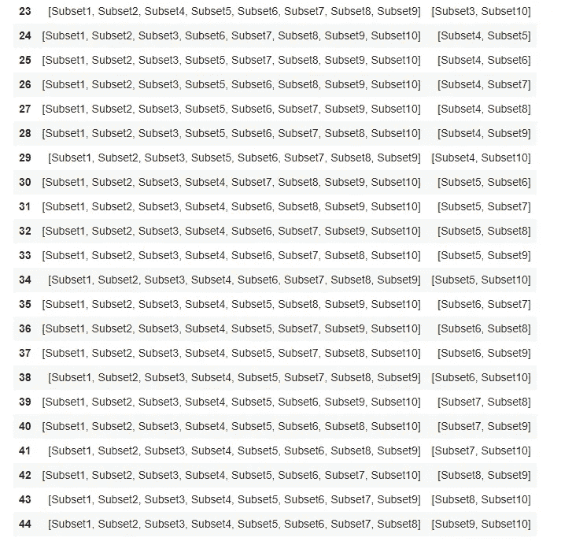

## →留一组法:

这基本上类似于 K-folds 组方法，除了 K-Folds 的分割顺序从末尾开始，而 Leave-One-Group 从开头开始。

```
logo = model_selection.LeaveOneGroupOut()
print("Train", "||", "Test")
for train, test in logo.split(data, groups=groups):
  print(train, "||", test)
```

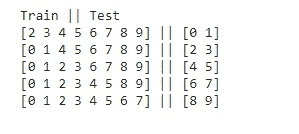

## →离开 P-组-排除法:

*   它将 p 组排除在外，在 n-p 个子集上训练模型，然后在 p 组上进行测试。

```
lpgo = model_selection.LeavePGroupsOut(2)print("Train", "||", "Test")
for train, test in lpgo.split(data, groups=groups):
  print(train, "||", test)
```

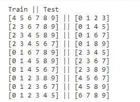

## →时间序列交叉验证

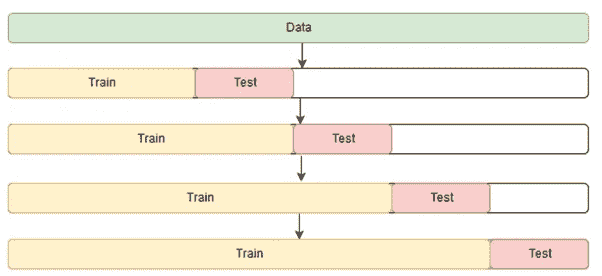

*   数据的顺序对于时间序列相关的问题非常重要。对于与时间相关的数据集，将数据随机分割或 k 倍分割成训练和验证可能不会产生好的结果。
*   对于时间序列数据集，将数据拆分成训练序列并根据时间进行验证，也称为**前向链接法**或**滚动交叉验证**。对于特定的迭代，训练数据的下一个实例可以被视为验证数据。

```
tsplit = model_selection.TimeSeriesSplit(n_splits=9, max_train_size=10)print("Train", "||", "Test")
for train, test in tsplit.split(data):
  print(train, "||", test)
```

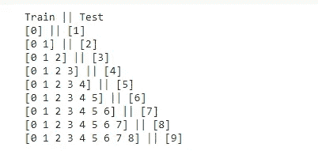

该模型是在连续子集上训练的，而不是在随机选择的子集上训练的。

```
tn = []
tt = []
for train, test in tsplit.split(data):
  tn.append(np.take(data,train))
  tt.append(np.take(data,test))tsplit_df = pd.DataFrame({"train":tn, "test":tt})
tsplit_df
```

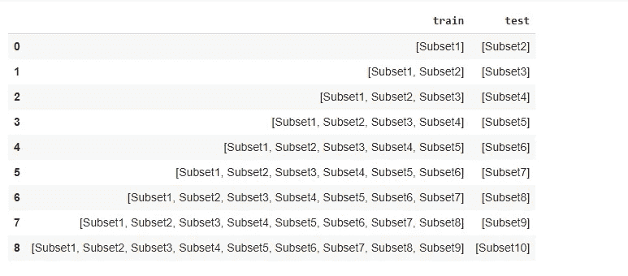

## →交叉验证受阻

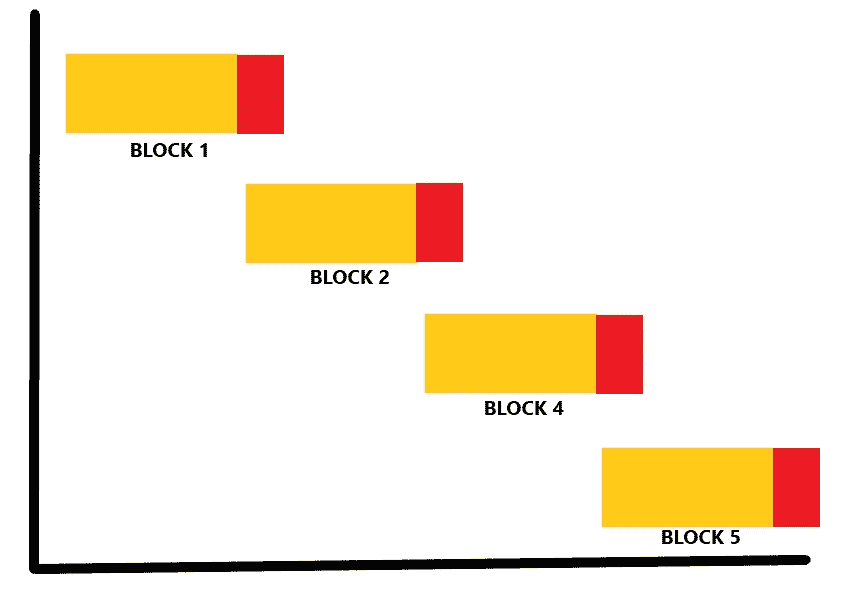

*   阻塞交叉验证过程类似于上述标准形式。
*   不同之处在于，没有初始的随机观察。
*   在时间序列中，这将呈现 K 个连续观测数据块。观察的自然顺序保持在每个区块内，但在它们之间被打破。
*   但是，这可能会将未来数据泄漏到模型中。该模型将观察未来的模式进行预测，并试图记住它们。
*   这就是引入阻塞交叉验证的原因。它的工作原理是在两个位置增加边距。第一个是在训练和验证折叠之间，以防止模型观察到两次使用的滞后值，一次作为回归变量，另一次作为响应。
*   第二个是在每次迭代中使用的折叠之间，以防止模型从一次迭代到下一次迭代记住模式。

```
blocks = 2
n = len(data) // 2for i in [data[i:i + n] for i in range(0, len(data), n)]:
  train, test = model_selection.train_test_split(i)
  print(train, "||", test)
```

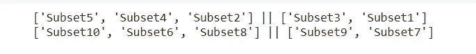

## →嵌套交叉验证


*   **嵌套交叉验证** ( **Nested-CV** )嵌套交叉验证和超参数调整。
*   它用于评估机器学习算法的性能，还用于估计底层模型及其超参数搜索的泛化误差。

```
outter_cv = model_selection.KFold(n_splits=5)
inner_cv = model_selection.KFold(n_splits=4)for train, test in outter_cv.split(data):
  tr = np.take(data, train)
  te = np.take(data, test)
  print(tr, "||", te)
  print("-----------------------------------")
  for in_train, in_test in inner_cv.split(tr):
    in_tr = np.take(tr, in_train)
    in_te = np.take(tr, in_test)
    print(in_tr, "||", in_te)
  print("<<<<<<<<<<----------------------------------->>>>>>>>>>>")
```

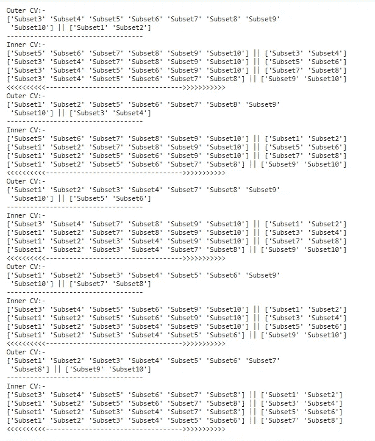

# 结论

*   没有一种交叉验证方法可以说是对您的数据有效的技术。
*   时间序列和分块 CV 是防止模型过度拟合的最好方法。

# 参考

[https://sci kit-learn . org/stable/modules/cross _ validation . html](https://scikit-learn.org/stable/modules/cross_validation.html)

喜欢我的文章？请为我鼓掌并分享它，因为这将增强我的信心。此外，请查看我的另一篇文章，并与未来关于数据科学和机器学习基础系列的文章保持联系。

还有，一定要在[**LinkedIn**](http://www.linkedin.com/in/abhigyan-singh-b13651121)T5 上联系我。

[](https://www.linkedin.com/in/abhigyan-singh-b13651121/) [## Abhigyan Singh -印度卡纳塔克邦班加罗尔市区|职业简介| LinkedIn

### 数据科学和机器学习爱好者。我在 medium 上写关于数据科学和机器学习的文章…

www.linkedin.com](https://www.linkedin.com/in/abhigyan-singh-b13651121/) 

Photo by [Markus Spiske](https://unsplash.com/@markusspiske?utm_source=medium&utm_medium=referral) on [Unsplash](https://unsplash.com?utm_source=medium&utm_medium=referral)