# 遗传算法中的交叉算子

> 原文：<https://medium.com/geekculture/crossover-operators-in-ga-cffa77cdd0c8?source=collection_archive---------1----------------------->


# 介绍

随着时间的推移，已经开发了无数的交叉算子。在本文中，我将讨论 13 个这样的交叉操作符，它们可以进一步分为 3 类(基于父代的编码)，如下所示:

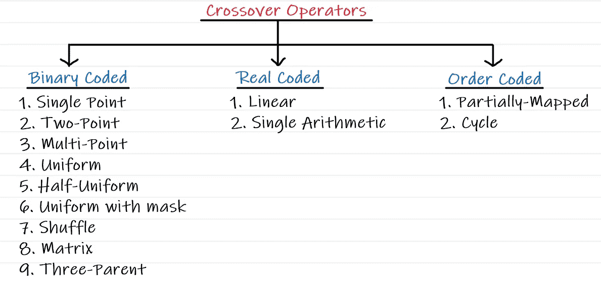

# 单点交叉

**第一步-** 选择两个亲本进行交配。

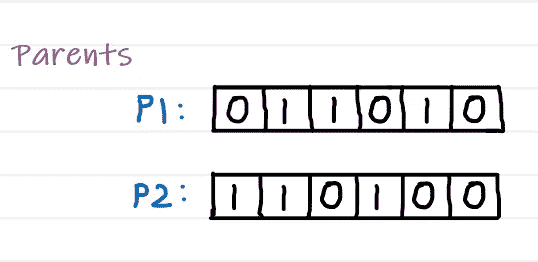

**步骤 2-** 随机选择一个交叉点，在正确的位置交换比特。

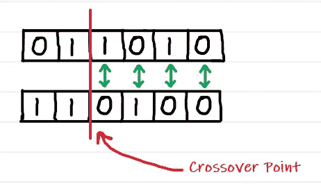

交叉后，生成的新后代看起来如下:

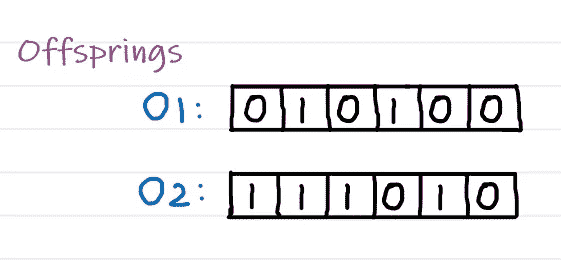

# 两点交叉

**第一步-** 选择两个亲本进行交配。

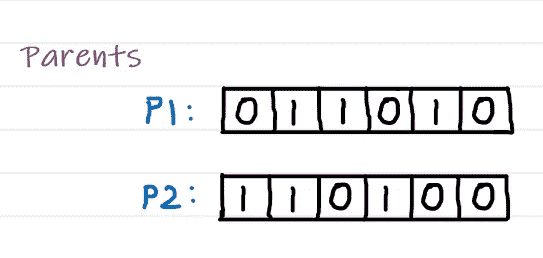

**步骤 2-** 随机选择两个交叉点，在中间位置交换比特。

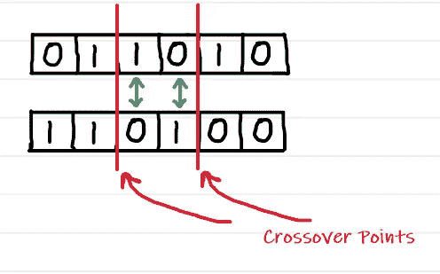

交叉后，生成的新后代看起来如下:


# 多点交叉

**第一步-** 选择两个亲本进行交配。


**步骤 2-** 随机选择多个交叉点，并在备用位置交换位。

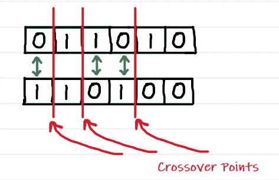

交叉后，生成的新后代看起来如下:


# 均匀交叉

**步骤 1-** 选择两个亲本进行交配。


**第二步-** 在父母的每个比特位置，抛一枚硬币(设 H=1，T=0)。

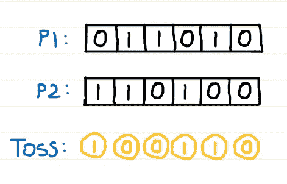

**步骤 3-** 按照下面提到的算法产生两个后代:

```
if Toss=1,
 then swap the bits
if Toss=0,
 then don’t swap
```

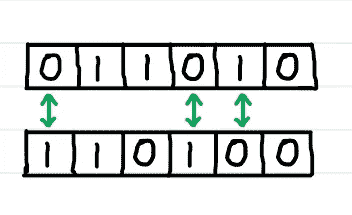

交叉后，生成的新后代看起来如下:

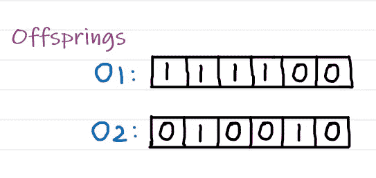

# 半均匀交叉

**步骤 1-** 选择两个亲本进行交配。


第二步- 只有当 P1 和 p 2 对应的位不匹配时，才抛硬币(设 H=1，T=0)。

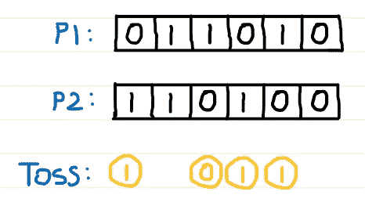

**步骤 3-** 按照下面提到的算法产生两个后代:

```
if Toss=1,
 then swap the bits
if Toss=0,
 then don’t swap
```

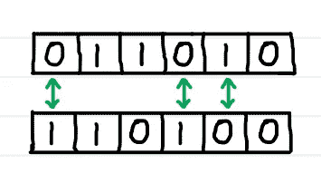

交叉后，生成的新后代看起来如下:

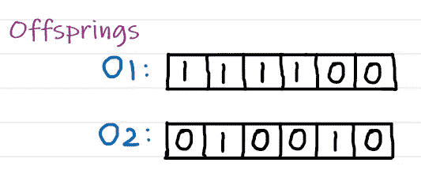

# 带交叉遮罩的均匀交叉(CM)

**第一步-** 选择两个亲本进行交配。


**步骤 2-** 定义交叉蒙版(CM)。

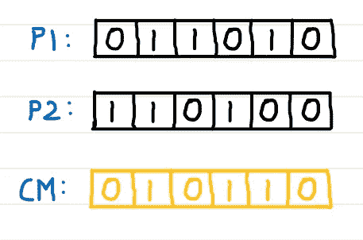

**步骤 3-** 遵循下述算法:

```
To generate first offspring O1
------------------------------
if CM=0,
 then select P1 bit
if CM=1,
 then select P2 bitTo generate second offspring O2
------------------------------
if CM=0,
 then select P2 bit
if CM=1,
 then select P1 bit
```

交叉后，生成的新后代看起来如下:

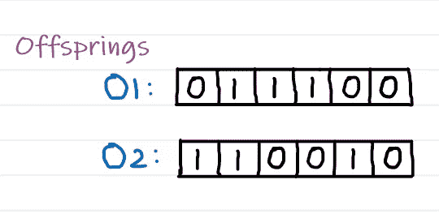

# 洗牌交叉

**第一步-** 选择两个亲本进行交配。


**第二步-** 随机选择一个交叉点，对双亲的基因进行洗牌。

*注:分别对右侧位点和左侧位点进行基因重排。*


**步骤 3-** 执行单点交叉。

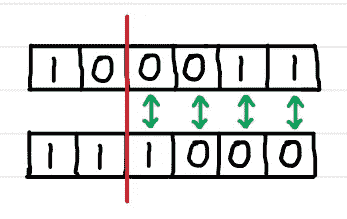

交叉后，生成的新后代看起来如下:

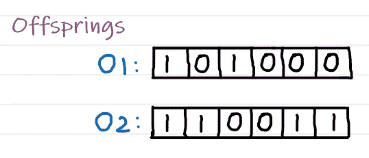

# 矩阵交叉

**第一步-** 选择两个亲本进行交配。

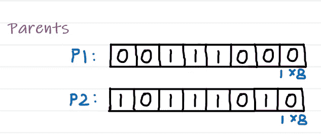

**步骤 2-** 用二维表示写出双亲，然后将得到的矩阵分成不重叠的区域。

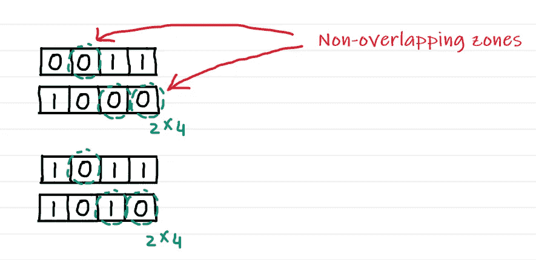

**步骤 3-** 基于区域执行交叉。

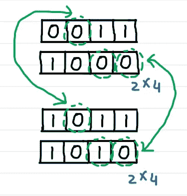

交叉后，生成的新后代看起来如下:

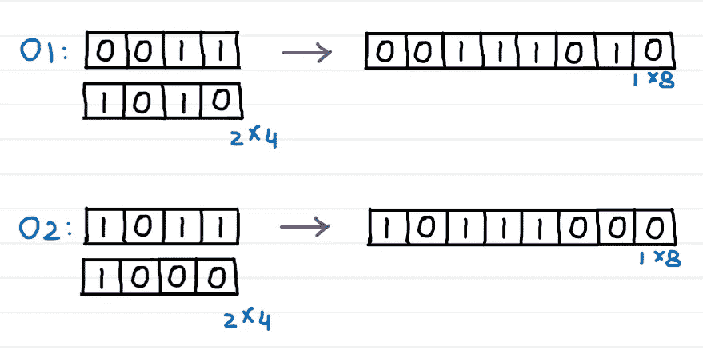

# 三亲杂交

**第一步-** 选择三个亲本进行交配。

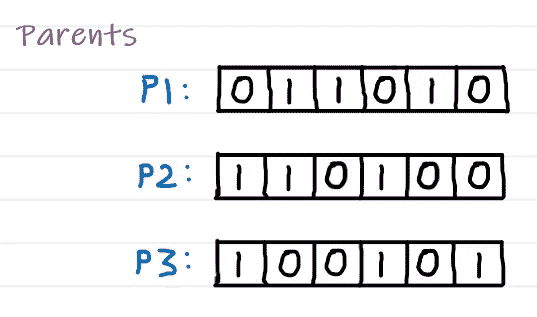

**第三步-** 按照下面提到的算法产生一个后代:

```
To generate offspring O1 from (P1,P2,P3) combination
----------------------------------------------------
if P1 bit = P2 bit,
 then select P1 bit
if P1 bit != P2 bit,
 then select P3 bit
```


交叉后，生成的新后代看起来如下:

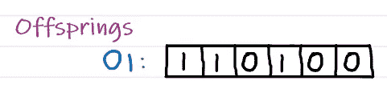

分别使用(P1、P3、P2)和(P2、P3、P1)组合重复相同的步骤来产生子代 O2 和 O3。

*注:有时，第三个父母可以被视为抛硬币或交叉面具(CM)。*

# 线性交叉

**第一步-** 选择两个亲本进行交配。

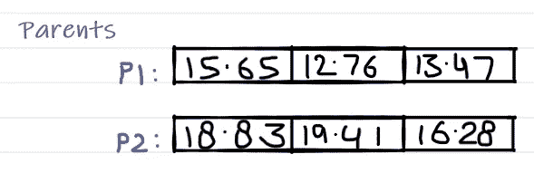

**步骤 2-** 随机选择单个基因(k)。

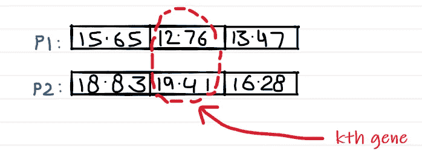

**步骤 3-** 定义α和β参数。

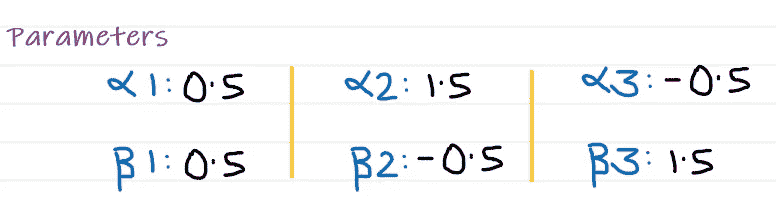

**步骤 4-** 使用下述公式修饰 P1 的 kth 基因:

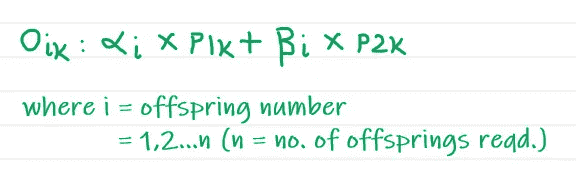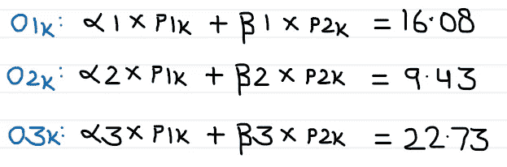

交叉后，生成的新后代看起来如下:

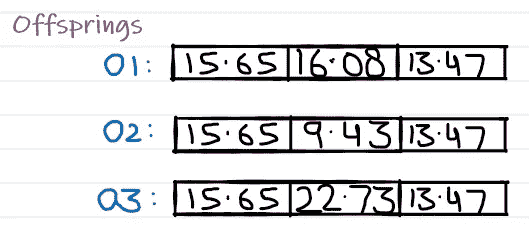

*注意:通过给定不同的α和β值，我们可以生成任意数量的子代。*

# 单一算术交叉

**步骤 1-** 选择两个亲本进行交配。


**步骤 2-** 随机选择单个基因(k)。


**步骤 3-** 定义α参数。


**步骤 4-** 修饰 P1 和 kth 基因产生后代:


# 部分映射交叉

**第一步-** 选择两个亲本进行交配。

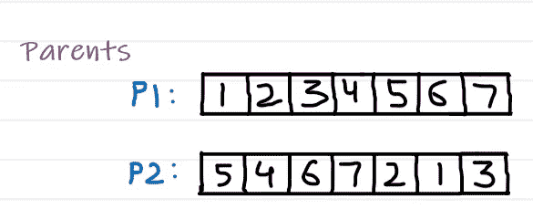

**步骤 2-** 使用交叉点从父项中随机选择一个子串。

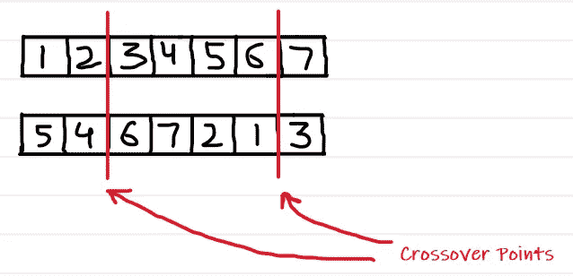

**步骤 3-** 进行两点交叉。

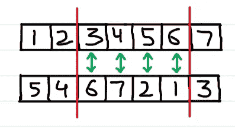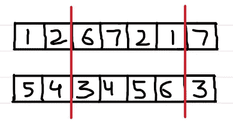

**步骤 4-** 从子串中确定映射关系。

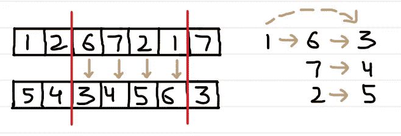

**步骤 5-** 使用映射使未选择的子串中的子串合法化。

交叉后，生成的新后代看起来如下:

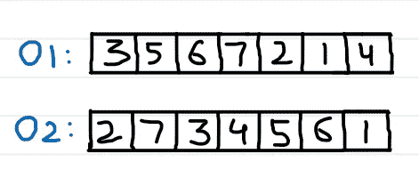

# 循环交叉

**第一步-** 选择两个亲本进行交配。


**第二步-** 找到父母定义的循环。

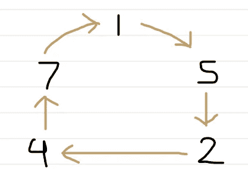

**步骤 3-** 按照下面提到的算法产生一个后代:

```
To generate offspring O1
------------------------
if P1 bit in cycle,
 then select P1 bit
if P1 bit not in cycle,
 then select P2 bit
```

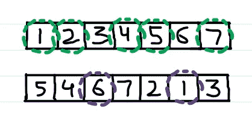

交叉后，生成的新后代看起来如下:

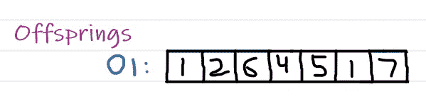

为了产生后代 O2，类似地进行，首先用 P2 填充，剩余的用 P1 填充。

这就是本文的全部内容。

不要忘记👏如果你喜欢这篇文章。

如果您想了解更多关于 GA 的知识，请查看我的系列文章:

[](https://apargarg99.medium.com/genetic-algorithm-ga-series-9cf533b292f) [## 遗传算法(GA)系列

### 我发表了不少关于遗传算法的文章。虽然这些文章站在自己的立场，它将更多…

apargarg99.medium.com](https://apargarg99.medium.com/genetic-algorithm-ga-series-9cf533b292f) 

如果你有任何问题或者想要澄清什么，你可以在 LinkedIn 上找到我。

~快乐学习。