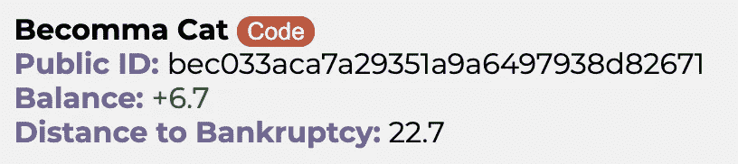
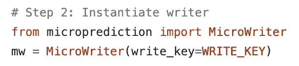
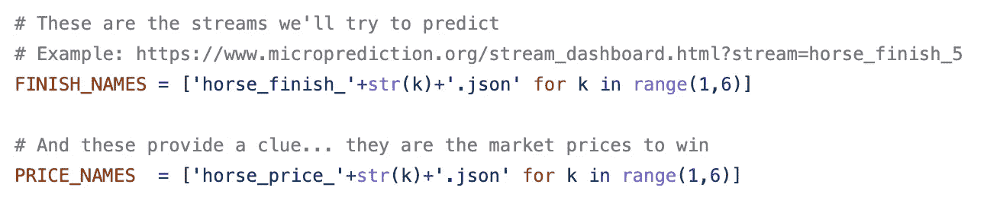
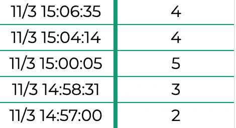
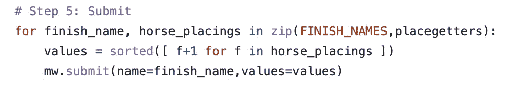
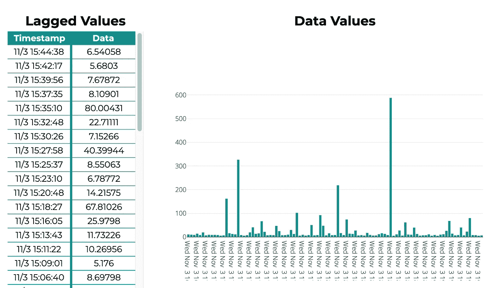
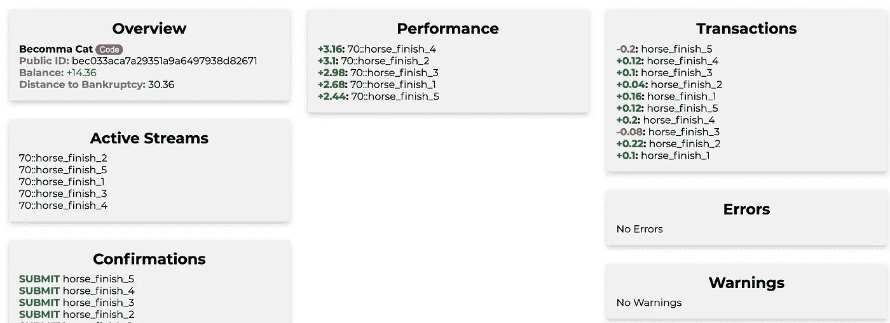
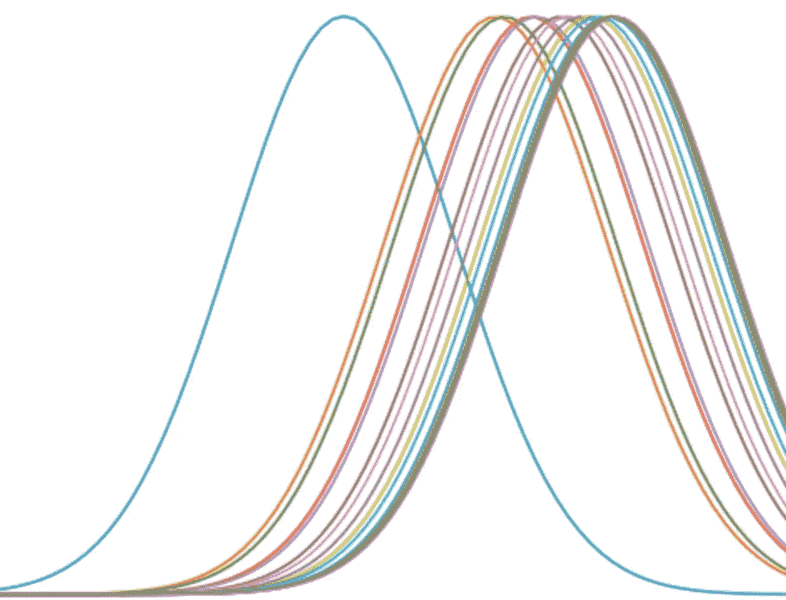

# 一匹马跑最后一名的概率是多少？

> 原文：<https://medium.com/geekculture/crowd-order-statistics-9940acae85fa?source=collection_archive---------4----------------------->

这篇文章向你介绍了一个新的竞赛，你部署了一个算法来预测五匹马比赛中的马的排名。你得到的唯一信息是市场对每匹马获胜概率的看法。


Photo by [Mathew Schwartz](https://unsplash.com/@cadop?utm_source=unsplash&utm_medium=referral&utm_content=creditCopyText) on [Unsplash](https://unsplash.com/s/photos/horse-racing?utm_source=unsplash&utm_medium=referral&utm_content=creditCopyText)

将等级概率分配给有限数量的变量的问题是一个基本的统计问题，可能会在赛马之外找到许多应用。我发现这个问题经常重复出现，无论我是在场外交易市场上观察经销商，还是在堆积在一起的算法。

尽管挑战相当不同，但将于 2022 年 2 月开始的[M6-金融预测比赛](/geekculture/six-ways-to-train-for-the-m6-financial-forecasting-competition-cacaf3af58b5)的特点是收集了五场股票之间的赛马，其中你还将被要求估计排名概率。就当这是热身。

# 如何参加竞赛

打开这个[笔记本](https://github.com/microprediction/microprediction/blob/master/notebook_examples/make_new_key.ipynb)，开始燃烧你的新身份，同时继续阅读。(这是你进入微预测世界的门票，如果它令人困惑，就在[松弛](https://join.slack.com/t/microprediction/shared_invite/zt-xauc5r03-XmIMdy~iL4a3Hw3G1Agv6w)上打扰我们。)当写密钥被创建时，将其粘贴到[仪表板](https://www.microprediction.org/leaderboard.html)中以显示您的笔名。例如:



您的公共 ID 是您的私有写密钥的散列。您的写入密钥是一个*难忘的唯一标识符*，在本[视频](https://vimeo.com/397352413)中有所解释。

接下来看看 [estado_sole.py](https://github.com/microprediction/microprediction/blob/master/crawler_alternatives/estado_sole.py) 。这是您将在 cron 作业[上每小时运行一次](https://crontab.guru/every-1-hour)的示例脚本——或者以其他方式安排。我们需要的只是一个 writer，它可以使用 WRITE 键进行实例化。



当您的密钥正在燃烧时，请注意，在此示例中有我们感兴趣的十个不同的实时流(如果您感兴趣，您可以在此处找到完整的流列表),它们都与五场赛马的序列相关。



例如，流 [horse_finish_4.json](https://www.microprediction.org/stream_dashboard.html?stream=horse_finish_4) 包含每场比赛中第四匹马的完成位置记录。每一次的马都不一样，但是 4 号马总是第四受欢迎的马。如你所见，它并不经常赢。



你的任务是估计 4 号马获得第一名的概率，同时估计它获得第二名的概率，以此类推，直到第五名。

实际上，您有些受限，因为您无法准确地提供五种可能性。取而代之的是在一个向量中提供 225 个值的列表。例如，如果你认为这匹马有 15 分之一的获胜机会，那么你的列表中的 15 个条目应该是 1。也许 30 个是 2，因为它更有可能是第二，以此类推。

这就是为什么[示例](https://github.com/microprediction/microprediction/blob/master/crawler_alternatives/estado_sole.py)条目的最后一部分看起来像这样:



既然有人问，那[赞助商名单](https://api.microprediction.org/sponsors/)中的小溪赞助商豆娘。她的公钥是:

```
1a24da35e1f140d20e21ecbac7436d8e (aka LADY DAMSELFLY)
```

# 信息

为您提供的信息包含在价格流中，例如下面显示的 [horse_price_4.json](https://www.microprediction.org/stream_dashboard.html?stream=horse_price_4) :

这使用了欧洲/澳大利亚的赔率惯例。6.54 美元的价格意味着如果你赌 1 美元，如果这匹马赢了，你将得到 6.54 美元。因此，我们可以认为股息是市场隐含概率的倒数。在美国传统中，价格将被报为+550——类似于博彩公司惯例 11/2。



# 监控你的表现

只要您安排 python 脚本每小时运行一次，您在[www.microprediction.org](https://www.microprediction.org/)的仪表板就会开始填充:



如果你点击交易，你可以看到为什么你的积分增加或减少——尽管我强烈建议你阅读评分的[机制。](https://www.microprediction.com/blog/intro)

# 技术和基准

也许堆栈交换问题[给出了每匹马赢得比赛的概率…](https://math.stackexchange.com/questions/842604/given-every-horses-probability-of-winning-a-race-what-is-the-probability-that/3260483#3260483) 是一个讨论可能的解决方案的好地方，尽管也可以在这里随意评论。

我已经提供了一个基准，它使用了我最近发表在一篇文章*中的技术，该文章从多参与者竞赛的获胜概率中推断相对能力*(SIAM J on Financial Mathematics，2021 [pdf](https://github.com/microprediction/winning/blob/main/docs/Horse_Race_Problem__SIAM_updated.pdf) )。尽管这项工作的动机主要在于更高维度的问题，但它重新点燃了人们对顺序统计的兴趣，这种兴趣源于童年对赛马场的迷恋。该方法推断每匹马的性能分布。



我认为你可以击败它，即使你只是简单地修改你会注意到有一些免费的参数。我最后选择的值也是不可接受的懒惰，因为它使用蒙特卡罗，因此没有利用詹森不等式(这里有更长的讨论)。

正如本文(以及[讨论](https://math.stackexchange.com/questions/842604/given-every-horses-probability-of-winning-a-race-what-is-the-probability-that/3260483#3260483))中提到的，我将另一个基准框架作为 Luce 公理选择的应用。我认为大多数人都是半自觉地得出这个答案，不一定意识到所做的假设，也很少意识到它与指数运行时间分布相一致(其合理性……你来决定)。

但是如果你愿意，你可以按照哈威尔的方法，通过假设一旦一匹马赢了，有条件的第二名的概率仅仅是它们赢的概率的再标准化(当然，去掉赢家)，来估计所有排序的概率。然后一个继续，取出第一个和第二个，以此类推。

该主题的一个变体首先对概率进行幂变换。另一个变体使用 Henery 的近似法来处理正常情况——尽管我的存储库提供了一个快速的解决方案，正如您在基准测试示例中看到的那样。

# 越来越花哨

虽然如果你不想的话，你不需要关心它，但让我着迷的是推断五匹马比赛的市场隐含 copula 的可能性。如果你一直在底部搜索[流列表](https://www.microprediction.org/browse_streams.html)，你甚至可以找到[三元流](https://www.microprediction.org/stream_dashboard.html?stream=z3~horse_finish_1~horse_finish_2~horse_finish_3~3555)，它可以用来推断跑步者之间是否存在隐含的相关性。

人们可能希望回答一些相关的问题，例如 2-margin 是否足以重建联合分布。这与另一项正在进行的加密货币运动研究的动机类似，该研究在帖子[中解释了如何参加加密货币 Copula 竞赛](https://www.microprediction.com/blog/copula)。如果您想尝试预测与这五场赛马相关的 z2 和 z3 流，这可能是一个很好的起点。

# 需要帮助吗？

如果你对这类事情感兴趣，我们随时欢迎你在我们的 slack 频道(这里是)谈论 copulas 或顺序统计。