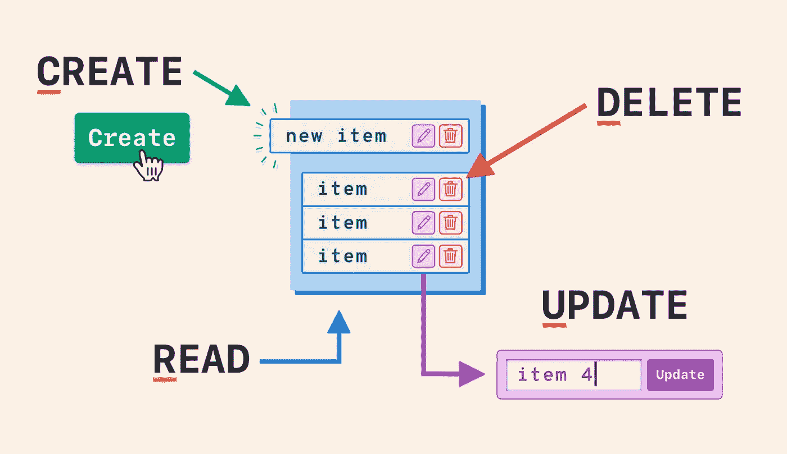
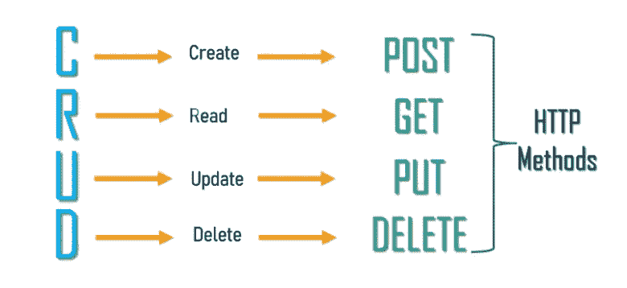

# CRUD 操作说明

> 原文：<https://medium.com/geekculture/crud-operations-explained-2a44096e9c88?source=collection_archive---------16----------------------->

# 什么是 CRUD？

如果你是编程新手，看到标题中的“crud”可能会引起关注，因为[韦氏词典](https://www.merriam-webster.com/dictionary/crud)字典将 CRUD 定义为“油脂的沉积物或水垢，或者是对可鄙的人的俚语”扩展这个定义可能很有趣，但这不是我们在本文中要扩展的内容。在计算机编程领域，CRUD 是一个值得了解的缩写词。我们将回顾什么是 CRUD 操作(也称为 CRUD 功能),以及为什么它是早期学习的重要基础。

**CRUD** 是首字母缩写，代表创建、读取、更新和删除。将 CRUD 视为一个简单的概念，它代表了模型应该能够完成的四个基本功能，并且被认为是实现持久存储应用程序所必需的。更简单地说，它代表了可以对任何数据进行的四种基本操作。您可以*创建*新的东西，*读取*或查看新创建的数据，编辑或*更新*数据，最后选择*删除*数据。

# CRUD 函数

这四个主要函数用于与数据库应用程序进行交互，并提醒用户需要哪些数据操作函数才能让应用程序感觉完整。当使用 web 服务时，CRUD 对应于 HTTP 方法，它向 web 服务器传达您希望如何与网站进行交互。

在这个分解中，我将使用我的 [*新开始的* s](https://www.youtube.com/watch?v=cmxgzGF6azU) 项目作为 CRUD 函数和与之相关的 HTTP 请求的例子。这是我的第一个(Ruby/HTML)应用程序，它是为当地的动物收容所开发的，用户可以创建一个帐户，登录，浏览所有要收养的动物，安排游戏日期，或者直接从网站上收养它们。

Meet Togo! He volunteered to help with our CRUD operations today.

# 创造

登录新起点网站，浏览所有可供收养的动物后，我们会点击多哥的名字。一旦我们被引导到他的展示页面，我们就可以在庇护所和他一起玩。在我们完成预约表单后，这些输入将与数据库中的模型表相关联。当我们提交数据时，一个请求的帖子被发送到我们的 API，我们与多哥的比赛日期将被存储在数据库中。

*   此帖子请求的路线—*/约会/新*

# 阅读

不错！我们已经安排了与 Togo 的游戏日期，但现在我们想在我们的页面上看到确认，对吗？毕竟，读取是我们使用其他操作的主要功能。现在，我们的 API 应该允许我们在页面上看到游戏日期确认。为了查看我们所有的约会，我们将使用一个 GET 请求，该请求允许我们查看预定的约会，而无需对存储在 API 上的数据进行任何更改。这个 HTTP 方法仅用于检索数据，应该没有其他作用。

*   这个 GET 请求的路由— */appointments。*

# 更新

Togo 真的很可爱，也许我们应该早点见到他！为了让我们更早地重新安排约会，我们可以使用相应的 HTTP 方法通过 PUT 更新您的 playdate。这将使用上传的内容(新的约会时间/日期)替换目标资源(多哥)的所有当前数据。route 中的“id”是资源的目标(Togo ),以确保我们只更新指定的约会，而不影响我们已经安排的任何其他约会。

*   这个 PUT 请求的路由—*/约会/:id* 。

# 删除

你猜怎么着 Togo 在这些 CRUD 功能上帮了大忙，我想我们应该把他带回家。既然我们可以直接从应用程序中领养 Togo，那就让我们取消我们预定的游戏日期吧。为此，我们可以使用 HTTP 方法 DELETE 从页面中删除目标约会。再次重申，每个 playdate 都有一个唯一的 id，下面请求中的 id 标识了您要从数据库中删除的特定约会。

*   删除请求的路由—*/约会/:id*

# 结论

无论这四个动作看起来多么简单，它们随处可见，因为它们增加了对现代 web 开发至关重要的重要功能。作为一名开发人员，我鼓励您围绕这一基本功能构建应用程序。记得在开发的最初阶段使用 CRUD 作为指导方针，来帮助思考用户应该或者不应该在你的应用中做什么。所以，发挥创造力，向世界展示你能做什么！

> 记住，没有 CRUD 的应用程序是无用的！

## 资源

*   [新开端应用程序演示](https://www.youtube.com/watch?v=cmxgzGF6azU)
*   [积垢与静止](https://nordicapis.com/crud-vs-rest-whats-the-difference/)
*   [RESTful 服务的 HTTP 方法](https://www.restapitutorial.com/lessons/httpmethods.html)

快乐编码😎