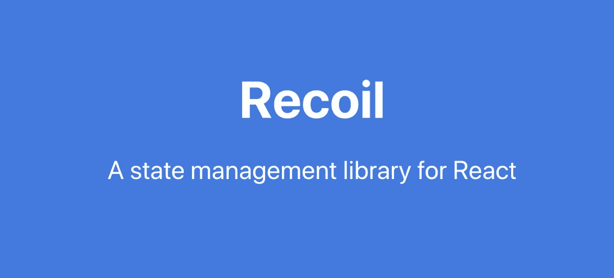

# 带有反冲 JS 和远程 API 的 CRUD

> 原文：<https://medium.com/geekculture/crud-with-recoiljs-and-remote-api-e36581b77168?source=collection_archive---------5----------------------->

[反冲 JS](https://recoiljs.org/) 是由脸书团队开发的 React 的现代状态管理库。你可能会问“另一个状态管理库？我用 Redux 搭配 Redux 工具包。为什么我需要别的东西？”。答案很简单。对于一个简单的带有 Redux Toolkit 的 CRUD 应用程序，你必须写大量带有 reducer、actions、extra reducers 等的代码。有了反冲 JS，一切都简单了。在本文中，我将向您展示如何使用 React+reschi rjs 创建一个 CRUD 应用程序，并将其与后端集成。

# 反冲核心概念

## [原子](https://recoiljs.org/docs/basic-tutorial/atoms)

原子是国家的一部分。您可以获取它的值并为其设置值。

## [选择器](https://recoiljs.org/docs/basic-tutorial/selectors)

选择器是派生状态的一部分。像原子一样，你得到并设定它。

## [异步选择器](https://recoiljs.org/docs/guides/asynchronous-data-queries)

选择器也可以表示承诺的结果。例如，获取数据的 API 调用可以包装在选择器中。

对于从异步选择器呈现数据，您需要用`React.Suspense`包装您的组件，因为在呈现开始时可能不会加载数据:

我建议你阅读官方网站[https://recoiljs.org/docs/basic-tutorial/intro](https://recoiljs.org/docs/basic-tutorial/intro)的所有文件。这将花费您大约 15 分钟的时间，这些文档非常容易阅读。

# 获取数据

使用异步选择器，您可以轻松地从后端获取数据。但是你不能修改这个数据，你需要把它存储在某个地方。对于这种情况，反冲提供了一种有趣的技术:传递一个异步选择器作为原子的默认值。

选择器从 API 加载数据，atom 存储数据。就这样，没有动作或突变，只有 9 行代码。

# 创造

对于一个新的行业创建，我们需要将数据发送到后端，并将响应添加到行业状态数组中。我更喜欢把可重用的代码包装成钩子。因此，让我们创建一个钩子来对`industriesState`执行修改操作:

# 更新

同样的更新方法，但我们不是添加，而是用新的行业替换阵列中更新的行业:

# 删除

为了删除，我们只过滤行业:

# 把所有的放在一起

现在我们得到了所有 4 个 CRUD 操作:

# 结论

库必须简化开发者的工作，而反冲 JS 做到了这一点。目前，它还处于实验阶段，但我很确定这个图书馆有一个美好的未来。

今天就到这里吧！如果你有任何问题，不要犹豫，写在评论里。

*下次见！Servus！*