# 普通 JAVASCRIPT 的 CRUD

> 原文：<https://medium.com/geekculture/crud-with-vanilla-javascript-ff1f54e93cf5?source=collection_archive---------0----------------------->

作为一名开发人员，在构建 web 或移动应用程序时，您一定已经达到了想要创建、读取、更新和删除数据的程度。

数组和对象之类的东西用来保存用户的动态数据。能够存储和更新这些数据对于正确控制数据的使用非常重要。

在这里，您将看到并学习如何使用我们将使用普通 JavaScript 构建的 Product_List_App 对表单输入数据执行 CRUD 操作。

让我们创建我们的产品列表应用程序文件。你可以使用任何你喜欢的 HTML 编辑器，但是我在这个课程中使用 visual studio 代码(vscode)。

在编辑器中打开一个新文件夹，命名为 Product_List_App，在里面创建一个文件，命名为 product.html。进入我们在上面创建的 HTML 文件来添加它；

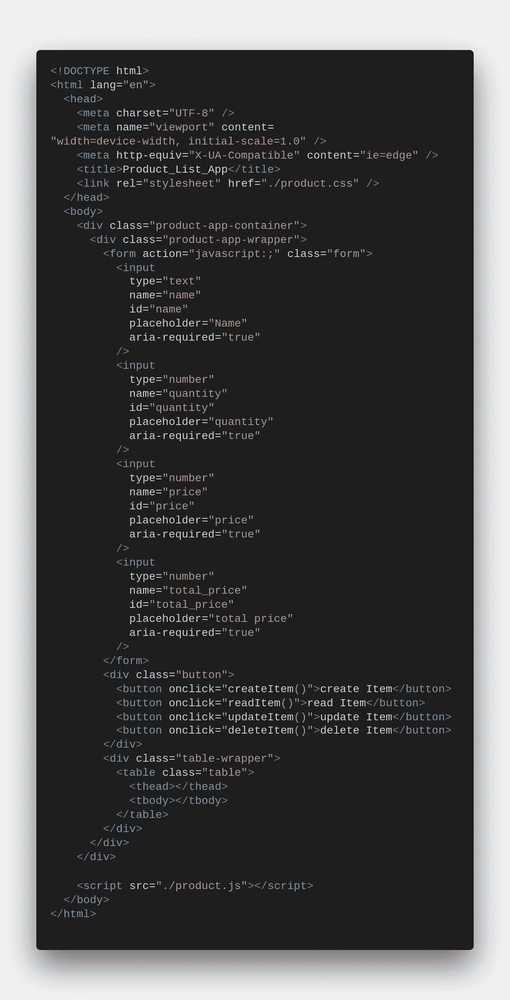

HTML file for the production list app

上面我们已经创建了一个 HTML 文件，打开了一个表单，并为用户值添加了输入，我还为 input 元素添加了一个占位符和 name 属性，以便进行适当的说明。在输入元素中，还添加了一个 id 属性，这将使我们能够动态地获取输入元素的值。

我们还添加了包含我们所有产品的 table 元素、一个 table head 元素，并且创建了一个表体，它将被动态地添加值。

就在结束 body 标记之前，还添加了一个包含 SRC 属性的 script 标记，该属性包含 JavaScript 文件的路径，这是因为我们将在这个项目的构建中使用外部 JavaScript 文件。这是上面 HTML 文件的浏览器视图。

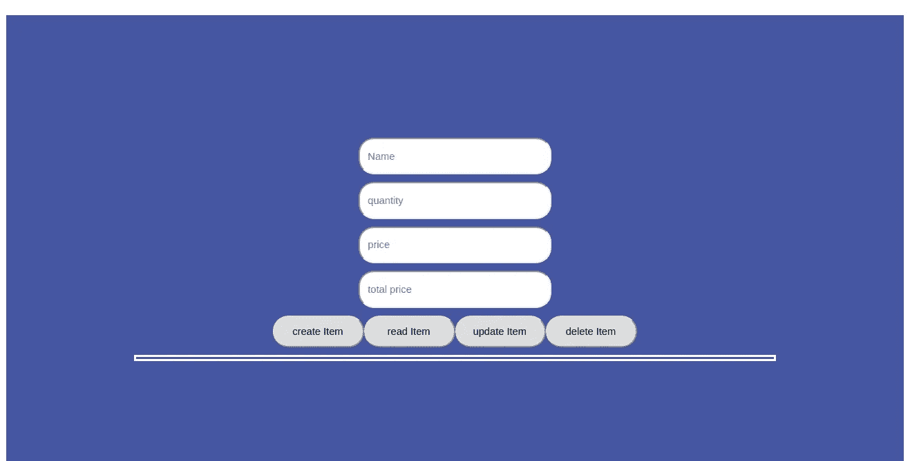

The browser look of the HTML

添加了一点 CSS 样式，使事情看起来简洁明了。

在 Product_List_App 文件夹中，我们创建了一个 JavaScript 文件，将其命名为 product.js。在该文件中，我们将存放 Product_List_App 的所有算法。

此时，您的文件夹应该分别包含 product.js 和 product.js。现在让我们声明所有的全局变量。转到我们创建的 product.js 文件中添加它；

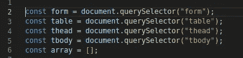

The global variables

进一步来说，我们将有八个函数可以使用。这些功能如下:

*   createItem 函数，
*   总价格函数，
*   表头功能，
*   表体函数，
*   readItem 函数，
*   表功能，
*   updateItem 函数，
*   删除项目函数。

# 创造产品

现在让我们转向 createItem 函数，在我们已经创建的全局变量下面，让我们添加 createItem 函数。

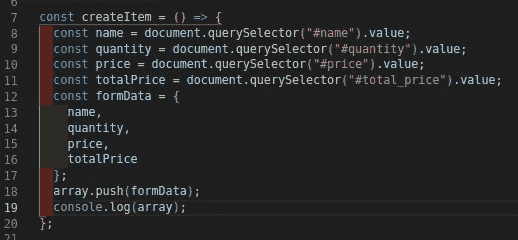

The function that adds the form values to the array

在上面，我们已经声明了所有的函数变量，document.querySelector 用于分别获取所有的值。由于我们要存储所有这些值，并且能够处理这些值，这些值被设置为一个对象，现在将这个对象放入我们在上面的全局变量中声明的数组中。

createItem 函数是在我们创建的 HTML 文件中的 create item 按钮中执行的。

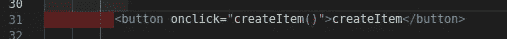

Executing of createItem function

现在，让我们前往浏览器控制台，看看阵列中有什么:

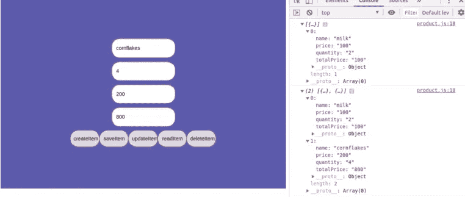

The Product List

上面我们首先添加了一个项目是牛奶，控制台给了我们一个牛奶属性的数组。其次，我们添加了另一个条目，即玉米片，这一次数组包含一个对象的两个实例，该对象包含我们的条目。更进一步，这是物品将继续被添加到数组中的方式。

总价格输入包含数量值和价格值的乘积。如果我们仔细观察上面的 createItem 函数，我们在这里只有一个小挑战，我猜你可能没有注意到，尽管如果你能够自己添加项目的准确总价，这不是问题。

让我说清楚。查看上面的 createItem 函数，我们的项目的价格和数量的乘积不会自动设置在总价格输入中，毫无疑问，如果不固定，我们很容易对总价格进行错误计算，这是我们根本不想参与的。让我来给我们省点压力吧。很快，让我们在下面的总价输入上添加我上面提到的 totalPrice 函数；

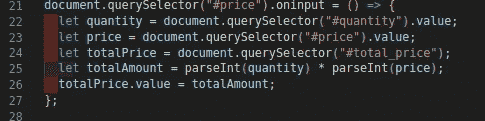

Giving the total price input its value on lookup on price input

这里，在价格输入上附加了一个 oninput 函数，它总是查找数量输入来进行计算，然后将值传递给总价格输入。这将使我们不必为避免总成本价计算错误而增加总价格输入值。现在，我们正在接受我们的价值观，让我们进一步拯救这些价值观。

## 拯救产品

这就给我们带来了一个强大的浏览器 API 叫做 [***本地存储***](/@princewillchime43/local-storage-with-vanilla-javascript-c87e3923163a?sk=85673734d89b5926166023b806067643) 。这给了我们在浏览器上存储和持久化数据的能力。让我们将它添加到上面创建的 createItem 函数中。

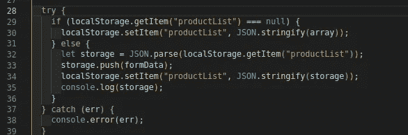

Using the try and catch method to save and persist items to the local storage

上面应用了试捕法。它是一个条件语句，检查给定的算法是否正确，如果不正确，它会向控制台捕捉一条错误消息。

在 try curry 大括号内，使用了一个条件语句来检查商品是否已经保存到本地存储，如果没有，商品列表将被设置到本地存储。如果是，新的表单数据将被添加到本地存储的现有列表中。目前，只要单击上面的“创建项目”按钮，所有表单数据都将保存到本地存储中。

如果您正在学习本课程，您的“创建项目”函数应该如下所示:

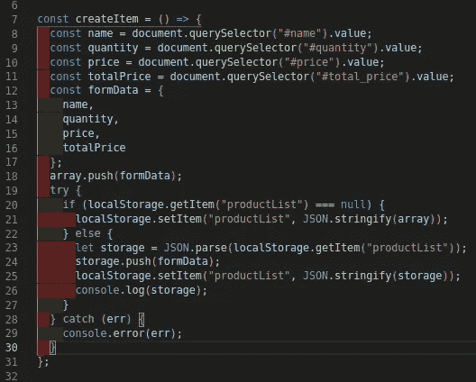

The createItem function

现在让我们看看我们的本地存储目前的情况:

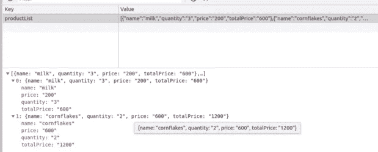

Product list that was saved to the local storage

通过以上操作，我们已经成功地将一些项目保存到本地存储中。

另一方面，每当单击 create item 按钮时，它总是将数据提交到本地存储，无论是否为空对象。因此，让我们转到 createItem 函数，并在将它提交到本地存储之前添加一些验证。将被添加到 create item 函数中的 const 赋值之后。

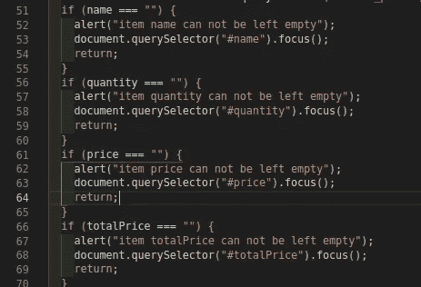

Form authentication for the product lists before saving to the local storage

这里，我们已经成功地验证了产品列表的表单输入数据。在上面的示例中，我们检查了输入值是否为空，如果为真，将弹出一个警告，指示未填充的特定输入，并立即关注该输入以快速填充空输入。

# R-阅读产品

我们将在这里显示我们的项目，这些项目将保存到我们在上面的 HTML 文件中创建的表的本地存储中。现在让我们创建上面提到的 tableHead 函数。

## 表头功能

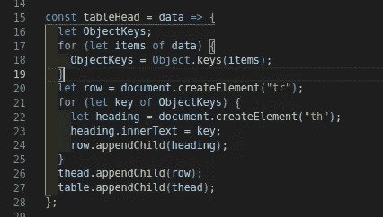

The function that takes care of the table headings

上面是一个读取表格标题数据的函数，这些数据将很快显示在浏览器上。它需要一个参数来查找要访问和使用的对象数组。

Object.keys()是一个为我们提供对象键功能的方法。更多关于物体的阅读 [***这里***](/learnfactory-nigeria/constructors-prototypal-inheritance-and-es6-classes-b54a5aad8f62?source=friends_link&sk=c2af11e4df62886386be59ccca94b916) 。document.createElement 帮助我们创建动态 HTML 元素。在我们的例子中，我们用它来创建表格的行和标题元素。table 元素的标题将保存产品列表数组中存储对象的键。

## 表体功能

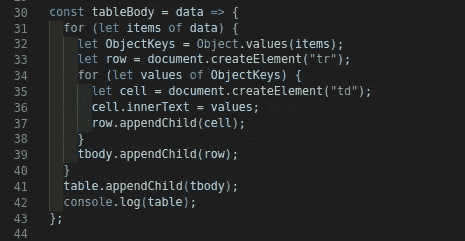

The function that handles the table body function

这是一个查找要访问的对象数组的函数，就像我们上面创建的 table head 函数一样，除了 Object.value()方法之外，其他都保持不变，该方法使我们可以访问对象值和分别保存表体数据的单元格。接下来让我们创建上面提到的 readItem 函数，它将显示我们的数据，这样它就可读了。

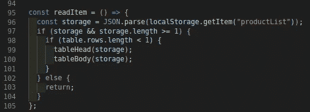

The function that handles the readable data

上面是一个函数，它显示本地存储中的数据以提高可读性。让我们看看刚刚发生了什么。首先声明一个名为 storage 的变量来保存本地存储数据。其次，进行了一项检查，以了解本地存储是否保存了将要显示的任何数据

最后，进行最后一次检查，以了解存储数据是否已经加载到表中。如果是，表格保持不变。如果否，数据将被加载到表中。

上面创建的表头和表体函数在 readItem 函数中执行，以使数据的键成为表的标题，数据的值成为单元格的值。

readItem 函数是在 HTML 文件中创建的 read item 按钮上触发的，如下所示:

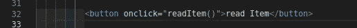

更进一步，所有尚未创建的函数将分别在它们的按钮中被调用。现在让我们看看当我们触发 read item 按钮时，我们的表是什么样子的

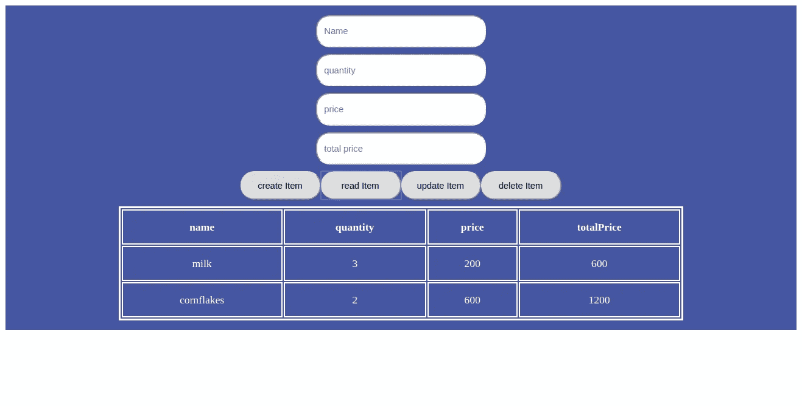

The product lists now readable

哇！我相信这太棒了,“阅读项目”按钮让我们看到了显示在桌面上的产品列表。现在让我们看看并学习如何更新本地存储中的数据

# 更新产品列表

在更新表数据之前，我们应该指定将要更新的实际项目。这将使我们现在创建之前提到的表函数。因此，让我们将以下代码添加到 product.js 文件中:

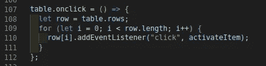

The table function that will handle the user’s click on the table

在这里，一个 on click 函数被添加到创建的表中，表中的行被获取并分配给上面截图中声明的行。

我们删减了表中的行，以便能够管理每一行数据，最后添加了一个事件监听器，监听表中每一行的 click 事件。

一个函数作为事件侦听器的第二个参数传递，该函数名为 activateItem。该函数将处理每一行被单击时发生的情况。下面让我们添加 activateItem 函数；

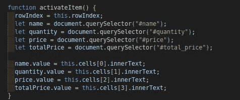

Function to get the product lists activated

在上面的截图中，声明了一个变量，当被点击时，该变量将保存被激活项目的索引。因为我们希望更新项目，所以被单击的行将被设置回表单字段进行编辑。

既然我们已经成功地将激活的条目返回到表单字段，接下来就是用更新后的条目更新本地存储数据并重新加载页面。

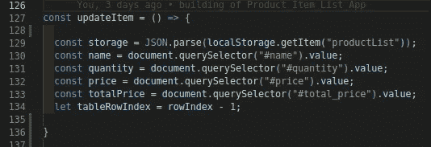

Our Update function

之前，我们已经成功地编辑了激活更新时的产品列表。上面我们得到了存储数据，声明了保存表单输入值的变量，并声明了保存将被单击的项的索引的表行索引变量。

让我们进一步验证这个表单字段，以确保我们不必将空字符串更新到本地存储，并确保用户已经单击了将被更新的项目。下面让我们用验证更新上面创建的 updateItem 函数；

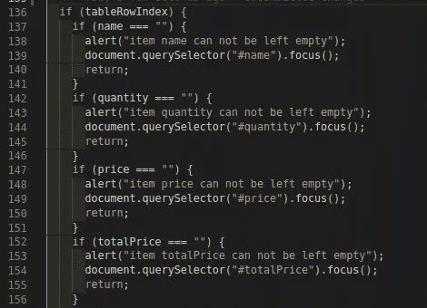

Validating Of The Form Fields

这里，我们已经成功地验证了产品列表的表单字段。在上面的示例中，我们检查了用户是否激活了将要更新的条目，还检查了输入值是否为空，如果为空，将弹出一个警告，指示未填充的特定输入，并立即关注该输入以快速填充空输入。

在调整表单输入值后，弹出一个确认警告会很好，为什么？以防用户记得在最终将数据更新到本地存储器之前仍然进行一些其他改变。该权限将被授予用户。所以让我们在上面声明的 updateItem 函数中添加警告框；

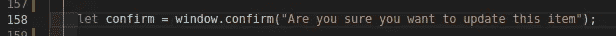

Creating a confirm alert for the user on update

上面我们已经创建了一个窗口警告框，每当点击更新项目按钮时总是弹出。向确认括号传递了一个文本，该括号包含用户阅读并确定更新过程是否应该继续或取消更新过程的消息。

现在我们有了确认警告框，如下图所示；

The Alert Box for confirmation

让我们进一步将编辑过的项目更新到下面的本地存储中；

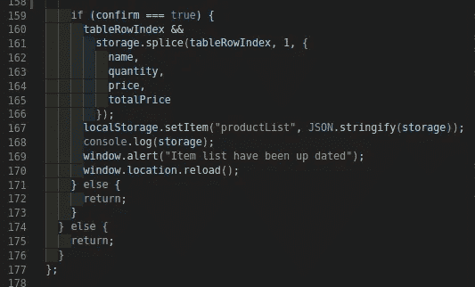

Updating The Edited Item To The Local Storage

在上面的截图中有一些事情需要注意，这些事情是应用的 tableIndexRow 和 splice()方法。

只有当 confirm 为 true 时，才会执行 updatedItem 函数。拼接方法是用存储中的旧项目更新最近更改的方法。

注意:***array . filter()***也可以用于本地存储的数据更新

splice 方法用于将索引相同的项目与用户想要更新的项目的索引进行拼接。然后页面会被刷新。下面是此时本地存储的样子

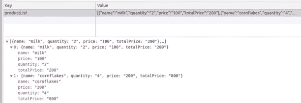

This is the JSON format of our product lists

让我们更新本地存储中已有的内容，看看它是如何工作的，方法是添加一个像面包这样的项目，并将玉米片项目更新为糖。

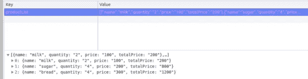

The local storage has been updated with the sugar item and we added the bread item as said earlier. the length has updated to 3 currently table has been successfully updated with the recent change

我相信这很好。让我们来看看 delete item 函数，看看事情是如何完成的。

# D-删除产品

很多时候，在录音时，你会希望有一些/一张唱片不再出现在你的录音列表中。你会在一瞬间学会，并且能够自己做。让我们快速创建下面的 deleteItem 函数；

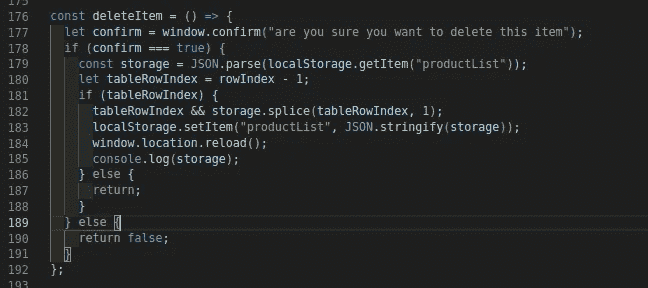

The function that handles the deleting of an individual item in our product lists

在上面的截图中，我们已经创建了前面提到的 deleteItem 函数。在 deleteItem 函数中，我们有一个弹出窗口，用户在从存储中删除任何产品项目之前必须确认该窗口。

我们还检查并确保用户已经激活了一个特定的项目，我们在存储中查找与被点击的项目在同一索引中的项目，并将其从本地存储中删除。之后，页面将重新加载。

注: ***Array.find()*** ， ***数组。Filter()*** 和 ***include()*** 也可以用来执行删除操作。

让我们通过尝试删除糖项并保留牛奶和面包项的存储数据来尝试这个函数。

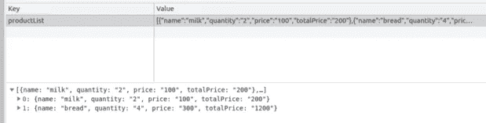

Our storage items after deleting the sugar item current product item after deleting the sugar item

你的 HTML 文件应该是这样的

The complete HTML file for the product list app

您的 product.js 文件也应该是这样的；

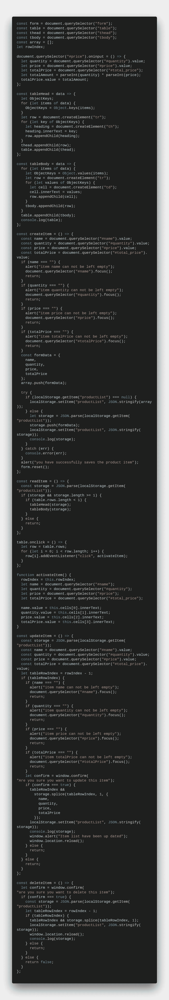

The product.js file

很简单，对吧？至少您现在可以使用本地存储持久化和执行 CRUD 操作。

如果本课程对您有帮助，您可以分享和推荐，或者如果您有任何与本课程相关的问题，您也可以放弃下面的问题。

可以关注我***M***[***edium***](https://medium.com/u/ca30ca69cc7e)***。t***[***witter***](https://twitter.com/cprincewill102)和***L***[***inkedin******。*** 为本课程全部代码，](http://www.linkedin.com/in/chime-princewill-3a2b1b192)*[***我这里是***](https://github.com/chibuike07/product_item_list_app)*