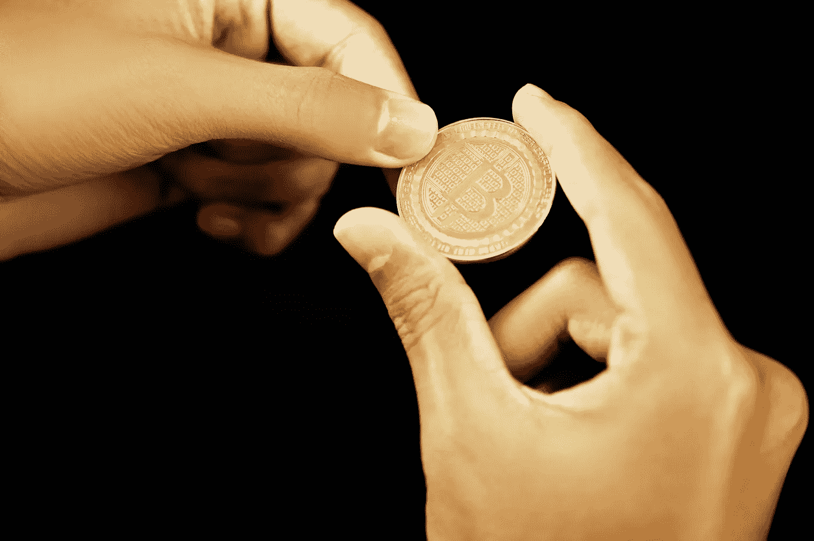

# 加密的采用正在上升

> 原文：<https://medium.com/geekculture/crypto-adoption-is-on-the-rise-c9b435437eaa?source=collection_archive---------13----------------------->

## 证据在这里！

Photo by [Executium](https://unsplash.com/@executium?utm_source=unsplash&utm_medium=referral&utm_content=creditCopyText) on [Unsplash](https://unsplash.com/s/photos/crypto-use?utm_source=unsplash&utm_medium=referral&utm_content=creditCopyText)

据我所知，很多人只在比特币创下历史新高时才听说加密货币，特别是在接近峰值时，因为这是新闻中有很多关于它的嗡嗡声的时候，人们担心错过现在，甚至那些不太相信比特币或对它一无所知的人也开始对它感兴趣，因为围绕这个主题制造的炒作。

现在呢，加密技术的应用正在增加吗？有多少人知道比特币，加密货币有多主流？

# 统计数据说明了什么？

根据 businessofapps.com[的数据，如果我们对谷歌做一点研究，我们会发现在最大的密码交易所，如比特币基地或币安，我们在 2021 年有以下数量的用户:](https://www.businessofapps.com/)

*   比特币基地拥有 5600 万用户，而 2019 年为 3000 万，2017 年为 1300 万
*   币安拥有 2860 万用户，而 2019 年为 1950 万，2017 年为 150 万

其他统计数据显示，在牛市周期接近尾声时，比特币基地等交易所的用户数量增长更快。这证实了我在介绍中所说的话。在那个时代，对密码市场潜力的认识可能会变得更加强烈。

在 chain analysis 的[博客上，这是一家数据分析和数据研究公司的博客，仅在去年，从 2020 年 7 月到 2021 年 6 月，加密货币的采用在全球范围内出现了 880%的惊人增长。](https://blog.chainalysis.com/)

总部位于新加坡的一家名为 [TripleA](https://triple-a.io/crypto-ownership/) 的公司提供全球加密货币所有权的统计数据。为了有一个更好的视角，我们看到大多数加密货币所有者在印度(1 亿)。第二名是美国(2700 万)，第三名是尼日利亚(1300 万)。

据[statista.com](https://www.statista.com/statistics/647374/worldwide-blockchain-wallet-users/)报道，全球区块链钱包用户数量从 2014 年 1 月的 100 万人持续增长至 2021 年 1 月的 6600 万人。这是在大约 7 年的时间里增长了 6600%。

我敢说这是相当不错的增长！

# 加密货币正在成为主流吗？

我不确定加密货币现在是否会成为主流。嗯，它们是主流，至少对那些对加密空间感兴趣的人来说是这样，对其他人来说不是。一旦人们开始更多地将加密货币用作支付手段，而不是资产储存或仅用于投资目的，它们肯定会成为大众的主流。

我很有信心，加密货币很快就会成为主流，特别是因为现在，当区块链上有比以往更多的附带项目，涵盖许多活动领域时，元宇宙将逐渐改变我们的生活方式，而加密货币将改变我们支付的方式以及我们看待和使用货币的方式。

我们正处于社会大变革的开端，类似于计算机和互联网刚刚开始被大众接受时人们生活的时代。