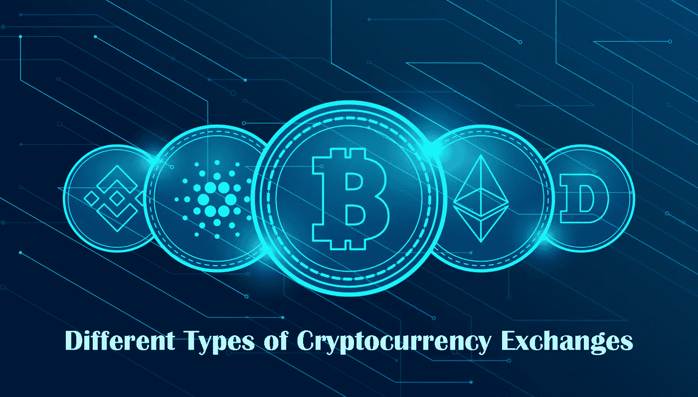
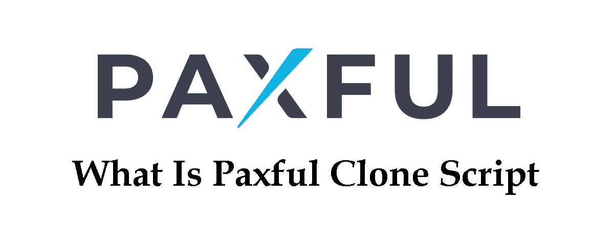
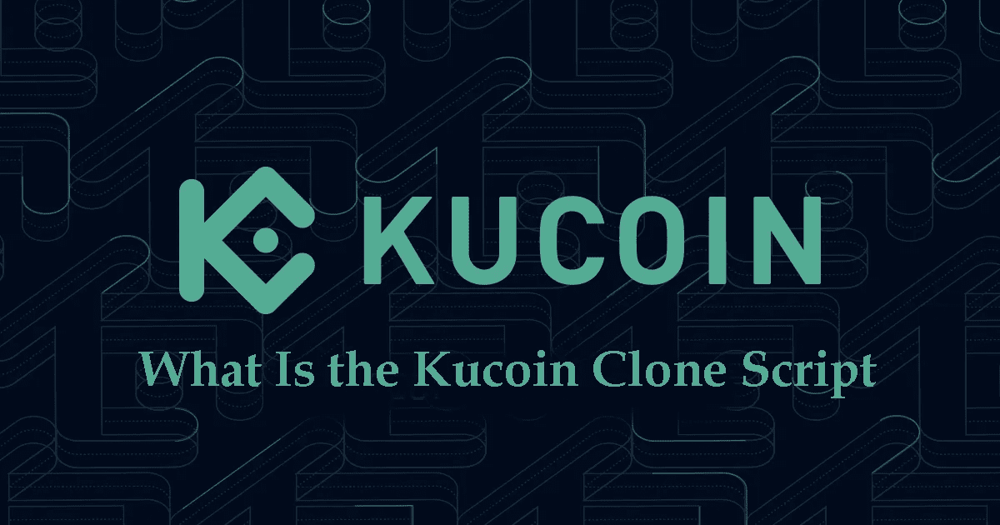

# 加密交换克隆脚本-前 7 名白标加密货币交换克隆脚本

> 原文：<https://medium.com/geekculture/crypto-exchange-clone-script-top-7-white-label-cryptocurrency-exchange-clone-scripts-6fafb8e4ddf0?source=collection_archive---------13----------------------->

众所周知，加密货币兑换克隆脚本是开展加密货币兑换业务最安全、最具成本效益的方式之一。还有其他方法，如加密交换脚本 GitHub 来启动您的交换。但是我们不建议这样做。为什么？因为缺乏安全性、不可靠的代码、昂贵的方式、缺乏客户支持等原因。然而，许多创业公司正在寻找一个免费的加密交换克隆脚本。

我们向这部分人推荐 GitHub，但是如果你正在寻求业务上的成功，并且你不希望在你的面前有一个障碍，你应该将你的加密货币交易所的开发委托给一个可靠的加密货币交易所软件开发公司。

在本文中，我们将描述 7 个最好的交易所和它们的克隆脚本，最后介绍一个加密交易所脚本开发公司。因此，如果你正在寻找[***最好的加密交换克隆脚本***](https://radindev.com/binance-clone-script/?utm_source=medium&utm_medium=referral&utm_campaign=medium&utm_content=crypto_exchange_clone_script)

和我们在一起。

第一步，我们解释了加密货币交易的类型。

# **不同类型的加密货币交易所**

**集中式:**集中式交易所由单一组织管理，便于将美元等法定货币转换为加密货币。或者，分散的交换分配促进和验证各种类型的加密交换的责任。

分散化:分散化交易所的目标是在没有中央政府参与的情况下运营。这意味着平台运行在不包含任何资源、信息或数据的区块链上，但允许用户之间进行交易。使用智能合约，分散式交易所产生了一种叫做“代币”的东西，它代表了一种提供用户间交易机会的资产。

**混合:**混合交易所结合了集中交易所和分散交易所的优点——提供集中交易所的高流动性和快速交易，以及分散交易所的匿名性和保护。由于这些好处，混合交易所在计划推出加密交易所的交易商和企业中越来越受欢迎。

根据上面的文字，选择合适的交易所取决于你。集中式交换提供了访问的便利性和可靠性，而分散式交换有助于增强隐私。两者都有各自的好处和顾虑。但如果你选择其中任何一个，你应该从最好的加密货币交易所开发公司获得加密交易所软件。他们负责从开发、设计、测试和部署的一切，让您只关注定制部分。为您的企业购买和部署分散式 exchange 软件有许多好处。

在本节中，我们将描述 7 大加密货币交易所及其克隆脚本。

# **7 大白标加密货币交易所克隆脚本**

大多数企业家有兴趣像他们一样推出加密交易所的最佳加密货币交易所类型是:

让我们从币安开始吧。

## **1。币安交易所**

[币安](https://www.binance.com/en)是世界上最大的加密货币交易平台，虽然它的诞生只追溯到 2017 年:只是提一个非常明确的数据，今年下半年它的成交额就超过了 13 亿美元这个可观的数字。

可以说，在他们的统计数据中，他们表示他们的生态系统目前每秒管理超过 140 万笔交易，日均交易量价值 20 亿美元。

**币安克隆脚本**

币安克隆脚本已准备好上市，无 bug，经过测试，并有源代码来启动类似于币安的 exchange。币安克隆具有先进的特性和功能，以促进一个强大的交易引擎的无障碍交易，以及直观的用户界面/UX 在短时间内启动加密交换。

## **2。Paxful Exchange**

Paxful 是世界上领先的点对点加密货币市场之一，允许您在私人用户之间买卖加密货币。平台上的操作以托管系统保证的高度安全性而著称。Paxful 于 2014 年在美国诞生，灵感来自两名移民，一名埃及人和一名爱沙尼亚人。如今，该团队在全球 4 个不同地点拥有 200 多名员工，超过 600 万用户，全球业务量达数十亿。

**Paxful 克隆脚本**

Paxful 克隆脚本是现成的网站脚本，100%的源代码，人们可以很容易地建立一个 p2p 交易所，就像 Paxful 一样。该脚本已使用高标准安全功能加密，并基于网络安全协议设计。

## **3。比特币基地交易所**

比特币基地是一个加密货币交易所。这是一个允许用户购买、出售和交换加密货币的平台，无论是现金还是其他数字资产。它是生态系统中最受欢迎的平台之一，已经成为美国最大的平台。它符合高安全标准，并尊重该国的法规。

**比特币基地克隆脚本**

比特币基地克隆脚本的工作方式类似于比特币基地交易所。通过使用这个脚本，您可以在一周内以预算友好的价格创建和部署像比特币基地这样功能丰富的加密交换。

## **4。库币交易所**

通过 Kucoin，你可以用加密货币交易加密货币，这与传统的货币对交易不同。近年来，它也是全球交易者最常用的交易平台之一。Kucoin 提供给用户的界面非常优秀，特别直观。理解如何交易加密货币对非常简单，你很快就会学会如何去做。

**库科恩克隆剧本**

库币克隆脚本是一个网站脚本，已经开发，验证，规划，并随时可以部署。Kucoin Clone 提供了一组非常棒的特性，其中安全性是主要关注点。它具有集中交易功能，可以立即开始使用您自己的交易平台。通过使用这个 Kucoin 克隆软件，你可以在几天内推出一个惊人的中央加密交换，看起来 100%类似于 Kucoin。

## **5。雷米塔诺交易所**

Remitano 是一个比特币交易所，是由 Babylon Solutions Limited 在塞舌尔建立的一种分散式加密货币。你可以在越南盾中买卖比特币和其他加密资产。可以用越南盾交易的资产类型:比特币、以太坊、涟漪、系绳、比特币现金、莱特币。

**雷米塔诺克隆脚本**

Remitano 克隆脚本是一个现成的脚本，具有 Remitano 加密交换中现有的功能、优势、交换选项和安全模块。您只需集成 Remitano 克隆脚本，即可立即安全地启动加密货币交易所网站。雷米塔诺贸易克隆脚本将确保你进入你的目标市场的一套基本功能很容易。

## **6。本地比特币交易所**

LocalBitcoins 是由 Jeremías Kangas 和 Nicholas Kangas 兄弟于 2012 年在芬兰赫尔辛基创建的一家交易所。这是一个平台，其目标是为全球比特币的购买、销售和交换提供服务。LocalBitcoins 的一个突出特点是，谈判是在真人之间进行的，以一种安全和直接的方式进行。也就是说，比特币交易的发生不需要中介。这最终简化了流程并提供了更大的通用性。

**本地比特币克隆脚本**

LocalBitcoins 克隆脚本是流行的加密货币交易所的替代源代码集。LocalBitcoins clone 具有现有 LocalBitcoins 交换平台的架构，其工作方式与之类似。LocalBitcoins 克隆软件的主要目标是，通过流行和独特的功能，帮助企业家快速启动加密交换业务，并最大限度地降低启动成本。

## **7。瓦济克斯交易所**

WazirX 是一家印度加密交易所，允许印度用户在印度买卖比特币和其他 alt。WRX 是 WazirX 的实用程序令牌。WazirX 支持一百多种加密资产，如比特币(BTC)、以太坊(ETH)、Ripple (XRP)、莱特币(LTC)、Dogecoin (DOGE)、币安币等。

**Wazirx 克隆脚本**

Wazirx 克隆脚本是 Wazirx 加密货币交易所的克隆软件。这个脚本遵循了与 Wazirx 相似的序言，但有一些独特的特性。这是一个现成的克隆脚本软件，可以帮助客户立即开始他们的加密货币兑换业务。

# **白标加密交换的优势**

# **哪里可以获得最好的加密交换克隆脚本？**

Radindev 是一家加密货币兑换软件开发公司，致力于开发安全、快速的加密货币交易的加密货币兑换软件。

如果你想创建一个与众不同的加密交换网站，拥有自己的品牌，反映你公司的价值观，在竞争中脱颖而出，你必须计划一笔可观的预算。开发我们克隆脚本的成本从 5000 到 50000 美元不等。根据您的需求和要求增加或减少功能。

此外，在 Radin，除了交易所自己的钱包之外，我们还为您开发了专用的加密钱包。我们还开发移动应用程序。和其他服务，如果您想使用它们的话。我们使用的语言是 Django-Spring 框架- Laravel- Node.js。

此外，如果你创建一个加密货币交换网站，目标是让它被访问。在将访客转化为买家之前，你必须有访客！SEO 优化的工作在于让你的网站在互联网上更显眼，让它出现在特定目标查询的好位置上。这个位置不应该被忽视:有一个好的网站是不够的，它仍然必须在网页上可见！我们为你从头到尾做这件事。

这些是我们在拉丁服务的一些例子。请访问我们的网站了解更多信息，并获得免费演示。