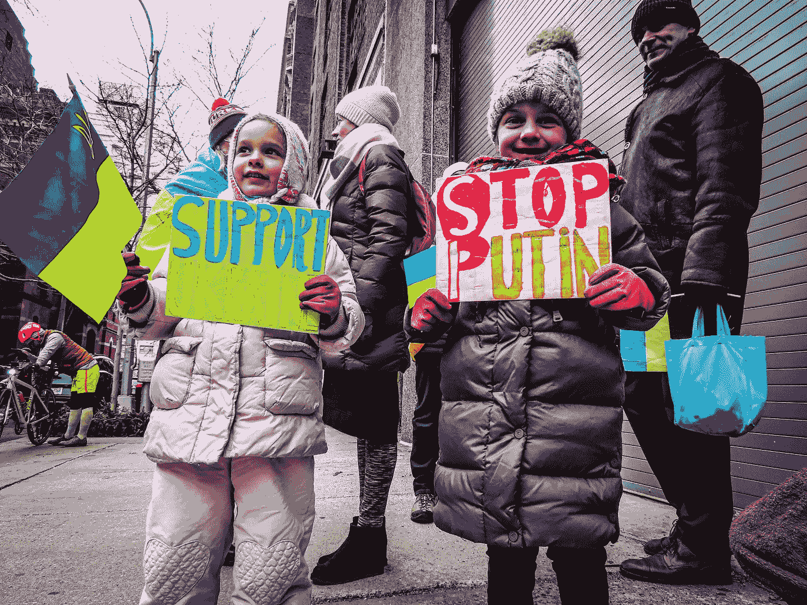

# Crypto 为乌克兰而战

> 原文：<https://medium.com/geekculture/crypto-goes-to-war-for-ukraine-c045d7a21351?source=collection_archive---------3----------------------->

**Image Courtesy of** [**Katie Godowski**](https://www.pexels.com/@katie-godowski-123880480?utm_content=attributionCopyText&utm_medium=referral&utm_source=pexels)

加密货币有史以来第一次被用于人类最黑暗的活动——战争。

战争是由国家领导人领导的，但当一个领导人采取侵略性的行动时，他的人民就会受到指责。我郑重声明，我和乌克兰人民以及俄罗斯人民站在一起。大多数市民想过自己的生活，不想被打扰。