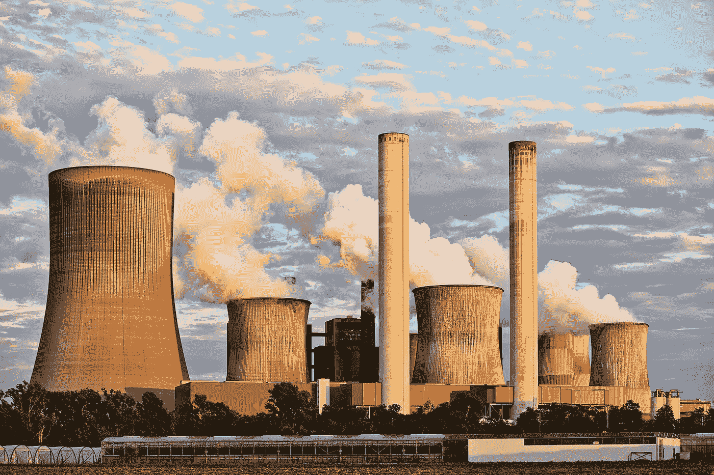

# 加密对环境没有坏处，公司才是

> 原文：<https://medium.com/geekculture/crypto-isnt-bad-for-the-environment-corporations-are-82b65dc1c610?source=collection_archive---------9----------------------->

密码对强盗不好，对小鹿斑比不好

Thanks [Pexels](https://www.pexels.com/photo/air-air-pollution-chimney-clouds-459728/)!

加密货币正在蓬勃发展。更好的是，它在经济上解放了数百万人。

不仅仅是早期投资者。但是艺术家、创作者、程序员等等。

尽管这个行业做了很多好事，批评家们还是坚持一个批评。“加密对……