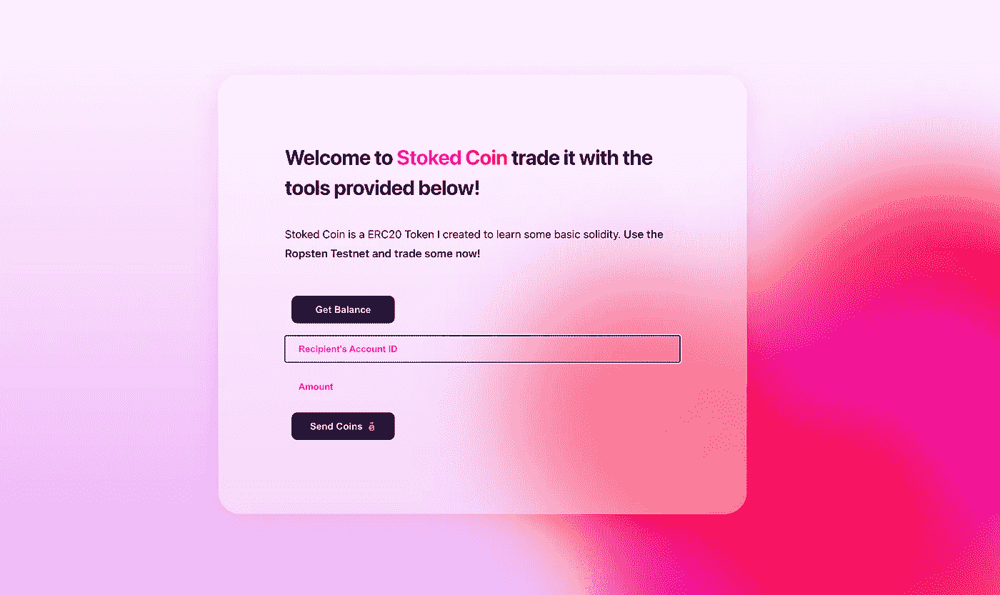
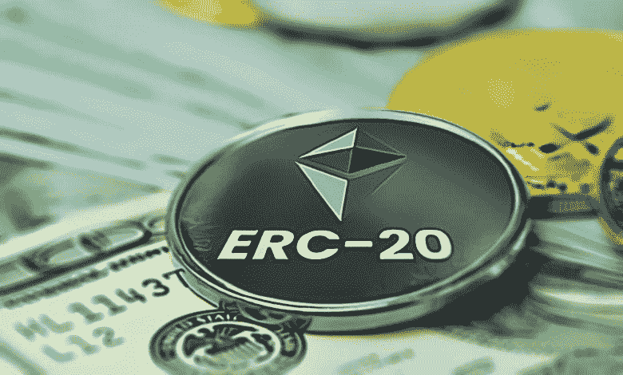
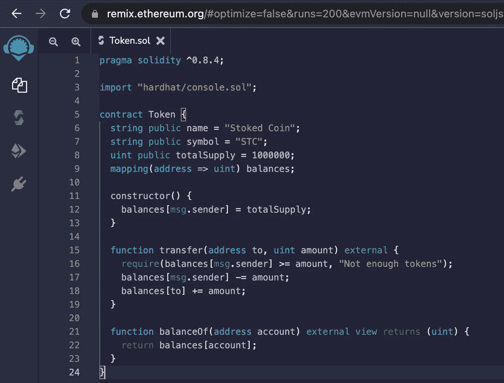
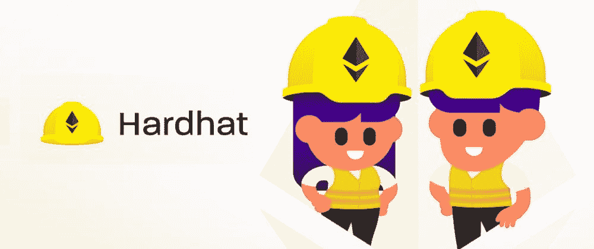
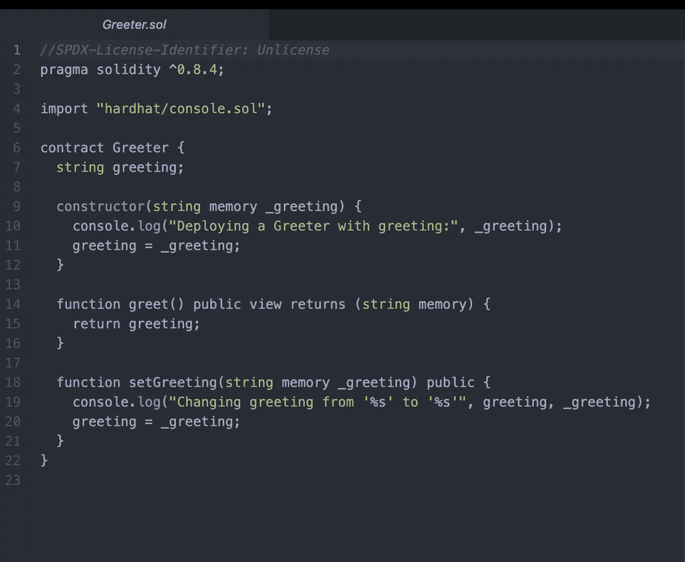
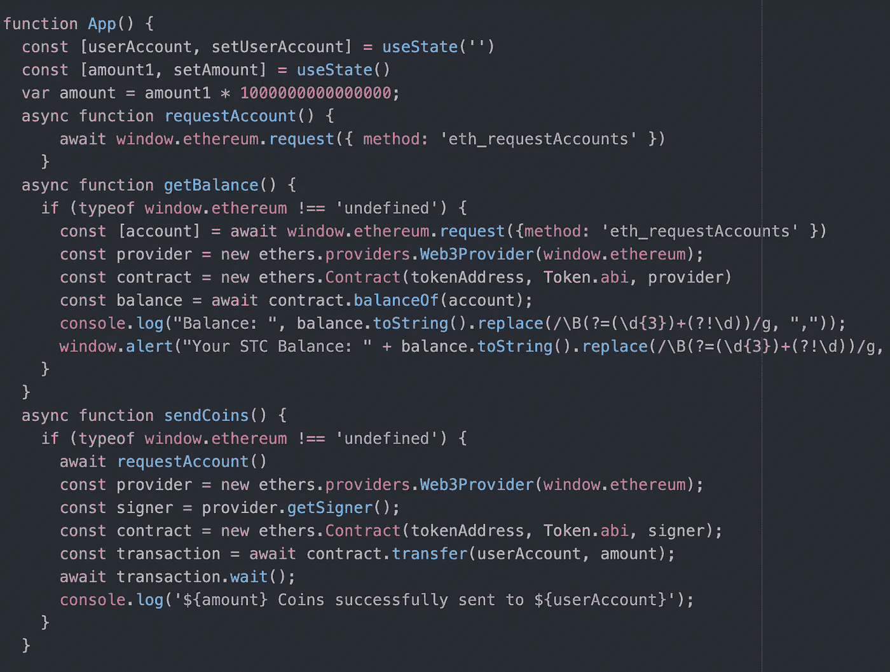

# 加密果酱——用罐子装

> 原文：<https://medium.com/geekculture/crypto-jam-with-a-jar-5e1a8e254d?source=collection_archive---------12----------------------->

## 构建未来

## 构建加密货币，将其部署到测试网，并使用自定义 GUI 与之交互

加密货币是区块链行业的面包和黄油——但它们是什么，它们是如何工作的？通过我关于媒介的文章，我尽我所能通过一个理论化的、简化的镜头来解释构成现代区块链空间基础的本质技术概念。然而，有些概念需要更详尽的、甚至更技术性的概述。因此，在这篇文章中，我决定不仅从更全面的技术角度来解决加密货币问题，而且通过构建自己的加密货币，将其部署到机器本机和 Testnet 区块链，并最终构建一个 GUI 来与所述加密货币进行交互。

[*在这里查看我完成的项目！*](https://stokedcoin.notion.site/Stoked-Coin-bc9dd054343f48adafa09ce93887b648)

## 行话你需要了解🧠

*   ERC20 令牌标准:标准令牌格式，确保在以太坊区块链上发布的每个令牌(在 ERC20 令牌标准的情况下，大多数是加密货币的形式)都与各种 Dapps 兼容，这些 Dapps 是为与以太坊和其他基于以太坊的加密项目进行交互而构建的。
*   智能合同:[这篇文章。](/geekculture/smart-contracts-what-are-they-and-how-do-they-work-2a5de5ec4cab)
*   Dapp:分散式应用——基本上是在区块链上运行的任何应用。
*   共识机制:确保区块链顺利运行和区块链不改变其原始路径的计划。

# 什么是加密货币？在基本水平上

虽然区块链最初是在 20 世纪 90 年代初提出的，但直到 2008 年才出现第一个真正的有形实施——以中本聪比特币的著名形式出现。

由于其独特的区块链绑定原则，比特币在世界商业和经济的海洋中掀起了波澜。它是分散的、不可变的，并且由于被称为工作证明的加密证明系统而具有真正的价值。

工作证明是一种共识机制，通过在区块链上交换矿工创造的价值(在这种情况下，是电力和计算能力)来确保比特币和其他加密项目保持其重要性。今天，区块链行业中使用了许多其他验证机制，但您应该了解的两个主要机制是工作证明(如上所述)和利益证明，这可以通过随机选择机器来从用户池中挖掘新块来节省电力，这些用户已经将 crypto 作为开采机会的抵押品。

正是通过验证机制，加密货币才能在线存在和保值；在区块链出现之前，有人可以无限复制一个 jpg，以至于没有人知道 JPG 的起源——当我们在互联网上讨论货币的概念时，这就变得令人担忧了。如果你可以无限复制你的网上货币，就没有办法验证你的货币是否合法。

总之，加密货币是在线货币，由于它们能够解决著名的互联网版权困境，因此具有实际价值。

# 项目概述

为了比在线研究更深入地探索密码学和区块链的世界，我决定构建自己的加密货币 Stoked Coin (STC)，将其部署到本地和 Testnet 区块链，然后创建一个 Javascript 支持的 GUI 来与智能合约进行交互。以下是最终结果:

这是我的第一个区块链项目之一，起初进展缓慢。我发现，我经常通过自己的方式完成一个项目来学习最好的东西，所以我选择不遵循我项目的任何单一教程，而是试图有机地应用我迄今为止学到的技能来构建项目，而不需要过多参考任何其他东西。这个规则的例外是，我使用了来自[https://georgefrancis.dev/](https://georgefrancis.dev/)的一个优秀的 Pixie.js 教程，用一种玻璃形态设计语言来构建前端美学(乔治·弗朗西斯非常有才华，我建议查看他的作品集和以前的作品)。

# 简短的技术见解

在开始这个项目之前，我建立了一个区块链知识和开发能力的基础，这里是我建议的来源。

*   https://buildspace.so/
*   【https://cryptozombies.io/ 
*   [https://www.learnweb3.io/](https://www.learnweb3.io/)
*   [https://twitter.com/home](https://twitter.com/home)*(哈哈，只要花点时间逛逛 crypto twitter，你一定会学到一些很酷的东西)。*

# 入门指南

在建立了我的知识基础后，我马上投入到这个项目中。

我的第一步是构建一个模型令牌智能合约，以了解加密货币的基本要求；本质上，所有加密货币都必须满足几个参数才能用作加密货币。这些参数包括一个三位数的符号、一个名称、一个供应、一个允许令牌细分的函数(实度数字不会自动实现这一点)，以及一个合同将初始令牌供应发送到的地址。这很容易在 Solidity 中构建，此时您可以将您的契约部署到 Testnet，创建一个 React.js UI 与之交互，并立即开始在帐户之间交换令牌以获得乐趣。

然而，尽管在 Testnet 上是有效的，但是这个智能契约将不会包含使您的新密码在以太坊主网上能够在很大程度上使用的必要代码，而这正是 ERC20 标准发挥作用的地方。ERC-20 标准确保以太坊主网上的所有硬币/代币都与最终用户想要用来与代币交互的各种 Dapps 兼容。

# 构建 ERC-20 标准令牌

使用开放的[zeplin ERC20 预设，](https://docs.openzeppelin.com/contracts/3.x/erc20)可以轻松创建 ERC20 标准令牌智能合约，您可以将该预设弹出到 Remix(一个带有内置 GUI 的在线实体编辑器，可与 ERC 20 令牌进行交互)上的文件中，稍加编辑，然后将其部署到区块链。一旦您将令牌部署到 Testnet，Remix 会将合同地址传送到内置的 GUI，您可以继续在 Etherscan 上查找您的合同！最后一步是将令牌发送到您的钱包地址，这可以通过 Remix 提供的 GUI 轻松完成。

# 有趣的部分

在你建立了你的加密货币之后，剩下要做的就是玩它；把它发给你在测试网上的朋友，让他们发给他们的朋友，等等*。*

如果你正在使用 Metamask 这样的钱包，发送和接收加密的功能已经被嵌入到它的 UI 中，但是知道如何构建一个 UI 来与加密项目或 DAPP 交互仍然是一项有价值的技能，所以让我们快速地概述一下基础知识。网上有大量视频介绍了构建与令牌交互的 UI 的细节，从 0 到 100 不等，所以我将快速总结一下。

# 技术堆栈和快速代码解释

第一步是弄清楚您将在什么样的开发环境中工作:我喜欢 hardhat，因为它很容易通过终端使用，所以让我们假设我们正在使用它。

如果您的 Hardhat 环境设置成功，您将进入一个快速入门指南，它会引导您进入一个示例项目文件夹。示例项目是一个小的 solidity 程序，当连接到它的 App.js 和部署脚本时，console.logs 一个预设的文本字符串，每次您加载程序。有趣但没什么用。删除 Greeter.sol 文件。实际上，因为我们已经通过 Remix 向区块链发布了令牌合同，所以我们的合同文件夹中不需要任何东西。

*删除文件*🙄

## 构建您的用户界面

虽然您需要做许多内务工作来准备您的项目在 Testnet(或 Mainnet)上的启动，但是这个项目中唯一的另一个重要步骤是构建 Javascript 代码来与令牌契约进行交互。

在 App.js 文件中，你至少需要三个主函数:一个 App 函数、一个 getBalance 函数和一个 sendCoins 函数。

*   在 App 函数中，您需要做的只是请求用户的元掩码帐户，然后在文本字段的输入中创建一个变量，以接收您要向其发送令牌的钱包的地址，并使用 big number 变量将令牌的单位大小设置为 1.0。
*   在 getBalance 函数中，您读取令牌契约并在用户的元掩码钱包中识别它，然后提醒用户他们的当前余额。
*   最后，sendCoins 函数请求用户的帐户，验证他们是否签署了合同，然后将我们在上面创建的变量传递给函数，并将指定数量的加密发送到选择的地址。

# 人群疯狂了🎉

维奥拉，你现在是一个专业的加密专家…不完全是；这是一个非常肤浅的解释。我写这篇文章的目的不是让你掌握立即开始构建区块链项目所需的所有开发技能，而是向你介绍在区块链开始构建所需的技术堆栈和不同术语的基础知识。以及在技术层面上解释我们称为加密货币的复杂链上系统。

# 让我们回顾一下

1.  加密货币包含受区块链约束的原则，如去中心化、不变性和验证机制，这些原则沉淀为其保持在线价值的独特能力。
2.  验证机制是依靠网络上不同节点在区块链上传递事务的系统。这些验证机制中最流行的两个是工作证明和利益证明。
3.  构建加密货币的过程相当简单，这就是为什么在投资加密货币时，做好研究是至关重要的。一些硬币有合法的团队在幕后工作，继续建设他们的项目和围绕它的社区的价值，而其他密码是在某人的地下室一个小时的空间内建造的，在他们设法招揽的最初炒作之外没有未来。
4.  如果您对 React.js 和 Javascript 等前端语言有足够的经验，为区块链构建的 DAPPs 可以很容易地集成到 Web2 开发环境中并与之交互。

我希望你在阅读这个项目时发现的价值和我在建造和写作时发现的一样多。我鼓励你去查阅一些教程，自己尝试这样的项目，因为没有比经验更好的老师了。干杯！