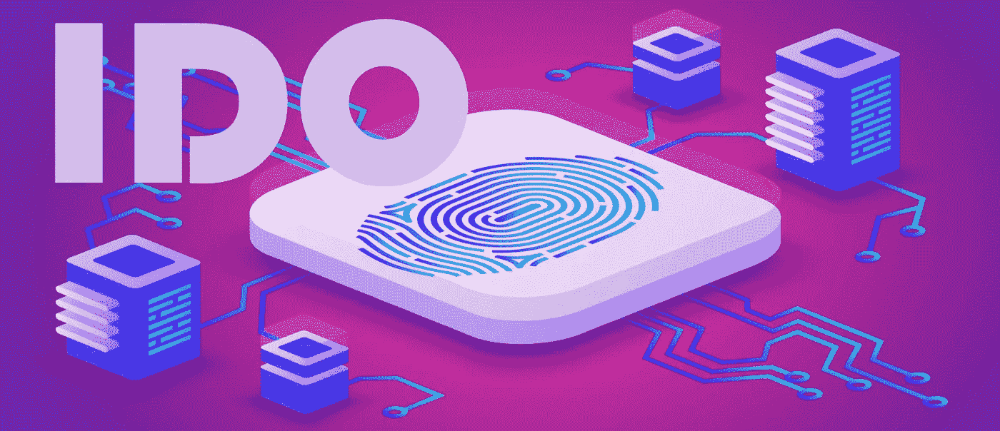
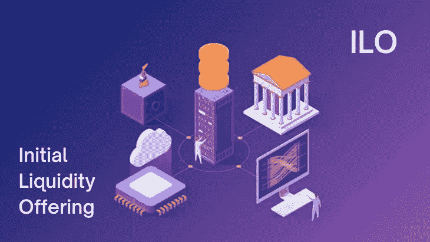

# 加密发射台开发:在开发发射台平台之前你需要知道的一切

> 原文：<https://medium.com/geekculture/crypto-launchpad-development-everything-you-need-to-know-before-developing-a-launchpad-platform-d916031c06de?source=collection_archive---------6----------------------->

加密发射台为投资者提供了巨大的阶梯，帮助他们选择潜在的投资项目。初创公司和基于密码的企业可以通过众筹平台轻松接触到投资者。通过接近加密发射台，他们成功的可能性最大化。

加密发射台是传统众筹过程的完美副产品。在深入研究采用一个 [**白标发射台开发服务**](https://www.appdupe.com/white-label-launchpad-development) 之前，这里有一些你需要了解的关于与之相关的不同加密发射台的信息。这个博客将会在探索企业家可用的不同加密发射台解决方案上引人注目。

# 加密发射台工作的熟练程度如何？

加密发射台是虚拟平台，各种处于早期阶段的加密项目可以在这里展示。初创公司和公司可以接触这些加密发射台，列出他们的项目。加密发射台是项目寻找潜在投资者筹集资金的门户。在产品上市之前，早期销售对投资者来说是一个很便宜的价格。启动加密项目的成本要低得多，这也是为什么几个项目都在使用加密发射台的原因。

launchpad 是令牌和即将到来的项目的最终目的地。在这里，它们甚至在上市前就可以出售了。启动平台确保投资者和项目的高度安全性，因为他们遵循项目的严格审查流程。它们是吸引投资者注意力的重要工具，也将在很大程度上扩大流动性池。

# 密码相关项目的流行筹资模式

## 首次发行硬币(ICO)

[**首次公开募股**](https://www.appdupe.com/ico-development) 对几个项目来说是一个很好的开始，他们也为筹集资金提供了很好的支持。这已经成为一些创业公司的支柱，并使他们的梦想成为现实。这个筹款平台将允许投资者以加密货币、法定货币或平台的本地代币的形式投资他们的资金。作为回报，投资者将获得等量的代币或公用代币。这种筹资模式优先考虑应用分散融资的方式。

## 首次交易所上市(IEO)

最初的交换提供模式为项目提供了更多的优势，因为它们是通过交换注册的。通过这种模式，公司可以通过大型网络筹集资金。即使和 ICO 差不多，但两者差别不大。在 ICO，项目业主将参与筹集资金，而在 IEO，资金是通过第三方平台筹集的。希望在交易所平台进行众筹的公司应首先支付上市费，交易所平台的投资者可以参与 IEO 活动。

## 首次 DEX 发行(IDO)

[**首次公开募股**](https://www.appdupe.com/ido-development) 是创业公司筹集资金的一种新的可靠方式。这是一种有效的分散融资方式。这些创业公司正在为他们即将到来的分散项目筹集资金。它不仅是一个可靠的平台，还有助于开展整体活动。它提供了正确的平衡，并保护平台免受任何程度的不安全。

**首发农祭(IFO)**

这种新型的筹资模式在 DEX 平台上迅速流行起来。IFO 模式旨在通过农业活动为项目筹集资金。这是一个分散的平台，预售活动将在这里举行。感兴趣的投资者可以参与活动并投资他们的资金。DEX 平台将在主办官方 ifo 之前对项目进行评估。这种模式将通过激励流动性池使投资者和用户双方受益。

## 初始流动性发行(ILO)

ILO 是创业公司提高公司增长率的直接高速公路。公司可以很容易地创建他们的网络来扩大他们的所有权基础。ILO 是一个分散的筹款平台，投资者和买家可以在这里出售他们的代币。这些 ILO 平台将内置 AMM，以确保订单请求得到难以置信的匹配，这样投资者就必须为流动性池做出贡献。因此，个人将因向流动性池捐款而获得奖励代币。

## 首次保险发售(IIO)

这种筹资方法将允许投资者为项目提供资金，也可以为他们的资产购买保险，以保护他们免受市场波动的影响。这种模式增强了基于社区的运营，作为公司，他们也将见证分散化方法的巨大参与。

## NFT 首次公开募股(INO)

对个人来说，非金融资产是最大的投资，我们可以看到它们的重要性与日俱增。这种筹资模式是一种专门针对非技术人员的方法。打算发展他们的非物质文化遗产的创作者和艺术家将选择 INO 来产生发展他们的非物质文化遗产的资金。

## 初始游戏产品(IGO)

基于 NFT 的游戏是隐文世界的最新趋势。投资者可以通过各种 [**IGO 密码发射台**](https://www.appdupe.com/igo-launchpad-development) 投资此类密码游戏项目。投资者将有机会获得特殊的游戏资产和功能。

# 管理白牌加密发射台开发的功能

一个加密发射台的平稳运行取决于你灌输给他们的特性。以下是您的加密启动板应包含的主要功能，

## 了解你的客户(KYC)

当用户选择你的平台时，评估他们是很重要的。但是，您可以通过验证用户的身份证明来验证用户。通过验证后，您可以让他们加入平台。

## 和睦相处

现成的 launchpad 解决方案具有很好的兼容性，可以接受不同的区块链网络。所以你可以选择你喜欢的区块链网络。

## 多种筹资方式

crypto launchpad 应该支持多种筹资模式，这样你就可以毫不费力地创造收入。基于像 ICO、IEO、IDO 这样的筹款模式，这将是一个创收的大好机会。

## 内置数字钱包

为了帮助投资者和公司存储他们的密码，你需要集成一个内置的钱包。crypto launchpad 开发将提供定制的特殊选项，以便您可以选择自己喜欢的钱包。

## 流动性池

该平台为交易者提供了出色的流动性。这是可能的，因为平台鼓励用户在初始阶段存放流动性代币。

## 多层打桩

在众筹中，可能会有多轮融资，只要代币售完，融资就会延长。根据下注的代币总数，可以进行多轮融资。

## 高额象征性投资

该平台应该使用户能够将他们的代币投资到分散的网络中，以进行购买或存储价值。这将确保为用于筹集资金的项目提供高额象征性投资。

## 能见度

一个强大的加密发射台将旨在为项目创造更高的知名度，以产生更多的投资。你的平台应该能够让项目从全球投资者那里获得投资。

# 为您的企业考虑的顶级加密发射台

Crypto launchpads 一直在为初创公司提供一个很好的平台，为与加密相关的项目筹集资金。谈到融资，这里有五个在加密市场非常受欢迎的发射台。您也可以从这些发射台获得灵感，用于您的 [**加密发射台开发**](https://www.appdupe.com/white-label-launchpad-development) 。

*   BSCPad
*   BullPerks
*   信任互换
*   波尔卡斯塔尔
*   安全垫

## 包扎

加密项目的兴起确实迫使企业家选择加密发射台来为他们的项目筹集资金。此外，你可以接近最好的区块链开发者来开发你的加密发射台。为什么要等？鼓起勇气启动你的加密发射台。