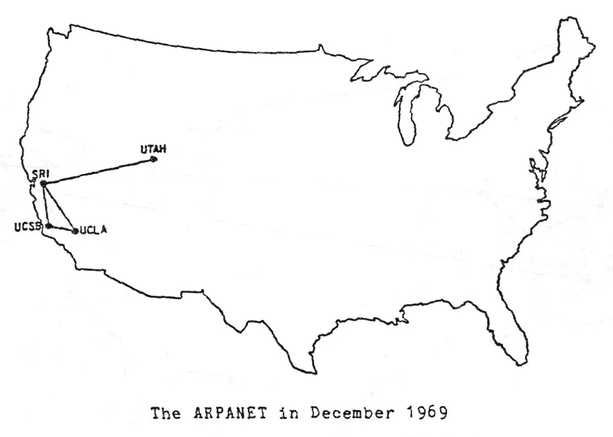
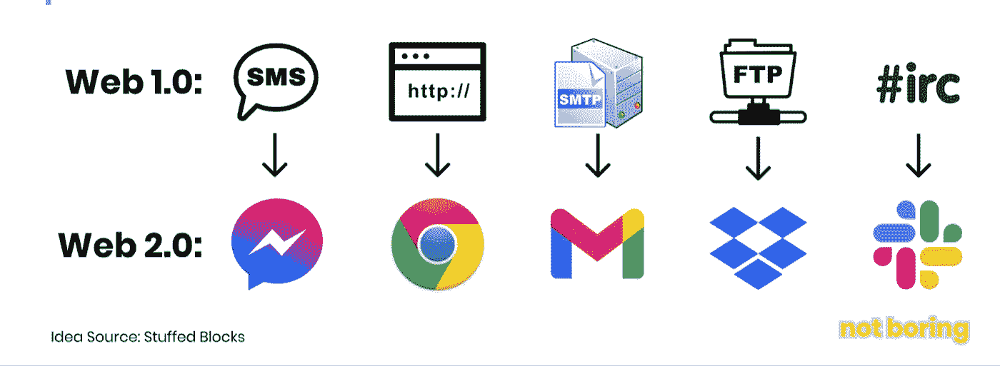
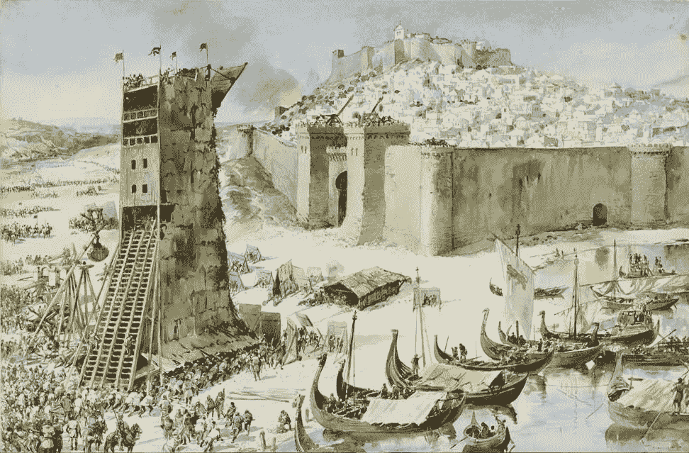

# 密码& web 3 的发明

> 原文：<https://medium.com/geekculture/crypto-the-invention-of-web3-ccc540d0175b?source=collection_archive---------21----------------------->

## 当拜占庭将军遇到美国战斗机飞行员时

Bitcoin (source: [Wikimedia Commons](https://www.google.com/url?sa=i&url=https%3A%2F%2Fcommons.wikimedia.org%2Fwiki%2FFile%3ABitcoin_.jpg&psig=AOvVaw1LlWlxAdu5DyCPID_4bmYj&ust=1618485077023000&source=images&cd=vfe&ved=0CA0QjhxqFwoTCLjMhvfM_e8CFQAAAAAdAAAAABAD))

今天风靡全球的区块链和加密热潮与最初的互联网有着惊人的、启发性的历史相似性:它遵循着始于军事计算机科学实验室的道路，并很快在商业领域找到了变革性的应用。一个悬而未决的问题是，它是否会遵循类似的繁荣与萧条、然后是更多繁荣的道路。

最初的互联网是由冷战时期为美国国防高级研究计划局工作的计算机科学家 J.C.R. Licklider 设想出来的。在 1963 年给 DARPA 同事的备忘录中，他在[中将自己最初的想法描述为“星系间计算机网络”。仅仅几年后，资金就有了保障，到 20 世纪 70 年代，Web 1.0 的种子已经播下。DARPA 团队成员和像](https://www.kurzweilai.net/memorandum-for-members-and-affiliates-of-the-intergalactic-computer-network) [Vint Serf](https://en.wikipedia.org/wiki/Vint_Cerf) 这样的学者(他连接了最初互联网的前两个节点，并合作编写了一些最初的协议，如 TCP/IP)开始利用这项非凡的新技术。

Source: [Sodunull](https://sudonull.com/post/66870-Joseph-Lik-Liklider-Intergalactic-Computer-Network-1963)

大多数人没有意识到，在他们每天使用的 Web2 应用程序下，隐藏着一套 Web1 协议，这些协议是军方和学术界在建立最初的互联网时制定的。例如，WhatsApp 和其他消息应用程序利用了一种早期的标准，称为 SMS 或短消息服务。Outlook 和其他邮件软件使用 SMTP 或简单邮件传输协议。像 Dropbox 这样的软件服务使用 FTP 或文件传输协议。这些和其他核心互联网协议是分散的(意味着没有一个政府或公司控制它们)，容错的(意味着如果网络的一部分发生故障，整个系统仍然工作)和开放的(意味着任何人都可以自由地在其上建立)。

与开放和分散的 Web1 协议相反，Web2 应用程序是由关注利润的初创公司构建的。这些小公司现在是世界上最大最有实力的公司(谷歌、脸书、贝宝等)。).

Source: [Not Boring](https://www.notboring.co/p/the-value-chain-of-the-open-metaverse) by Packy McCormick

尽管这些 Web2 公司的内容发现、交流和价值交换带来了诸多好处，但它们也付出了代价:Web2 公司规定了这些应用程序的规则，并控制了它们用户的数据。许多人认为，这种主导地位不仅侵犯了隐私，产生了垄断租金，还扼杀了自由、公民言论和创新。这些批评者认为，大型科技对利润的关注和非凡的力量背叛了最初的 Web1 互联网所基于的自由精神和去中心化的原则(创新正是基于这些原则而蓬勃发展)。

在这种情况下，值得记住的是，我们正在目睹的加密货币和区块链的出现是对这些原始原则的回归。讽刺的是，Web3 的种子也是由美国军方播下的。尽管它花了更长的时间来发展，Web3 实际上在互联网本身(即 Web1)发明后不久就开始了它的智力发展。作为对 1973 年阿拉伯石油禁运的回应，美国开始关注如何使从电器到电网到飞机的所有东西更加节能。

Oregon gasoline dealers sign 1973–74 (source: [Wikimedia Commons](https://en.wikipedia.org/wiki/1973_oil_crisis#/media/File:FLAG_POLICY_DURING_THE_1973_oil_crisis.gif))

提高飞机效率的工作与我们的故事相关，这项工作要求飞机在计算机的中间控制下飞行。但是计算机的问题是它们偶尔会出故障或者有错误的信息，这在高海拔、高速飞行的恶劣环境中尤其常见。即使是几微秒的错误状态信息，飞机的机翼也会脱落，因此解决这个问题至关重要。

让计算机更可靠的方法是备份，然后备份备份。但是，如果飞机上的各种微处理器对飞机的状态或各种机载计算机指挥的行动不一致，会发生什么呢？你如何让飞机上的各种微处理器就飞机的状态达成一致，控制系统如何从这些不同的大脑中整理出潜在的不同命令？

在 20 世纪 70 年代和 80 年代，不同的计算机科学家致力于这个问题。也许最著名的是计算机科学家莱斯利·兰波特，他提出了拜占庭将军围攻一座古城的类比。他在他 1978 年的著名论文中写道:“仅通过信使沟通，将军们必须就一个共同的作战计划达成一致”(该论文由弹道导弹防御系统司令部和陆军研究办公室资助)。“然而，他们中的一个或多个可能是叛徒，他们会试图迷惑其他人。问题是找到一种算法，确保忠诚的将军们会达成一致。”

Depiction of the [siege of Lisbon](https://en.wikipedia.org/wiki/Siege_of_Lisbon), 1147 (Source: Wikicommons)

利用拜占庭将军问题，这些美国军方资助的计算机科学家通过创建一套共识协议开发了该问题的解决方案。这些协议允许绝对确定飞机的状态和流经系统的命令的真实性，而不必依赖单一的事实来源或中央权威。

一个完整的计算机科学分支出现了，它花了几十年的时间研究所有的排列，以确保即使有任意的数据或敌对的数据在一个平面上(或在任何其他系统中)的通信网络中流动，a)总会有一个关于国家的单一真理，b)有能力在没有中央权威的情况下建立和延续这一真理。当时，当他们考虑这个问题时，他们专注于飞机上的 CPU 或节点。今天，我们不再需要保证国家或所有权的权威包括政府、人民或公司等实体。

如果这开始听起来很熟悉，你可能是拥有比特币或 NFT 的 10%左右的美国人和欧洲人，或者是一直在关注这些市场的 80%左右的人的一部分(截至本文撰写时的百分比)。这听起来很熟悉，因为正是这一系列工作导致了智能合约、区块链、加密货币、DAOs、DeFi、NFTs 以及过去几年涌现在科技领域的各种其他协议和概念的诞生。

目前围绕比特币、NFTs 和 DAOs 的热潮反映了 1999 年至 2001 年的科技泡沫，既反映了技术的起源，也反映了推动公司估值膨胀的热情。如果我们正处于网络 3 历史上的一个类似的过度兴奋的时刻，就像我们在网络泡沫破裂之前看到的那样，我们必须问自己的问题是，网络 3 世界中哪些将是引人注目的失败，谁将是赢家？谁是 Webvan 或 Pets.com，哪些公司将成为 Web3 版本的谷歌或亚马逊？

Z.R