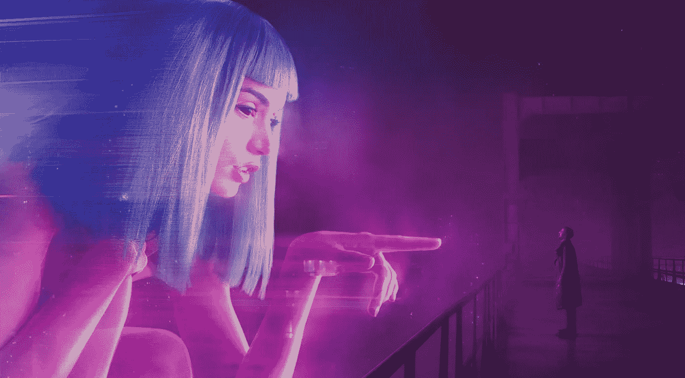

# 密码，元宇宙&互联网的未来

> 原文：<https://medium.com/geekculture/crypto-the-metaverse-the-future-of-the-internet-a68c177e80d7?source=collection_archive---------11----------------------->

courtesy of Blade Runner

虽然你可能刚刚听说过，元宇宙已经很久了。这是一种用户体验的结合，主要源于始于 21 世纪初的视频游戏(想想魔兽世界)和始于 2010 年左右的数字金融。

任何有孩子的人可能都已经以 Roblox、《我的世界》或堡垒之夜的形式处理过这个问题。当我还是个孩子的时候，我用…