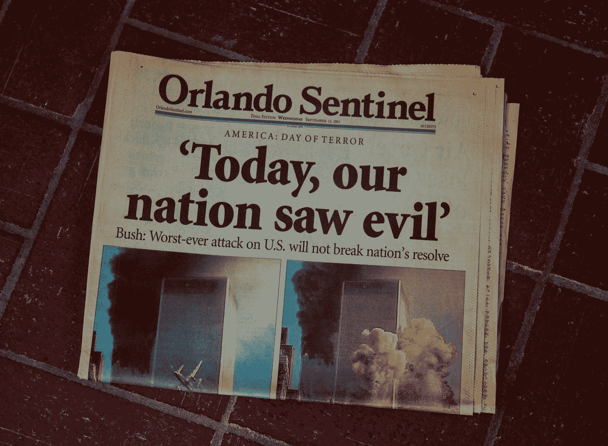

# 加密货币——金融 9/11？

> 原文：<https://medium.com/geekculture/cryptocurrencies-a-financial-9-11-cd3f5b66de73?source=collection_archive---------7----------------------->

Photo by [Aidan Bartos](https://unsplash.com/@bartos?utm_source=medium&utm_medium=referral) on [Unsplash](https://unsplash.com?utm_source=medium&utm_medium=referral)

美国议员称，加密货币可能成为“金融 9/11”

国会议员 Ted Budd 出现在 MakerDAO 的 Maker Speaker 系列中，谈论 DeFi、加密货币和监管。在这样做的时候，他透露了直接来自美国立法者的令人兴奋的见解。

最近几周，加密货币一直是华盛顿的一大话题。金融…