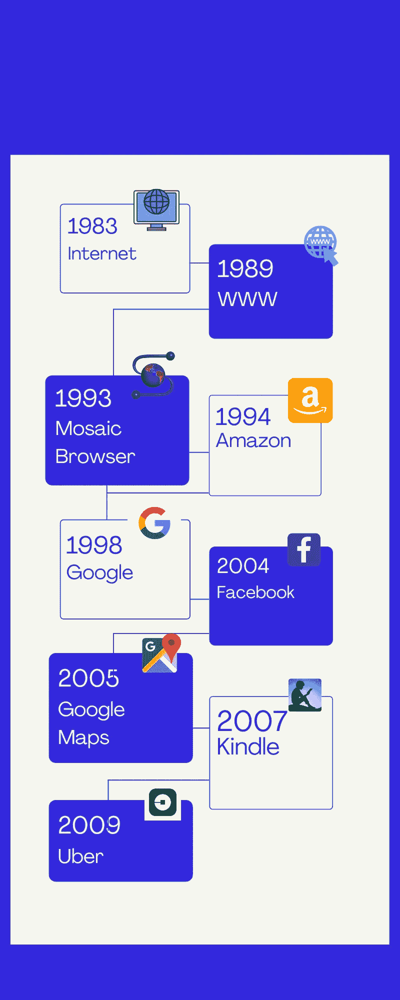

# 加密货币、DeFi 和 NFT

> 原文：<https://medium.com/geekculture/cryptocurrencies-defi-nfts-e48f0dfd4208?source=collection_archive---------19----------------------->

## 在新世界里，一切是如何结合在一起的

[Image Credit: NASA/Goddard/Arizona State University](https://explorer1.jpl.nasa.gov/galleries/earth-from-space/#gallery-15)

我们正在见证一个新世界的黎明。由于围绕加密生态系统的多种文化、技术和政治争论，前景可能是模糊的。然而，一旦我们越过它，一个充满无限可能的世界即将出现。

今天，我们在加密生态系统中看到的几乎所有事情都发生在一个封闭的筒仓中。但是，将它视为一种短暂的现象可能类似于重复几十年前互联网刚刚兴起时人们所犯的同样的错误。

Bill Gates explaining Internet

# 互联网简史

> “历史不会重演，但它经常押韵”——马克·吐温。

加密是一个发展非常迅速的领域，在多个领域都有快速的发展。我们没有水晶球来预测未来会如何发展。相反，我们可以做的是回顾一个类似现象的演变，并进行比较。

下面的时间线并不是互联网的详尽历史。然而，如果我们仔细观察，我们可以看到三个主要的主题。

## 纯数字阶段

互联网的第一个十年是关于信息交换和消费的。ARPANET 是第一个广域网，它的发明是为了让科学家和专业人员能够远程访问计算基础设施。

随着万维网
(www)和网络浏览器的出现，人们可以从他们的电脑上在线浏览信息，而不是去图书馆或订阅纸质杂志。人们围绕他们的特殊兴趣发现网页和社区。

## 数字增强真实世界用例

杰夫·贝索斯意识到，他可以利用互联网将完整的图书目录放到网上销售，这是普通商店做不到的。谷歌使万维网上的信息可供全球搜索。人们也可以在网上搜索当地企业和服务的信息。例如，如果你需要一辆出租车从你住的地方到机场，你可以在谷歌上查找出租车服务，登陆其中一个出租车业务网页，然后通过电话预订出租车。

## 数字世界和现实世界的融合

谷歌只是返回一个地点的文本地址，谷歌地图会告诉你它的确切位置，然后给你一个接一个的方向。以前，你会查找电话号码，然后叫出租车。优步让你点击一个按钮就能叫到出租车，然后实时看到你的出租车在哪里。亚马逊将图书数字化，并开始以电子方式交付，为图书读者提供即时满足感。

这一阶段出现的关键主题是用户旅程中的接触点变得更加集成，交付价值的时间显著减少。

# 绘制平行线

> “它有所有的迹象。范式转变，黑客喜欢它，但它被嘲笑为一个玩具。就像微型计算机一样。”——**保罗·格拉厄姆**

在比特币的早期，黑客和早期采用者收购和使用加密货币纯粹是为了满足他们对新技术的好奇心。加文·安德森，比特币的早期开发者之一，写了一个免费赠送比特币的在线水龙头。Virwox 等平台将比特币引入第二人生经济，用于购买数字汽车和虚拟豪宅。2011 年夏天,《第二人生》的玩家每 30 天花费近 10 万 BTC(当前价值超过 40 亿美元)。如今，加密货币的使用主要是数字原生的。这可以被认为是加密货币的**数字专用**阶段。

比特币的第一笔真实交易发生在 2011 年。Laszlo Hanyecz 是一名程序员和比特币贡献者，他用 10000 比特币与一名 18 岁的男孩 Jercos 交换了 2 张多米诺披萨。这在 2021 年的今天价值接近 5 亿美元。这一天被纪念为比特币披萨日。

随着比特币和其他加密货币的价格开始上涨，过去十年来，币安和比特币基地等加密交易所应运而生，以迎合新的交易者阶层。这些用户将加密货币视为替代资产类别，并开始进行数十亿美元的交易。类似于互联网，信息的交换和消费与基于搜索的信息呈现(谷歌)的真实世界用例相结合，按标题、作者等对书籍进行在线分类(亚马逊)；使用比特币和其他加密货币进行现实世界交易标志着数字增强现实世界经济用例。这些市场全天候开放，资产的可替代性更强；如果你愿意，你可以将比特币从 coinbase 中取出，转移到另一个交易所进行交易。

随着自动化 DeFi 协议的出现以及比特币被一个民族国家所采用，可以说我们正处于加密货币的**现实世界整合的早期。**

# 真实世界整合的形成

谷歌地图将地理数据数字化并放到互联网上。优步利用这一点和全球定位系统来确定需求和供应的实时位置，并创建了一个与之匹配的市场。

如今，DeFi 中缺失的一块是对真实世界经济数据的理解。例如，如今流行的借贷定义协议 Aave 可以以加密资产作为抵押自动发放贷款。但是，如果一个小企业主想以他们的商店为抵押贷款，Aave 既不理解钱包背后的人目前拥有一家商店，也不理解商店本身如何估值。

NFTs 和加密预言可以帮助解决这个问题。Chainlink 等加密 Oracles 充当了现实世界数据和区块链之间的桥梁。数据提供者可以使用 Chainlink 设置自己的节点，并开始向智能合约提供数据。Chainlink 提供了一个额外的验证层，它拥有多个数据源，并为 oracles 维护一个信誉分数，以便就所提供数据的有效性达成共识。

资产所有者可以拥有证明商店所有权的 NFT，并使用 NFT 将其商店作为抵押品。在这个小企业贷款的特定案例中，oracles 可以作为提供商店估价的来源，从而使智能合同能够计算贷款条款，如利率和金额。我们可以在其他用例中想到类似的构造。一个例子是 Lambda 学校的学生在链上有他们的学业成绩，这可以被智能合同用来计算他们未来的潜在收入和偿还贷款的能力。

另一个我们可以看到密码入侵的前沿领域是商业支付。Visa 最近开始发行加密卡，你可以用它来获得某些加密货币的现金返还，或者更好地在 USDC 消费。Twitter 最近向一组有限的用户推出了用比特币支付小费的功能。

虽然加密货币已经证明了实现大额廉价交易的好处，但低价值交易的网络费用仍然高得惊人。然而，随着比特币上的闪电网络和第二层扩展解决方案(如 Arbitrum、乐观主义和以太坊上的多边形)的出现，链上微交易现在成为可能。

# 政府的角色

当资产是加密的时，DeFi 协议可能会工作得很好，但是如果我们必须扩展到商业贷款和房地产交易等用例，它会给我们留下合同可执行性的问题。例如，您可以使用 NFTs on-chain 完成房地产的销售，但是如果在现实世界中卖方拒绝移交财产，您就麻烦了。

幸运的是，我们已经看到了这个方向的积极发展，美国不同的州已经开始认识到区块链、数字资产和智能合同。比特币在萨尔瓦多已经被认可为法定货币。印度的马哈拉施特拉邦政府将疫苗接种证书存储在 Polygon 区块链上。不难想象，在未来，财产所有权将被记录在网上，政府将在维护这些协议的神圣性方面发挥积极作用。

# 走向未来

加密货币及其周围的几乎一切都是一个两极分化的话题。人们持有极端的强烈观点。但是，还有另一种方式来看待权力下放运动。人类一直在不断地将他们今天从事的活动自动化，以致力于塑造未来的更有趣的项目。

在殖民时期的美国，农业是 90%美国人口的生计。如今，这一数字不到 10%。这些变化是由技术创新推动的。同样，区块链为金融服务带来了前所未有的效率。区块链使一个不可信的节点网络能够处理金融交易，实现经济活动，并通过算法管理货币政策，而没有大型机构和官僚机构的开销。

然而，在我们到达那里之前，从用户体验的角度来看，生态系统仍然有许多地方需要覆盖。

就目前的形式而言，与用户习惯使用的类似于 Venmo、Chime 或 UPI 的东西相比，使用 crypto 太复杂了。加密钱包是通往加密货币生态系统的门户。钱包需要简化和抽象出潜在的复杂性，而不是期望用户弄清楚区块链网络、代币、L2 桥等的细微差别。

> 这是我们打算在 [Brew](https://brew.money) 上解决的问题。在 Brew，我们的目标是成为访问 DeFi 的最简单平台，并根据您的财务需求利用它的好处。

然而，一旦我们到达那里，由加密货币、DeFi 协议和 NFT 组成的去中心化基础设施可以创造一个金融包容性和个人主权的新世界，这是人类多年来一直在努力的目标。

*如果你喜欢这个帖子，请给我几个掌声。这将有助于让更多的人看到这篇文章。我会说，我仍然处于理解密码的初级阶段。如果你有任何反馈，请分享。*

*同时，这也是我写的关于加密生态系统进化的 4 篇系列文章的最后一部分。可以看看下面以前的帖子:*

 [## 透过神秘的冬天了解去中心化的世界

### 或者我如何学会不再担心加密崩溃，并成为一名信徒

medium.com](/geekculture/understanding-the-decentralized-world-through-the-crypto-winters-edff53378d1a)  [## DeFi 的夏天

### DeFi 的出现和未来

medium.com](/geekculture/the-summers-of-defi-8ea87b17615e)  [## NFT 文艺复兴

### 为什么非专利技术对文化、艺术和所有权的未来如此重要

medium.com](/geekculture/the-nft-renaissance-71b187d6f593) 

# 感谢

*   [请](https://www.linkedin.com/in/pritesh123iit/)和 [Mehul](https://www.linkedin.com/in/mehulmarakana/) 分享对草案的反馈