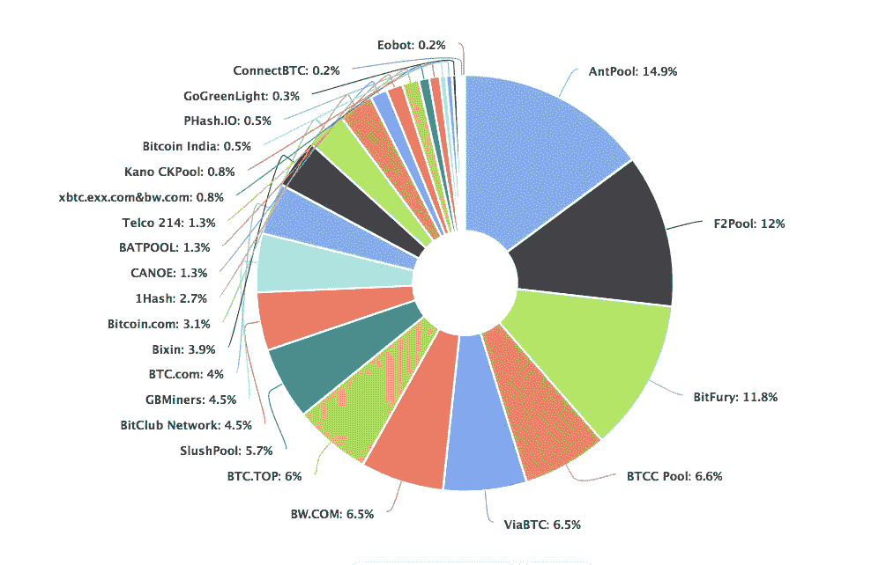
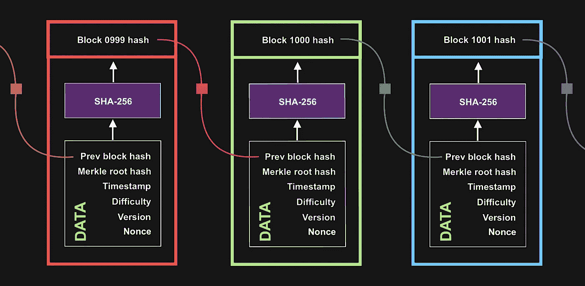
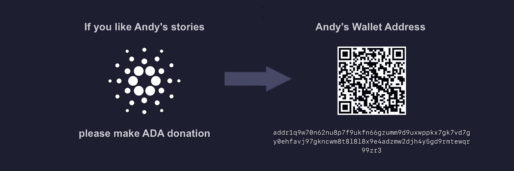

# 加密货币 911——矿工们到底在做什么？

> 原文：<https://medium.com/geekculture/cryptocurrency-911-what-are-miners-really-doing-1a1b816bdc83?source=collection_archive---------23----------------------->


我们中许多听说过采矿的人要么不知道矿工们真正在做什么，要么对它有误解。大多数关于这个话题的文章和视频都没有揭示事情的本质。但是，大家都有目共睹的是，矿工获得的报酬很好。为什么他们的工作报酬这么高？

在这个故事中，我将告诉您挖掘是如何工作的，并将向您展示挖掘对普通家用计算机的 CPU 的负载程度。例如，您可以运行用 Swift 语言编写的应用程序。

# 理论

矿工(当然不是人，而是他们当前的[***ASIC***](https://www.prnewswire.com/news-releases/riot-blockchain-announces-milestone-purchase-of-8-000-s19-pro-antminers-from-bitmain-with-delivery-starting-january-2021--resulting-in-1-45-ehs-in-total-hash-rate-301113391.html)-设备)的第一个主要任务是 ***验证事务*** ，以便将那些事务放入 ***块*** ，进而形成 ***【区块链】*** (分类账)。矿工的第二个主要任务是保持区块链对攻击的抵抗力。从技术上讲，比特币网络的功能得益于一种*共识机制，或者简称为 ***PoW。****

*每个新事务，简称为 ***Tx*** ，首先进入[***MemPool***](https://www.blockchain.com/charts/mempool-count)等待处理(你可以称之为未决或未确认 Tx)。具有 ***最大费用*** 的交易首先从内存池中取出。费用最低的交易可能会等待很长时间的确认，最长可达 2 或 3 周。*

****提示*** *:尽管你可能在一些文章中读到，在比特币网络中，费用是可选的，但现在你再也不能不支付任何费用就发送 BTC 币了。如果您不支付费用，您的交易将被拒绝，资金将在几天后返回到您的钱包。**

*目前(在 [***闪电网络***](https://en.wikipedia.org/wiki/Lightning_Network) 在每个比特币钱包中实现之前)，遗留比特币网络平均每秒钟处理多达 7 笔交易。大约每 10 分钟就会创建一个新的块，其中包含已确认的事务。现在一个经典的比特币网络相比其他的区块链有着缓慢的表现，比如[***Cardano***](/geekculture/cardano-911-twenty-interesting-facts-about-cardano-6e165914d1e8)。*

*通过确认“合法”交易，矿商可以获得费用作为奖励。但是来自所有新的 Tx 费用的收入相对较小(对于一个块中的 3500 Tx，总共可以是 0.03 BTC)。除此之外， ***为那些解决了 ***数学难题*** 的矿工提供了一个采矿奖励*** ，以便为分类帐创建一个新的块，所有确认的交易都将放在那里。无论是谁，获胜者都将获得一切——以及采矿奖励和费用。*

*2021 年，新建一个区块的奖励是 [***6.25 比特币***](https://www.investopedia.com/bitcoin-halving-4843769) 。比特币可以开采到 2140 年。比特币总量在 2100 万左右。奖励减半预定每 ***210，000 块*** 发生一次，或者换句话说，每四年发生一次。*

```
*|-----------------|--------------------|
|      **Years**      |     **Reward**, **BTC**    |
|-----------------|--------------------|
|   2009...2012   |       50.000       |
|-----------------|--------------------|
|   2013...2016   |       25.000       |
|-----------------|--------------------|
|   2017...2020   |       12.500       |
|-----------------|--------------------|
|   2021...2024   |        6.250       |
|-----------------|--------------------|
|   2025...2028   |        3.125       |
|-----------------|--------------------|*
```

# *什么是数学难题？*

*为了解决前面提到的数学难题，需要巨大的计算能力——于是矿工们联合在 [***矿池***](https://www.investopedia.com/terms/m/mining-pool.asp) 。每个挖掘池中的每台计算机都在寻找一个从零开始的秘密数字。*

**

*Mining Pools in 2019*

*这个秘密数字的名称是一个 ***散列*** —一个唯一的标识符，由 64 个十六进制格式的字符(或 256 个二进制格式的字符)组成。比特币网络的算法负责形成一个 ***目标哈希*** 【某些阈值】基于一个预定义输入的组合。而矿工依次必须找到一个 ***有效的******hash***(即低于目标 hash)，靠蛮力。区块链的哈希一般是由一个叫做[***SHA-256***](https://en.wikipedia.org/wiki/SHA-2)的特殊哈希函数产生的。*

*我们来看看最近在 ledger 里写的 [***块 701，125***](https://www.blockchain.com/btc/block/00000000000000000006467d4ceb7b301b679b4146d7269a270091e5c82938aa) 。此块是由于 ***蚂蚁池*** 中的矿工发现了一个罕见的带有 19 个前导零的散列而创建的。这是:*

```
***00000000000000000006467d4ceb7b301b679b4146d7269a270091e5c82938aa***
```

*如果挖掘池首先找到这样的散列，则它将获得奖励(奖励将在池的成员之间公平地分配)。然而，问题是找到这个散列极其困难，因为最新的计算机，甚至是 ASICs，都不擅长处理 [***大数***](https://en.wikipedia.org/wiki/Large_numbers) 。这个散列必须在 10 分钟内被全世界所有的矿工搜索到。然后重复搜索以找到下一个块的散列。这个过程消耗了相当大的 [***电量***](/geekculture/cardano-911-twenty-interesting-facts-about-cardano-6e165914d1e8) 。*

*在***blockchain.com***网页上，您还可以注意到影响找到有效散列难度的五个重要输入参数。*

*   ****难度*** 是一个数学值，表示为当前块找到一个有效散列的难度。难度表示每个区间需要多少个哈希。挖掘难度定期(每两周)调整，持续调整。*

> *挖掘难度决定了平均需要多长时间(尝试次数)才能找到一个合适的输入集，从而产生一个有效的哈希输出来挖掘一个块。通常矿工或块创建者(像在 Cardano network 中)被要求找到某个目标以下的散列。挖掘难度越高，平均来说需要更多的尝试来找到正确的结果。*

*   ****Merkle Root*** 是一棵 [***merkle 树***](https://en.wikipedia.org/wiki/Merkle_tree) 的根节点，是树中所有散列对的后代。或者，换句话说，一个矿工的软件将所有的交易转换成一个被称为 merkle root 的汇总视图，然后对其进行哈希处理。每个散列的 Tx 只是被进一步散列。*
*   ****Nonce*** 为随机值，可调整以满足工作证明。*
*   ****时间戳*** 格式如下:2021–09–18 20:41。*
*   ****版本*** 是与正在进行的协议提案相关的 block 版本。*

*第六个重要的输入参数是一个 ***前一个块的散列*** 。*

# *我要随机数做什么？*

*从技术上来说，矿工试图找到一个 ***nonce*** ，来帮助他们生成一个有效的散列。或者我可以说哈希完全取决于这个游戏中的随机数。Nonce 是从 0 开始的自然十进制数。哈希是不可预测的(因为它是用 SHA-256 算法创建的)，所以所有的挖掘器都必须尝试很多次才能找到一个合适的随机数来生成一个带有几个前导零的哈希。哈希中前导零越多，哈希就越罕见。*

*理论上，当 ***nonce=1*** 时，可以在第一次尝试时找到 hash，但实际上这是绝对不可能的。让我们用输入的 **nonce** value— 进行实验，假设我们正在寻找一个仅从一个零开始的散列。*

```
*nonce = 0
**5feceb66ffc86f38d952786c6d696c79c2dbc239dd4e91b46729d73a27fb57e9**nonce = 1
**6b86b273ff34fce19d6b804eff5a3f5747ada4eaa22f1d49c01e52ddb7875b4b**nonce = 2
**d4735e3a265e16eee03f59718b9b5d03019c07d8b6c51f90da3a666eec13ab35****...
...**nonce = 39 **0b918943df0962bc7a1824c0555a389347b4febdc7cf9d1254406d80ce44e3f9***
```

*如你所见，我设法在 ***上找到了这样一个散列，第 39 次尝试*** 。现在有两件事对我来说是显而易见的:首先，将 nonce 改变 1 会导致哈希值的巨大变化——哈希值的每一位都会发生变化；其次，尝试查找哈希的次数非常多。*

# *测试用于 Mac OS 的挖掘应用程序*

*我写了一个小程序，向你展示挖掘是如何计算密集型的。这个应用程序的目的是演示在给定的参数下寻找一个散列的难度，例如，有 2、4 或 8 个前导零。要运行此应用程序，只需将以下代码复制粘贴到 Xcode 12.5 或 Xcode 13.0 中的 SwiftUI 项目中。*

****提示*** :考虑到我的 Swift 代码没有体现比特币挖矿的 ***标准*** ！我的脚本为 ***nonce*** 实现溢出加法(某种循环)，这里是无符号的 32 位整数。*

```
***import** SwiftUI
**import** CryptoKit**struct** ContentView: View {

    **@State var** nonce: UInt32 = 0
    **@State var** digest: SHA256.Digest? = **nil**
    **@State var** zeros: String = "SHA256 digest: **00**"    
    **var** body: **some** View {
        ZStack {
            **if #available**(macOS 12.0, *) {
                Rectangle()
                    .frame(minWidth: 300, minHeight: 200)
                    .foregroundColor(.indigo)
            }
            Button("Start") {
                **self**.startMining()
            }
        }
    }

    **fileprivate** **func** startMining() {
        **repeat** {
            nonce &+= 1

            **let** data = Data(String(counter).utf8)
            digest = SHA256.hash(data: data)

            print((digest?.description)!)
            print("\(counter) tries.")

        } **while** !(digest!.description.starts(with: **zeros**))
    }
}*
```

*比特币网络使用 SHA-256 来生成 32 字节的数字，这种方式需要可预测的处理器工作量。挖掘设备是解决区块‘散列’即满足某个**标准所建立的系统。***

***运行应用程序，看看我们在 Xcode 控制台中搜索`00`会得到什么:***

```
***SHA256 digest: **00328ce57bbc14b33bd6695bc8eb32cdf2fb5f3a7d89ec14a42825e15d39df60**
286 tries.***
```

***然后将一个 ***零*** 属性改为`"SHA256 digest: 0000"`值:***

```
**SHA256 digest: **0000a456e7b5a5eb059e721fb431436883143101275c4077f83fe70298f5623d**
88484 tries.**
```

**最后，搜索`00000000`:**

```
**SHA256 digest: **00000000690ed426ccf17803ebe2bd0884bcd58a1bb5e7477ead3645f356e7a9**
426479724 tries.**
```

**如你所见，我们需要**4.26 亿次尝试**来找到一个有八个前导零的散列数 ***00000000*** 。现在您知道了挖掘任务需要多少努力，以及它在多大程度上加载了 CPU。**

# **现实中正在发生的事情…**

**我之前解释的一切，只是整个画面的一部分。实际上， ***有效哈希*** 是由当前的 ***块头*** 构成的(进一步阅读)。由于 SHA-256 产量是绝对不可预测的，每个矿工必须通过蛮力方法找到一个哈希。蛮力搜索被重复，直到矿工发现 ***一个小于目标哈希*** 的由比特币网络组成的哈希。**

## **让我们来破译这个。以下是所有矿工的一系列行动:**

*   **取一个 ***块头*** 作为输入。块头包括:nonce、Tx 数据(消息)、时间戳、版本、难度、merkle 根散列和前一个块散列。**
*   **将 ***随机数*** 增加 1，所有参数保持不变。**
*   **如果结果散列低于目标散列，则 ***数学难题*** 被成功解决，幸运的矿工可以自由地向网络提交新的块。网络中所有的 ***活动节点*** 在检查 nonce 的正确性并验证挖掘块中的所有事务后，必须批准或拒绝它。如果某个节点认为某个块无效，它不会中继该块。但是，如果一切正常，所有网络节点都必须更新该块的输入值。奖励时间开始了…**
*   **如果其他人赢得了比赛，你必须回到这个序列的开头，从头开始。**
*   **如果出现 ***竞争条件***——最长的分支将成功(即其中工作最多的规范链)。同样，最长的分支解决了 [***双支出***](https://www.investopedia.com/terms/d/doublespending.asp) 的问题。**

****

**区块链中每个后续块的哈希值都小于前一个，这意味着在 2140 年将创建网络中具有最小哈希值的块。猜猜会是什么哈希？**

# **捐赠给作者**

****

**Click on the picture to make the QR code bigger**

```
**addr1q9w70n62nu8p7f9ukfn66gzumm9d9uxwppkx7gk7vd7gy0ehfavj97gkncwm8t8l8l8x9e4adzmw2djh4y5gd9rmtewqr99zr3**
```

**目前就这些。**

**如果这个故事对你有帮助，请按下 ***拍拍*** 按钮，按住*吧。在 Medium 上，每个故事最多可以拍 50 次*。****

***如果您有任何问题，您可以通过[***Cardano stack exchange***](https://cardano.stackexchange.com/users/4023/andy-jazz)联系我。***

**快乐的赌注！**