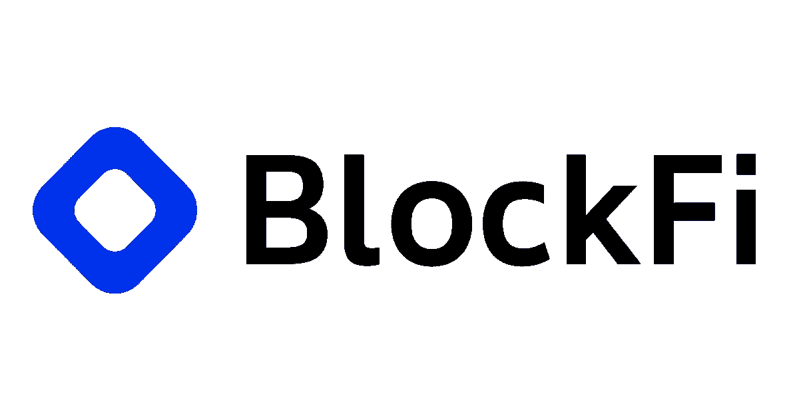
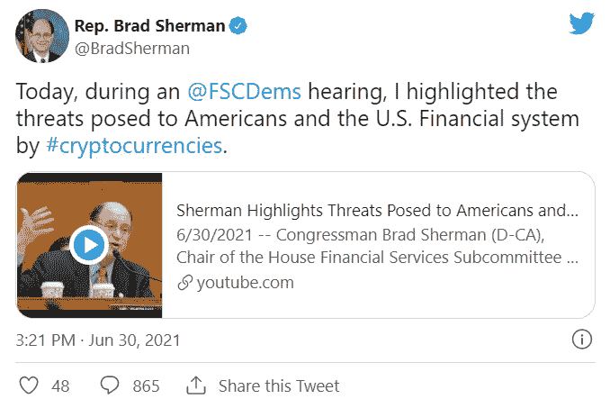

# 加密货币公司正在受到监管机构的审查和禁止。为什么会这样，还会继续吗？

> 原文：<https://medium.com/geekculture/cryptocurrency-companies-are-being-scrutinized-and-banned-by-regulators-why-is-this-happening-6e7be9003c4?source=collection_archive---------36----------------------->

最近，加密货币公司受到了世界各地监管机构的批评。比如，[币安](https://en.bitpush.news/articles/tag/binance)已经被英国和马来莎封杀， [BlockFi](https://en.bitpush.news/articles/tag/blockfi) 在美国多个州被封杀，中国所有交易所都被封杀。这是由于对加密货币的监管担忧日益加剧，以及银行的游说，随着加密货币变得更加成熟，这两者都应该会消退。

在世界各地，媒体报道监管的主要焦点似乎是加密货币的监管。然而，许多人没有注意到，加密货币相关公司也受到了世界顶级政府的审查，并被指控出售未注册证券等罪行。没有这些在传统金融和分散金融之间架起桥梁的公司，世界各地的投资者将很难投资于加密货币市场。可以说，这使得对加密业务的有效监管比加密货币本身更加重要。

不幸的是，企业一直面临着与监管机构和银行日益艰难的斗争。各国一直在禁止币安交易所，理由是监管方面的担忧，以及洗钱和网络攻击的威胁越来越大。此外，在美国，加密货币借贷平台 BlockFi 已被许多州禁止，包括肯塔基州、纽约州、德克萨斯州和新泽西州。

尽管这一趋势具有威胁性，并且对加密货币的未来不是一个好兆头，但两家公司都在反对他们的禁令，并且有足够的证据这样做。禁止 BlockFi 的各州给了这家计划在 2022 年上市的公司一个机会来回应并证明他们没有出售未经许可的证券。十有八九，这些禁令只是不知道如何监管加密货币的国家开始采取过于严格的方法的结果，然后随着他们开始更多地了解区块链技术，他们慢慢撤销了禁令。

BlockFi 正在向他们的客户和投资者保证，他们没有违反任何证券法，并将继续正常运营。作为一家总部位于纽约的金融服务公司，BlockFi 受到该国一些最严格的监管，应该能够轻松满足其他州的金融要求。此外，BlockFi 继续在 E 轮投资中筹集资金的事实令人放心，因为风险投资公司正在押注 BlockFi 是一家合法公司，有一天将在美国证券交易所上市。

世界各地的银行在一定程度上有责任向监管机构施压，要求对加密货币公司采取行动。例如，布拉德·谢尔曼，美国最反加密的政治家之一，每年从银行和交易所获得 10 万美元，这表明他是为了银行的最大利益而行动，以便继续接受他们的捐款。

在大多数情况下，站在新兴技术错误一边的公司要么不得不适应，要么倒闭。一些银行已经适应了加密，如 JP 摩根和高盛，而其他银行干脆拒绝承认它。那些拒绝接受区块链技术将为金融体系带来变革的公司将会被甩在后面，不管它们如何推动对竞争对手的监管。

十有八九，加密货币公司的监管问题将在未来几年内得到解决。由于区块链在世界各地的持续增长和成熟，美国将被迫在监管方面更加宽松，以确保其公民能够继续处于技术的前沿和区块链的世界领先地位。

尽管最近对加密货币公司监管的推动似乎对加密货币市场构成了威胁，但它可能会在未来几年消退。加密货币市场仍然是一个蛮荒的西部，为了将区块链和加密货币带给大众，必须进行监管。如果监管严格，像 BlockFi 这样的公司被禁止在美国运营，这对 crypto 来说将是极其不利的。然而，更有可能的是，银行开始更多地接受加密货币，释放它们给国会施加的压力，并建立有效的监管。

林肯·穆尔