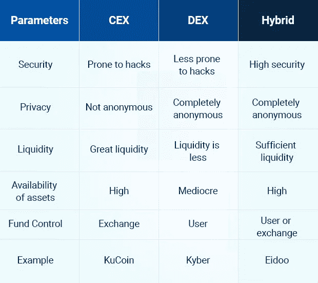

# 加密货币交易所的发展——以有效的规模参与元、交替的世界

> 原文：<https://medium.com/geekculture/cryptocurrency-exchange-development-engage-the-meta-alternate-verse-with-effective-magnitude-c5ab3288c77d?source=collection_archive---------21----------------------->

隐文现在对人们产生了不同的影响，不是吗？从公用事业股票到技术可能性，加密货币及其其他形式的实例正在向最大范围发展，并探索自己的潜在能力。从 ICO 到 NFTs，加密货币的主导地位令人印象深刻。但整个生态系统都是由加密货币交易所驱动的。没有密码交换，生态系统生存的可能性在很大程度上。在加密时代有许多新类型的 NFT，它们可以产生一系列的不同，从建立 p2p 交换到做出可能的行动。

## **加密货币交易所**

T2 的加密货币交易所让交易所的所有者成为更有影响力的市场领导者。当 NFT 在交易交流中发出巨大的噪音时，他们是使加密生态系统在加密时代没有一点声音成为可能的人。

## **加密货币交易所开发**

加密货币交易所的开发是由许多不同的人在加密时代进行的，但当有经验的专家开始开发过程时，完美的同步就完成了。加密交换的发展不仅仅是建立用户界面和合并一些 APIs 他们需要一个简化的架构来建立一个完美的加密货币交易所。这里是一些强制性的实例，将被开发和集成到加密货币交换模块，以实现市场的手工艺能力。

💡**交换界面**

交换模块是加密货币交换平台的 UI，用户将在其中与平台进行交互，以提高交易效率。不仅如此，交换市场的效率可以由 UI 在执行动作时的流畅度和响应度来定义。

💡**交易引擎**

交易引擎是对加密货币进行分析和列表的地方。同时，交易引擎将负责交易保证金成本和基于交易的所有其他服务。

💡**匹配引擎**

匹配引擎在将用户匹配到完美的接收者或交换者方面起着至关重要的作用。匹配引擎将努力寻找最佳匹配，以实现完美的交换。

💡**区块链整合**

加密货币交易所应得到区块链网络的支持，以执行基于分布式数字账本的活动，如日志记录、交易处理等。区块链是加密货币交易所提供的大多数功能的基本来源，

💡**多支持钱包支持**

加密交换应该有一个 API 模块，在那里他们需要接受并与建立在不同区块链网络上的钱包进行交易。这将广泛增加市场风险和汇率的变化。

## **加密货币交易所发展类型**

加密货币交易所的发展有各种不同的类型，它们都有自己的特点，以帮助和支持加密时代的市场发展进程。

1️⃣ [**中央加密货币交易所**](https://www.blockchainappfactory.com/cryptocurrency-exchange-software?utm_source=Medium+Publication&utm_medium=Geek+Culture-+31%2F12%2F2021&utm_campaign=vignesh)

建立在中央系统上的加密货币交易所将具有各种协议和权限来维持交易所的交易效率。中央加密货币交易的每一个过程都将在一个封闭的循环中完成，所有的交易都将被完全监控，以确保过程和交易的安全性。

2️⃣ [**分散加密货币交易所**](https://www.blockchainappfactory.com/decentralized-exchange-development?utm_source=Medium+Publication&utm_medium=Geek+Culture-+31%2F12%2F2021&utm_campaign=vignesh)

这种类型的加密货币交易所与集中式交易所有很大不同，在集中式交易所中，所有信息和公用事业都是自动化的，或者利用智能合同来完全执行任务。分散式加密货币交易所将没有中介，并尊重使用该平台的用户的隐私，分散式加密货币交易所因维护用户友好的环境而闻名。

3️⃣ [**混合加密货币交易所**](https://www.blockchainappfactory.com/hybrid-cryptocurrency-exchange-development?utm_source=Medium+Publication&utm_medium=Geek+Culture-+31%2F12%2F2021&utm_campaign=vignesh)

我们这里的加密货币交易所是集中式和分散式加密交易所的集成，以提供更好的解决方案。该混合将具有集中式交换的结构和功能功能，并且分散式加密货币交换的私密性、安全性被挑选出来以形成如上所述的混合交换。

## **加密货币交易所的特点**

📌**安全**

加密货币交易所的安全性非常高，区块链网络将记录每一次行动，某些其他协议将致力于确保保持坚不可摧的能力，并且过于坚固，不会轻易被攻破。

📌**流动性**

流动性太高，因为交易所中的交易流非常好，甚至在加密市场的各种情况下都充当了流动性引擎。

📌**多币种支持**

加密货币交易所的另一个主要优势是支持多种货币。这意味着加密空间的任何货币都可以兑换或与法定货币交换。这为交易所创造了一个巨大的热点

📌**打桩**

赌注是购买加密货币或任何其他资产并将其放入钱包或类似金库的过程。加密货币交易所将在区块链的效率被最大化的特定过程中工作。这是因为赌注涉及钱包和交易所，以将交易转移到钱包。有了平台，这变得很容易。

📌 **KYM 和反洗钱**

了解你的客户和反洗钱是加密货币交易所必须增加的两个基本特征，以确保平台和用户的安全。

上述标准无疑将揭示在加密时代你可以信任和进行交易的程度。与此同时，它为初露头角的密码企业家提供了一个机会，让他们能够按照这些规定建立自己的交易所。比特币和[加密货币交易软件](https://www.blockchainappfactory.com/cryptocurrency-exchange-software?utm_source=Medium+Publication&utm_medium=Geek+Culture-+31%2F12%2F2021&utm_campaign=vignesh)现在在该领域广泛使用。许多人都在追随这一趋势，认为加密货币是未来的发展方向。随着未来的进一步变化，现在是利用这种热情并建立加密货币交易平台的最佳时机。通过适当的设计和营销策略，您的解决方案可能会成为下一个大热门。