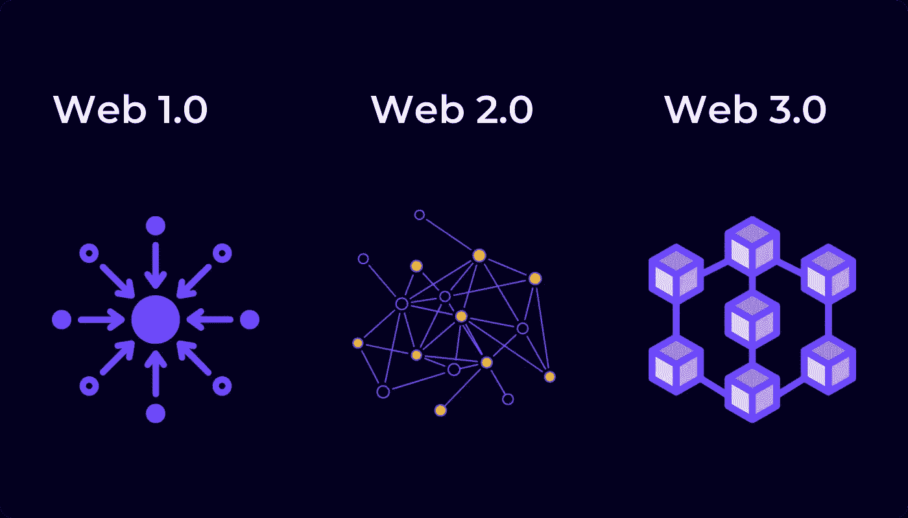

# Web3 上的加密货币交易开发

> 原文：<https://medium.com/geekculture/cryptocurrency-exchange-development-on-web3-861a479198bd?source=collection_archive---------8----------------------->

**Cryptocurrency Exchange Development On Web3**

互联网是一项革命性的技术，它促成了世界上大量的新发明。这是世界上从未经历过的事情；这对每个人来说都是一个奇迹。有了互联网，一切都变得可能，现在人们可以随时获取每一条信息。这种未来的革命性技术为当今数字世界中存在的一切铺平了道路。自从计算机时代成为主流以来，互联网一直在积极发展，导致了从 web1 到 web3 的迭代开发。但是，没有什么比 web3 更令人难以置信了。这次互联网迭代消除了之前迭代面临的所有障碍。因此，为主要包括密码空间在内的新技术的超常发展铺平了道路。这个概念非常适合企业在 web3 上启动 [**加密货币交易所开发，并释放其业务潜力。**](https://bit.ly/3t9qIdP)

# **为什么 Web3 更适合加密货币交易所的开发？**

**Web3 More Suited For Cryptocurrency Exchange Development**

Web3 是数字空间的最新成员。互联网的这一次迭代并没有用在前一次迭代中相当活跃的中介来规范自己。因此，web3 的整个功能将只与相关用户进行交互。因此，联网路径将得到充分保护和隐私保护。用一个词来形容这次互联网迭代，就是全面去中心化。这种分散的联网消除了所有中介的参与，这些中介是以提高浏览体验和其他联网相关活动的效率为名的网络钓鱼数据和信息。随着 web3 互联网迭代的使用，这些障碍完全消失了。

web3 的特别之处在于它有能力在途中开发出令人印象深刻的发明；加密货币交易所、区块链和 NFTs。web3 互联网迭代是对这些创造的最好补充。为买方和卖方之间的分散交易开发一条途径。因此，增加了每个人在数字空间中的广泛应用的使用。此外，为了释放这一互联网迭代的全部潜力，这对每个人都是高度有益的。因此，为 [**加密货币交易所在 web3**](https://bit.ly/3t9qIdP) 上的发展提供了依据；使其成为所有类型的分散平台的有力候选，包括加密货币交易所、加密钱包和 [**NFT 市场**](https://bit.ly/3abqLzh) 。

# **为什么 Web3 会战胜它的前辈？**

web1 和 web2 互联网迭代的主要问题是从用户浏览器收集数据。这些世代网络之前由雅虎、谷歌、必应、脸书等科技公司主导，还有很多其他公司也榜上有名。此外，谷歌是 web2 网络的最高力量；高达 88%的互联网用户被这家科技公司监控和管理。这些事件导致被网络钓鱼的数据数量增加，从而也给互联网用户的隐私带来了问题。因此，迫使用户寻找替代品，他们用 web3 互联网迭代解决了这个问题。这一互联网迭代不仅远远优于其前辈，而且为一系列特殊的新技术打开了大门，其中最值得注意的是 web3 上的加密货币交易所开发。

# **web 3 的异常用例**

*   **人工智能**

Web3 internet 迭代使用多种语言结合的概念，帮助系统区分数据和信息。这样，它使用户能够在短时间内享受准确和快速的结果。

*   **3D 图形**

三维图形设计特征经常在网络上产生。这种设计能力存在于广泛的应用中，如电脑游戏、地理环境等。

*   **连通性**

由于在平台中加入了语义元数据，信息和数据与 web3 网络紧密相连。从而使用户能够享受令人印象深刻的在线浏览体验。

## **包装完毕，**

目前，web3 是轰动一时的互联网系统，将在加密领域创造奇迹。对于企业来说，在 web3 上开发加密货币交易所是在数字空间发展业务利基的完美解决方案。有各种方法可以做到这一点，最合适的方法是聘请顶级的加密货币交易所开发公司。在开发公司的指导下，可以为数字空间中的业务平台解锁多种益处和特征。