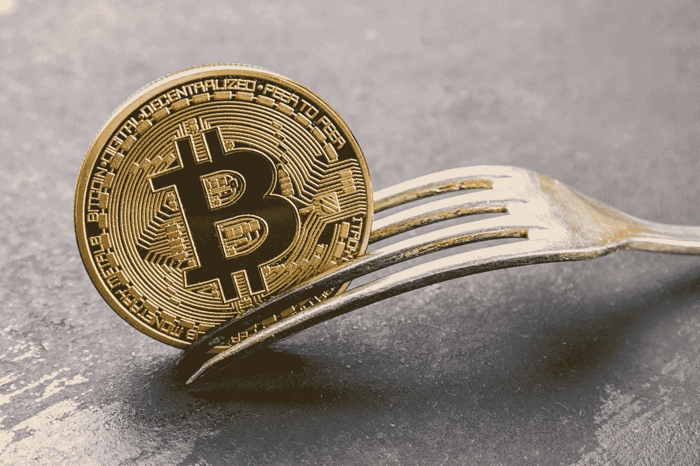

# 加密货币分叉:它们是什么，为什么你会选择其中一个？

> 原文：<https://medium.com/geekculture/cryptocurrency-forks-what-are-they-and-why-you-would-want-to-choose-one-over-another-85da01e98e08?source=collection_archive---------18----------------------->

## 加密货币分叉在区块链和加密货币行业中很常见。然而，它们往往不被理解或有效地解释。

Image courtesy of [Canva](https://canva.com)

加密货币分叉是特定数字货币一分为二的实例。分叉可能是由于货币软件开发者之间的分歧而产生的。当这种情况发生时，开发团队的一部分将实现他们的项目版本，创建多种类型的加密货币。比如 2018 年 11 月发生的比特币现金分叉。

比特币现金团队一直在实施一些改变，这些改变在最初支持比特币及其软件的人看来并不积极。这导致一些最初的团队成员用新的规则和特性实现他们的软件版本。另一个例子是以太坊经典如何在一次有争议的 DAO 黑客攻击后从以太坊分裂出来，DAO 是一个建立在以太坊平台之上的去中心化自治组织。

本文将描述分叉及其对用户的影响。它还将解释为什么用户想要一个分叉而不是另一个来决定支持哪个项目或硬币。但是，首先，什么是叉子？

# 叉子是什么？

当两个挖掘者几乎同时找到一个块时，就会发生分叉，这会导致其中一个作为无效块被丢弃。如果在升级或更改管理网络交易(如比特币现金)的协议方面存在分歧，也可能会发生这种情况。这可能导致创建两个具有不同交易历史的不同分支——一个分支从比特币核心软件继承，另一个分支从比特币现金软件继承。原始区块链将不间断地继续，而每个新分支将有自己的一组分支块，从而创建一个分叉。还有，叉子有两种:软的和硬的。

# 软叉对硬叉

硬分叉是对协议的永久更改，它的不同之处在于它会使其中一个链上有效的事务无效。对于包含在两个分支中的事务，它必须遵循两个分支的协议。软分叉，也称为向后兼容分叉，不同于硬分叉，因为它不一定会导致一个分支的事务在另一个分支上无效。

硬分叉提供了更好的安全性，被视为大多数用户的首选。这是因为硬分叉增加了网络效应，并为正在讨论的加密货币创造了稳定性。通过将权力从开发商手中转移回矿商手中，这也可能导致更大程度的权力下放。

软分叉的一个例子是 Segwit。Segwit(隔离见证)改变了比特币核心软件的交易格式，实施该格式是为了提高交易能力。Segwit 于 2017 年 8 月激活，但直到 2018 年 2 月，比特币网络上运行的所有活跃节点才开始通过拒绝非 segwit 块和交易来强制执行。

分叉听起来会影响我的投资组合。我能怎么做呢？

# 如果我的加密货币分叉，我的投资会怎么样？

如果你的加密货币分叉，这意味着你在两条链上拥有相同数量的硬币。如果是这种情况，您需要决定您想要哪个分支。当然，每个分叉的结果可能会有所不同，但这都取决于您的个人偏好。因此，如果你对支持哪一个团体或哪一种硬币犹豫不决，最好在做出决定之前对每个团体或硬币进行广泛的研究。

但是什么使叉子成为好叉子呢？

# 是什么决定了哪个叉子比较好？

有几个因素可以决定每个项目或加密货币的结果。在两个分叉之间做出选择时，要考虑的一个主要因素是哪一个更有支持力度，无论是来自矿商还是投资者。这可能很难在硬分叉发生之前确定，但在做出选择之前记住这一点是至关重要的。考虑这两个加密货币项目中哪一个已经存在了更长时间，并在很长一段时间内证明了它的价值，这可能也是明智的。

我们可以用比特币现金和以太坊经典找到一个很好的例子。2017 年 8 月 1 日硬分叉后，以太坊分裂为两个独立的加密货币，以太坊(ETH)和以太坊经典(ETC)。这次分裂是由于 DAO 中的问题导致大约 360 万以太网被黑客窃取。这些资金本应退还，但在社区内部进行了大量辩论后，他们没有采取任何行动，资金随后就丢失了。这导致了那些仍然支持旧链的人和那些将以太坊作为一个全新项目向前推进的人之间的裂痕。

这一分裂在社区内部引起轩然大波，导致许多用户和矿工站在 ETH 等一边。那些选择 ETH 的人继续将其交易为新的 ERC20 令牌，使该项目的初始硬币发行(ICO)投资大幅飙升，帮助它在各个领域取得了巨大增长。另一方面，那些选择坚持使用 ETC 的人对区块链技术中不变性和诚实的意识形态概念更感兴趣，他们不想支持他们认为以太坊上本质上不诚实的行为。

这种分歧是他们冲突的主要因素，尽管理论上这可能是个好主意，但最终导致了两个项目的失败。然而，随着时间的推移，越来越多的代表类似意识形态的加密货币开始出现，即使在艰难时期没有脱离 ETH。

# 两个分叉都有可能存在吗？

分叉是加密货币历史上多次发生的事情。每当一个艰难的分叉发生时，通常会有两个想法和目标截然不同的方面。在这些情况下，社区通常支持一个分支或另一个分支。要么是因为两条链都可以长时间保持活性，要么是一侧可以完全消失。因此，2014 年发生的分叉导致两种不同的加密货币在他们的网络上共存，最终分裂成其他企业。我们所指的硬币是以太坊经典(ETC)，而发生的分叉被称为 DAO 或分散自治组织。

# 了解加密货币分叉的最佳方式是什么？

有几种方法可以随时了解即将到来的加密货币分叉，但参加论坛或社交媒体是最直接的方法。如果你想直接了解即将到来的 forks 的最新动态，像 Reddit 和 Twitter 这样的论坛是很好的资源。

当一个新的加密货币分支宣布时，这些在线社区的成员将提供尽可能多的信息。这将包括分叉的日期，以及如果你已经拥有任何被分叉的硬币，在哪里可以找到新的加密货币的钱包来认领你的令牌。

# 结论

如果你想了解即将到来的加密货币，最好的方法是参加论坛或社交媒体。当一个新的分叉宣布时，这些在线社区的成员将提供尽可能多的信息，并分享如果你已经拥有任何被分叉的硬币，你可以在哪里找到你的代币。如果这一切听起来令人困惑，你需要帮助，加密社区比以往任何时候都更强大。然而，这一切都取决于你的决定。

如果你投资加密货币，你必须及时了解你的特定硬币关于福克斯的最新消息。

你经历过 crypto 的分叉吗？

关注我在 LinkedIn 和 T2 Quora 上的其他文章！