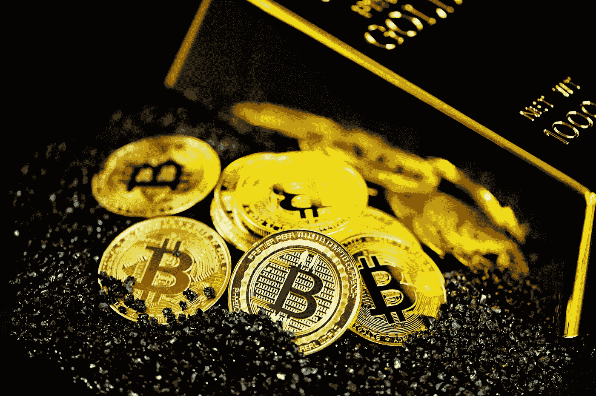

# 加密货币:金融的未来

> 原文：<https://medium.com/geekculture/cryptocurrency-the-future-of-finance-11bece1f988c?source=collection_archive---------35----------------------->

自 2009 年比特币发明以来，它就引起了人们的关注，随着时间的推移，人们对它的兴趣也在增加，现在它已经引起了主流的关注。然而，作为一项新发明，大多数人对它持怀疑态度，甚至拒绝它。例如，一个门外汉听到“比特币、加密货币、区块链、ICOs 等”就会感到困惑然而，除了技术方面，加密货币是一项新的技术发明，改变了支付方式，重新定义了金融系统。

2008 年的金融危机促使人们接受了这项旨在建立一个比法定体系更好的金融体系的发明。在早期，比特币被用于一些非法目的，即洗钱、购买丝绸之路上的非法物品等。可以说，这是自互联网泡沫以来最具颠覆性的技术。

## 比特币是什么？

比特币是一种数字货币，用于在全球范围内进行安全交易。它也被归类为一种价值储存手段，可以用来在没有第三方干涉的情况下向任何人发送价值。被一些人称为“数字黄金”，它是一种在正确存储时不会被黑客攻击或窃取的资产。它是在一个被称为区块链的安全数字网络上创建的。比特币易于使用，速度快，从世界的一个地方传送到另一个地方更便宜，无需支付高昂的费用。它可以被分割到小数点后八位，即交易的 0.00000001 BTC。

比特币是一种遵循用户需求和供给的经济规律来确定其价值的货币，不像法定货币可以被操纵&受到政府经济政策等的影响。比特币的最大供应量上限为 2100 万比特币(流通中超过 1600 万)，这使其成为一种稀缺资产。比特币将像互联网一样彻底改变货币。

它运行在一个被称为区块链的分散的公共账本上。比特币交易被记录在区块链上，公众可以看到。比特币区块链是一个没有中央权威的网络。因此，没有一个中心人物来控制它的运作。因此，它是分散的。用户只需连接互联网和私人钱包信息，就可以轻松跨境汇款。作为一个用户，你所需要的是你的钱包的私人密钥来访问你的令牌。

## 区块链技术；你需要知道的是

区块链是一个安全的代码层，有助于跟踪数字资产。与通过单一服务器连接的传统数据库不同，区块链具有分散的指挥链。它由分布在全球各地的计算机网络(称为节点)管理。这些节点的职责是跟踪网络上执行的每一个单一事务，并将其添加到现有的事务块中。简单地说，区块链是一个会计系统。有趣的是，每笔记录的交易数据一旦被加入网络就不能被修改或删除。这样做是为了保持透明度。

## 货币简史

货币的演变可以追溯到物物交换系统，在这个系统中，人们用商品和财产交换价值。随后，传统机构开始使用银币和金币。这些硬币也表现出货币的一些属性，即稀缺性。后来，随着纸币的引入，银行系统彻底改革了货币。通过这种方式，银行允许人们携带黄金兑换纸币。

1971 年，总统尼克松给了政府印刷钞票的全部权利。因此引入了法定货币。除了政府的支持，这种货币体系没有有形资产的支持。法定货币受到政府的操纵，在引入后不到 100 年的时间里，由于通货膨胀，美元丧失了 90%的购买力。

出于这个原因，许多财务顾问建议投资于其他资产，股票，黄金，房地产等，而不是为了财富保值而持有现金。

根据记录，美元是世界上最好的货币之一。然而，与许多其他资产相比，它不是一种很好的价值储存手段。在此之前，世界上大多数可信赖的价值储存手段是宝石，即金、银、钻石等。然而，最近，加密货币被认为是一种非常有信誉的价值储存手段。例如，华盛顿州 DC 的一家联邦法院裁定[比特币是一种价值储存手段](https://www.coindesk.com/bitcoin-is-a-form-of-money-d-c-federal-court-rules-bloomberg)。

## 比特币对发展中经济体的影响

美国经济是世界上最稳定的经济体之一。因此，如果美国人不关心比特币，这是可以理解的。然而，阿根廷、津巴布韦等国家的人们。经历严重衰退和恶性通货膨胀的美国人会更倾向于进入比特币，因为它提供了一个在他们日益萎缩的经济之外运营的伟大解决方案。

大多数发展中经济体无法获得金融服务。很多时候，这是因为这些商业银行采取了严格的监管措施。然而，人们只需一部智能手机和带有比特币的互联网连接，就可以获得金融服务。只需在智能手机或个人电脑上按几个按钮，你就可以拥有、存储和进行比特币交易。

*你知道……*

> 现在，许多发展中国家都开设了几家场外加密货币交易所。例如，菲律宾所有的 7-11 便利店都允许用户来兑换比特币。比特币和加密货币正在接管世界，发展中经济体也不例外。

## 比特币的独特卖点和价值主张

尽管支付是比特币核心用例不可或缺的一部分，但它不是唯一的一个。比特币也是一种不受政府审查的货币。例如，根据瑞士银行的数据，全球约有 20 万亿美元的财富存在几家高净值个人和公司的离岸银行账户中。这一措施并不违法，相反，这是他们保护自己的资产免受税收、法律案件等影响的合法方式。同样，比特币和其他加密资产可以被用作对冲或价值储存以及其他更高的用途。

## 为什么拥有比特币很重要

可以买比特币有几个原因。它可以是投资、价值储存、货币等的一种形式。然而，需要注意的是，拥有比特币或任何其他加密货币都是一种选择。然而，我在这里指导你做出最好的决定。

以下是我的建议:

*   作为个人，你可以持有比特币和其他加密货币，以获得安全的金融未来。您可以拥有由您最喜欢的数字资产组成的多样化投资组合。
*   加密货币可能在未来的世界经济中扮演重要角色。同样，区块链的资产可以代表我们这个时代最伟大的技术创新之一，就像互联网让许多人成为百万富翁和亿万富翁一样。
*   在不到 15 年的时间里，比特币的价格从不到 1 美元涨到了超过 6 万美元的历史最高水平。这可能是做出投资决定的最佳时机。

*此信息仅用于教育和培训目的，不应被视为投资建议。与所有金融决策一样，在投资任何金融工具之前，您应该联系您的特许金融顾问。**

## 您需要加密货币书写服务吗？给我发一封[邮件](mailto:hello@johnoladokuno.com)。大家讨论一下。