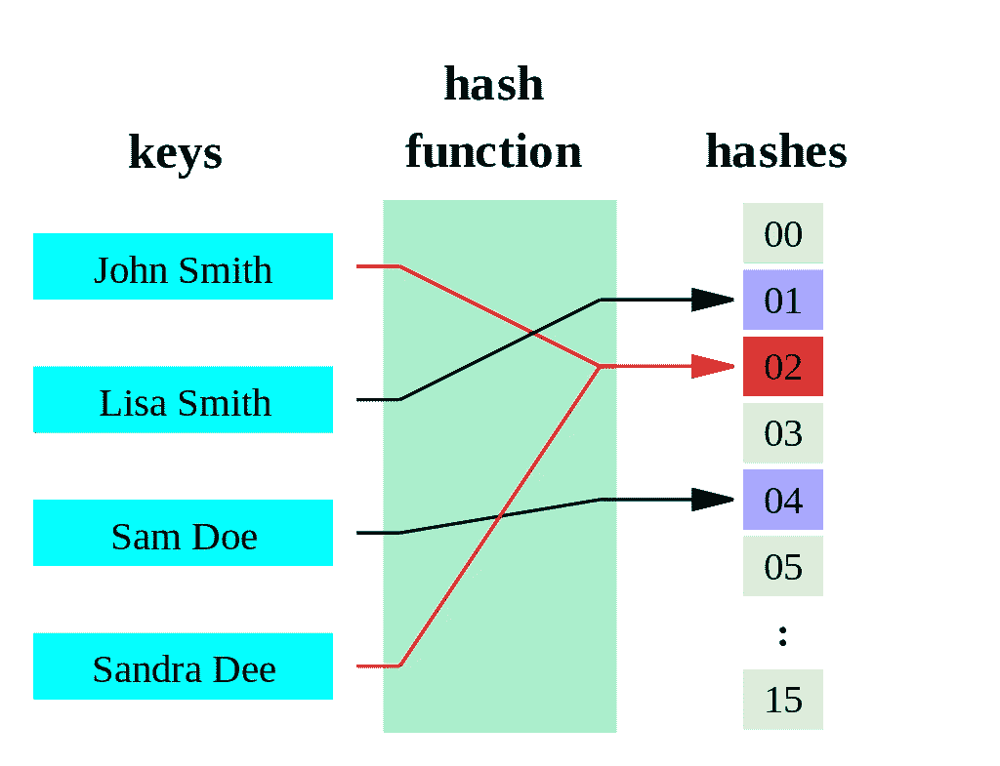
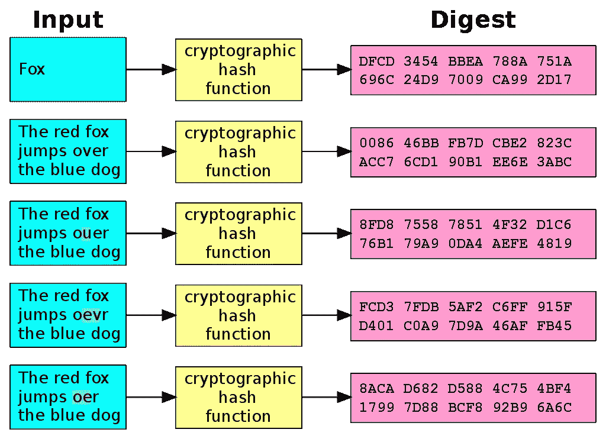

# 加密哈希函数

> 原文：<https://medium.com/geekculture/cryptographic-hash-functions-174875f73338?source=collection_archive---------18----------------------->

[散列函数](https://en.wikipedia.org/wiki/Secure_Hash_Algorithms)是一组广泛的函数。有几种类型，有不同的用途，它们不一定都与密码学中的密码有关。

Photo by [Towfiqu barbhuiya](https://unsplash.com/@towfiqu999999?utm_source=medium&utm_medium=referral) on [Unsplash](https://unsplash.com?utm_source=medium&utm_medium=referral)

然而，作为一个快速的视觉演示，这是来自维基百科关于哈希函数的页面。如果您听说过计算机科学中的术语哈希表或哈希映射，它们与哈希函数有关，这是一个假设哈希函数的示例，它只是将一些输入字符串转换为从 0 到 15 的两位数。

By Jorge Stolfi — Own work, Public Domain, [https://commons.wikimedia.org/w/index.php?curid=6601264](https://commons.wikimedia.org/w/index.php?curid=6601264)

这是一个非常简单的版本，只有 16 个输出，它将被视为一个有效的散列函数。密码很简单，因为我们可能有成千上万不同的用户对他们的密码进行哈希运算。如果我们只有 16 种不同的输出，人们输入多少输入和不同的唯一密码都没有关系。对于一个人来说，一遍又一遍地猜测密码并不需要太多的努力。他们不必为某人的电子邮件获取正确的密码；他们只是必须得到一个恰好散列到同一个数字的密码。

另一方面，并不是每个哈希函数都适合存储密码。这些算法有一个特定的子集，通常指的是获取任意大小的输入并输出固定大小的输出。对于加密哈希函数，在这组加密哈希函数中，我们最关心的是密码哈希函数或密码安全哈希函数。

一般来说，我们需要的特征首先是一个不可逆转的单向函数。因此，作为单向函数的一个例子，让我们假设我们有“ *pass123* ”，我们得到一个散列输出，不管它是什么。但是，如果有人进入我的数据库，他们看到这个密码已经被散列，他们应该没有办法逆转它，并找出输入是什么。

这里有一个简单的例子。绝对值将接受一个正数并返回该正数，作为正数，它将接受一个负数并返回一个正数。所以，如果我有一个名为 absolute 的函数，在 JavaScript 中我们只有 *Math.abs()* 。如果我在这里传递一个数字，我会把它变成一个变量。你不会知道它是什么，我会把它删掉。如果我调用变量 x 的 *Math.abs(x)* ，假设我们得到 10 作为输出，但是你不能告诉我输入是什么。是 10 分还是负 10 分？只有两个选择，但这是一个单向函数。你不能告诉我具体的输入是什么。恰好是负 10，这就是单向函数的原理。

此外， ***“输入的微小变化会产生输出的巨大变化。”*** 所以，如果我们把“pass123”改成“pass 123”，那应该是输出中一个异常实质性的变化。我们应该看不出这两个密码是相似的。仅仅通过查看它们的散列输出。

By User:Jorge Stolfi based on Image:Hash_function.svg by Helix84 — Original work for Wikipedia, Public Domain, [https://commons.wikimedia.org/w/index.php?curid=5290240](https://commons.wikimedia.org/w/index.php?curid=5290240)

上面有个例子。这是使用一种叫做[安全散列算法](https://en.wikipedia.org/wiki/Secure_Hash_Algorithms) (SHA)的散列函数。这是一个输入，它经过一些加密哈希函数，我们收到一个输出。举个例子，

*《赤狐跳过蓝狗》*

然后

*《赤狐跳过蓝狗》*

这里的*“v”*变成了*“u”*所以那里只是一个字符的变化，然后这里的输出就完全不同了。*它不像一对夫妇的性格；这完全不同。*我们不能看着它，想出任何关于原始输入的东西，这很重要。

另一个关键点是，它是确定性的。这只是意味着同样的输入总是给我们同样的输出，如果我们不能总是用同样的输入得到同样的输出，这将使我们所有的费力的工作都白费，并使整个目的落空。否则，恢复散列输出，然后再次散列，就会得到无法比较的结果。你必须承认相同的输入总是给你相同的输出。同样，我们得到两个相同值的输出是不太可能发生冲突的。这有点像，2⁸⁰中的一个，是 1.2089258196146 x 10 ⁴，(这是一个巨大的数字)概率，会发生碰撞，得到两个相同的输出。

最后，慢功能最好。这需要时间，如果我们有一个快速哈希函数，人们就可以更容易地强行进入，尝试哈希一百万次或数十亿次不同的密码，并快速尝试不同的组合。但是如果我们使用一个故意慢的散列函数，就要花更长的时间。