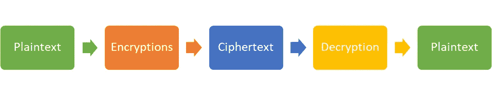
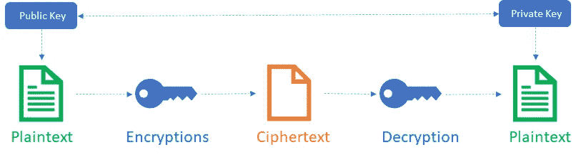

# 密码学——信息安全的艺术。

> 原文：<https://medium.com/geekculture/cryptography-an-art-of-information-security-d51b7723b613?source=collection_archive---------40----------------------->

密码术是一种保护信息和通信的艺术，其中只有发送者和预期接收者可以查看信息的内容。密码学这个术语来源于希腊语[**kryptos**](https://en.wikipedia.org/wiki/Kryptos#:~:text=The%20name%20Kryptos%20comes%20from,sculpture%20is%20%22Intelligence%20Gathering%22.)**和*[**graph**](https://en.wikipedia.org/wiki/-graphy)*，*其中 kryptos 的意思是“隐藏的”，graph 的意思是“写作的艺术”。随着比特币、以太坊等加密货币的出现，Crypto 一词变得非常流行。密码术基本上用于保护电子交易，其中发送者加密消息并通过网络发送，接收者解密消息以获得原始内容。*

# *密码学的组成部分*

***明文:**通信过程中需要保密的文本消息、图像或二进制内容。它是从发送方发送到接收方的未加密或未经处理的数据。*

***加密:**将明文转换成不可读格式的过程，接收方可以将其转换回明文。加密算法用户对消息进行加密，并使用密钥。没有密钥，接收方无法解密消息。*

***密码:**加密和解密信息的一系列步骤被称为密码。*

***密钥:**一组数字，密码通过这些数字将明文转换成密文，反之亦然。*

***密文:**转换成不可读格式的明文称为密文。基于秘密密钥和解密算法，可以容易地对其进行解密。*

***解密:**使用密钥将密文转换回明文的过程。根据使用的加密类型，密钥可能会有所不同，如对称密钥加密，将使用相同的密钥进行解密，而非对称密钥将使用不同的密钥。*

**

# *目标*

***保密性/隐私性:**只有消息的预期接收人才能够解密该消息。*

***可靠性/完整性:**发送给接收方的消息在传输中或静止时不能修改。*

*不可否认性:消息的发送者不能否认消息是他发送的事实。*

***真实性:**在任何时间点，消息的发送方和接收方都可以验证彼此的身份。*

# *密码术的类型*

## *对称密钥加密*

*对称密钥加密是一种加密算法，其中相同的密钥用于内容的加密和解密。这也称为私有或秘密密钥加密，发送方和接收方共享同一个密钥。*

*对称密钥算法的一些例子是:*

*高级加密标准*

*数据加密标准*

*河豚*

**

## *非对称密钥加密*

*非对称密钥加密也称为公钥加密，其中不同的密钥用于加密和解密。一个保持私有的密钥被称为“私有密钥”,一个与所有各方共享的密钥被称为“公共密钥”。数学计算是这样的，私钥不能从公钥导出，但公钥可以从私钥导出。*

*当发送者想要发送一些内容时，他们使用接收者的公钥对消息进行加密。收到消息后，接收者可以使用自己的私钥解密内容。任何窥探中间内容的人都无法解密该消息，因为目标接收者的私钥是未知的。*

*非对称密钥算法的一些例子是:*

*RSA(Rivest–sha mir–ad leman)*

*数字签名算法*

*椭圆曲线密码系统*

**

## *散列函数*

*哈希函数是单向函数，用于保护内容，代价是无法获得原始明文。哈希函数转换固定长度字符串中的文本，验证内容的唯一方法是尝试哈希函数上所有可能的输入，直到两个存储的哈希匹配。*

*散列函数算法的一些例子是:*

*MD5(消息摘要算法 5)*

*SHA-1(安全哈希算法 1)*

*SHA-2(安全哈希算法 2)*

**

# *我们真的使用密码术吗？*

*是的，加密已经成为日常数据传输的标准。我们中的许多人使用消息应用程序向朋友、家人或预期的收件人发送消息。这些应用通过加密传输和休息中的内容来保护我们的信息。当我们配置这些应用程序时，会生成一对密钥并向服务器注册，以帮助我们传输消息。*

*更多的例子有:*

*认证/数字签名服务*

*数据时间戳服务*

*安全网络通信*

*电子邮件服务*

*数据存储*

# *结论*

*当前的技术进步产生了大量敏感数据，这些数据与个人信息的关联度更高，如个人身份信息(PII)或地理位置等。保护这些信息非常重要，因为如果暴露在公共网络中，这些信息可能是有害的。加密是一种保护这些信息并确保只有指定的接收者才能使用这些信息的方法。*