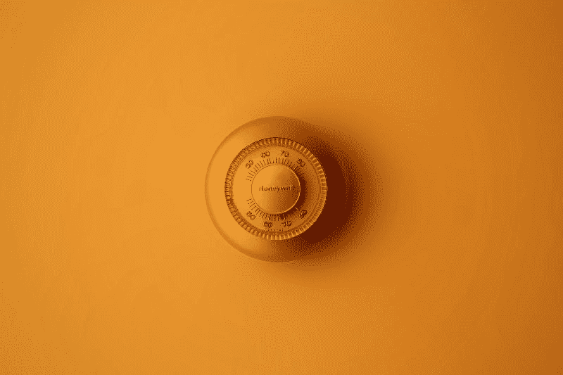
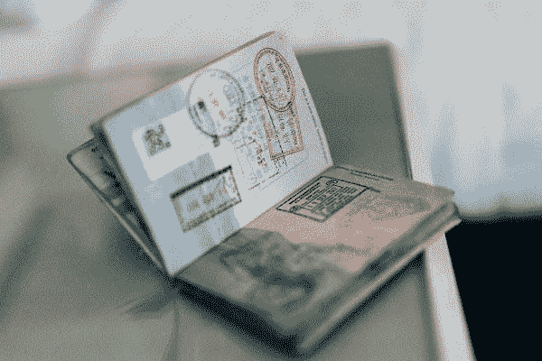
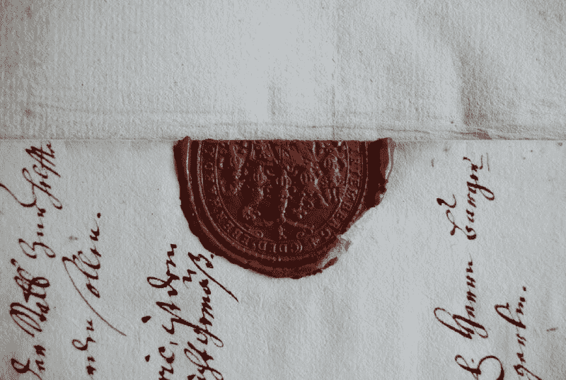
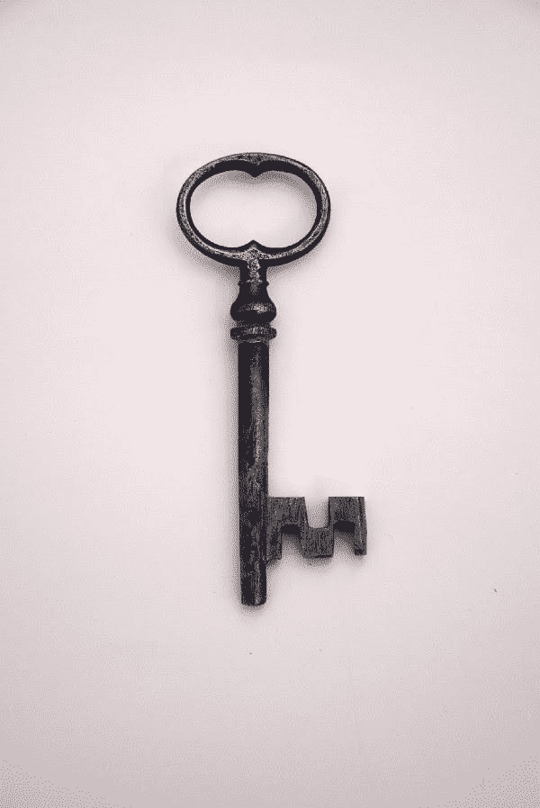
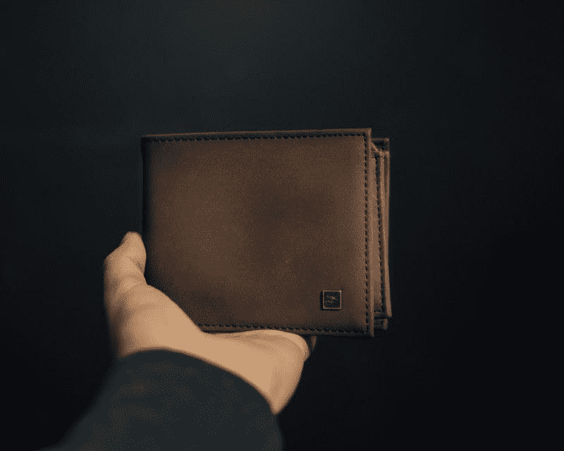

# 区块链加密——简化

> 原文：<https://medium.com/geekculture/cryptography-for-blockchain-simplified-89a1988a342?source=collection_archive---------18----------------------->

## 区块链基础知识再探

## 如果每个人都能进入，你是怎么保卫诺克斯堡的？

照片由 [Moja Msanii](https://unsplash.com/@mojamsanii?utm_source=medium&utm_medium=referral) 在 [Unsplash](https://unsplash.com?utm_source=medium&utm_medium=referral) 上拍摄

*2 万亿美元是今天所有区块链资产的总和——超过了加拿大、俄国或澳洲的 GDP。每周，主要加密货币交易所的交易量都超过诺克斯堡黄金储备的美元价值。*

然而，与诺克斯堡不同的是，区块链是公共网络。全球的任何用户都可以参与这些分散的网络，查询数据，提交交易——当然，也可以尝试入侵它们。

如果我们没有栅栏或防火墙将坏人挡在外面，那么这个巨大的数字价值金库又怎么能得到保护呢？还有什么比诺克斯堡周围的墙更防弹呢？简而言之:密码术！冗长的回答:

*继续阅读…*

# 没有身份就没有所有权

Photo by [ConvertKit](https://unsplash.com/@convertkit?utm_source=medium&utm_medium=referral) on [Unsplash](https://unsplash.com?utm_source=medium&utm_medium=referral)

任何所有权问题都始于身份。如果我们想知道一个人是否是某个物品的所有者，是否有权决定该物品(*授权*)，我们首先需要确定用户的身份(*认证*)。这同样适用于模拟和数字事物。

在现实世界中，州政府向其公民发放身份证(护照)——这将是你买房时任何公证人要求你做的第一件事，也是公证人工作的必要前提。全息形状，紫外线印刷或雕刻断言这些文件的真实性，使他们难以伪造。

然而，在区块链网络中，没有一个集中的实体来保证用户的身份——这就是去中心化的全部意义。那么，在这些全球不信任的网络中，我们如何确定某人的身份呢？这个挑战的答案是数字签名。

# 签名证明身份

链上和链下，签名证明了个人的身份，就像你签署了一份书面合同接受其条款，你签署了区块链交易，然后再发送到网络上。

在这两种情况下，过程都包括两个步骤:首先你*签署* *授权*，然后另一方*验证身份*。收银台的女士会对照你卡上的签名来检查你的签名，就像区块链节点会检查你的数字签名一样。在数字世界中，签名和验证过程是通过加密技术实现的。

Photo by [David Nitschke](https://unsplash.com/@david_nitschke_95?utm_source=medium&utm_medium=referral) on [Unsplash](https://unsplash.com?utm_source=medium&utm_medium=referral)

# 加密保护签名

> “密码学是*在第三方存在的情况下对安全通信的实践和研究”* ( [沃斯姆吉尔，2020](https://shermin.net/token-economy-book/) )

密码术不是区块链技术独有的。事实上，它已经存在了几千年，它对社会的影响是巨大的:[它在中世纪杀死了女王](https://www.englandcast.com/2018/05/mary-queen-of-scots-cipher/) s，[在战争时期拯救了数百万人的生命](https://www.bbc.com/news/technology-18419691)，它是今天互联网上任何安全通信的支柱。

本质上，加密包含两个步骤:

*   **加密**把你想签的任何东西变成一个无法理解的文本(*密文*)；
*   **解密**表示相反的过程，将密文变回可读的明文。

因此，与你在现实世界中的签名不同，这个过程通过伪装你签名的文本并将其转换回可读格式来进行验证。但是什么能防止数字签名的伪造呢？这就是加密密钥发挥作用的地方。

# 钥匙是你的一切

一个数字键只是一个大数字——一个非常大的数字。例如，在以太坊上，私钥由 64 位十六进制数(256 位，32 字节)组成。猜中这样一个数字的几率是 1/115。那就是 115 后面跟着 75 个零。没错，就是*那个*巨大。

Photo by [zarnadi](https://unsplash.com/@zanardi) on Unsplash

如果只使用一个密钥，我们就讨论对称加密——这是完成这个过程的简单方法。在这种情况下，一个人用他们的私钥签署(加密)一条消息；要解密消息，需要完全相同的密钥。

这很像现实世界中的一把钥匙:只有当你拥有它时，你才能访问它锁定的任何东西，从而证明钥匙的有效性。然而，这使得密钥从一个人到另一个人的安全传输成为必要。

正是由于这个问题，对称加密不太适合区块链。区块链使用更加复杂的**非对称加密方法。**

也称为公钥加密，该方法使用两个密钥:一个私钥和一个公钥。私钥只有消息的签名者知道；公钥是从私钥派生出来的一个更短的密钥，可以与任何人共享。任何签名的消息只有在知道公钥的情况下才能被验证——这就是这个系统的美妙之处。

有两种流行的密钥生成系统，ECC(椭圆曲线加密)和 RSA (Rivest-Shamir-Adleman)。两者都是通过创建一个函数来工作的，这个函数在一个方向上很容易求解(从私钥导出公钥)，但是在另一个方向上却完全不可能求解(从公钥构造私钥)。

私钥用于签署区块链网络上的每一笔交易，是您唯一的身份证明。如果您忘记、丢失或泄露了私钥，那么与它相关的任何资金都可能会丢失。一把私人钥匙是你在区块链上最有价值的东西。

***千万小心对待他们，保证他们的安全。***

# 还需要了解什么:钱包、账户、MultiSig

Photo by [Jonathan Duran](https://unsplash.com/@jonathandu?utm_source=medium&utm_medium=referral) on [Unsplash](https://unsplash.com?utm_source=medium&utm_medium=referral)

# 钱包

钱包本质上是存放私人钥匙的地方。它们将安全性与便利性结合在一起:一方面，它们保证您的私钥安全；另一方面，它们是区块链网络的直接接入点，因此你可以签名并直接从你的钱包向区块链发送交易。

然而，一个分散的应用程序需要支持你选择的钱包，并且开发者经常发现他们自己编写特定于供应商的代码或者需要依赖浏览器插件。但也有像 Flow 这样的连锁店提供工具来提供钱包发现服务( [FCL](https://docs.onflow.org/fcl/) )，所以你最喜欢的钱包可以在所有使用 FCL 的应用上使用。

# 帐目

选择区块链时，查看其账户模型很重要，即密钥和账户之间的关系。例如，以太坊直接从公钥中获取你的地址。由于隐私和安全原因，您应该不时地轮换您的密钥，这是以每次使用一个新帐户为代价的。

然而，有些网络遵循以人为中心的账户模式，最明显的是流量。在 Flow 上，您的帐户地址不是直接从公钥中获得的，您可以为一个帐户分配多个密钥对。这不仅缩短了你的帐户地址的长度到 18 个字符，而且当你旋转你的钥匙的时候，它也使你免于切换到一个新的帐户，并且它有多重签名。

# 多重签名

签名交易也可以在一个称为多重签名的过程中由多方执行(简称:*多重签名*)。对于需要集中管理数字资产的组织或团队来说，这是一个非常实用的用例。

以太坊需要使用专门的软件来使用多重签名，而像 Flow 这样的网络已经将多重签名过程嵌入了协议层。

# 结论

正如我们所看到的，加密技术通过提供一种透明且健壮的身份验证机制来保护区块链上的数字资产。由公钥加密技术支持的数字签名是区块链认证的本质，而您的私钥是验证您对数字资产的所有权的唯一工具——请谨慎对待它。

钱包、账户和多签名流都连接到区块链的加密层，您选择的区块链类型会极大地影响您是否以及如何利用这些功能。