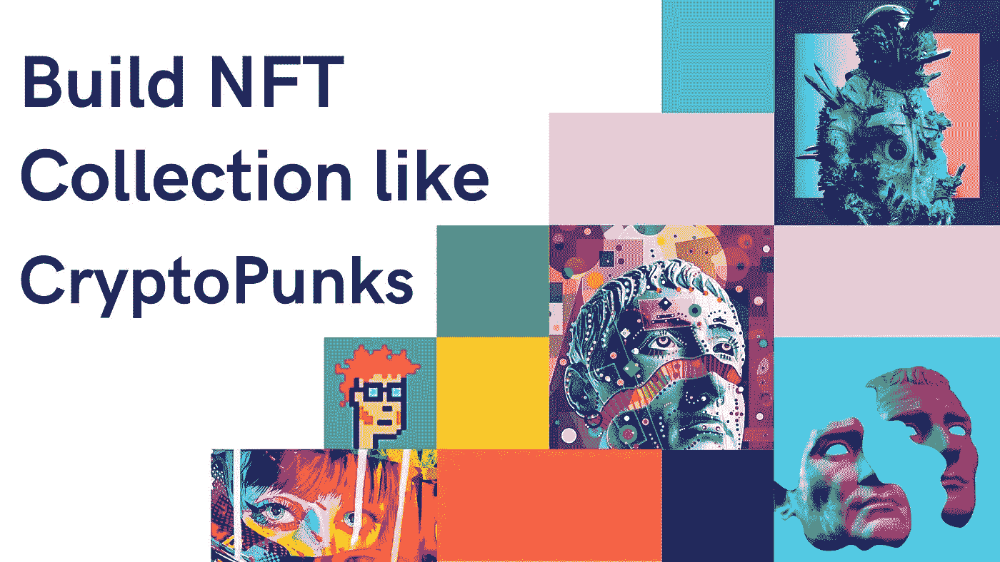

# 加密朋克克隆——创建一个像加密朋克一样的算法生成的 NFT

> 原文：<https://medium.com/geekculture/cryptopunks-clone-create-nft-collections-like-cryptopunks-6300d6a6ca48?source=collection_archive---------16----------------------->

2021 年是 NFTs 年，2022 年也是不可替代代币的开始。今年的第一周已经发布了许多 NFT，随着三星推出适用于 NFT 的电视，大牌公司正在进入市场。NFT 是数字资产，它使用区块链技术来验证各种项目的所有权，如数字艺术、音乐、视频，甚至域名等。

购买 NFT 的人每天都在增加，甚至可以卖到数百万美元。数字艺术家 Pak 的“The Merge”是有史以来最贵的 NFT，价格为**9180 万美元**。在所有的 NFT 中，有一个集合变得特别受欢迎，那就是**密码朋克**。卖出的最贵的 5 种 NFT 中，Cryptopunks 占了 3 种。

# 什么是加密朋克？

Cryptopunks 是以太坊区块链上一个由 10，000 个加密艺术组成的集合，用 NFT(不可替换的令牌)来表示。这 10000 个 NFT 是 8 位风格的小混混，每个人都有独特的功能。Cryptopunks 是第一个激励许多人进入 NFT 世界的 NFT 项目，甚至是 ERC-21 标准的发展。尽管 crypto punk 于 2017 年首次发布，但它在 2021 年变得流行，当时一些 crypto punk 售价高达数百万美元。它们是目前需求量很大的非功能性食物的集合。

# 密码朋克是如何产生的？

Cryptopunks 是在 ERC-20 令牌协议上创建的，因为当时还没有 ERC-721(T11 ),它现在被用来创建 NFT。因此，幼虫实验室必须修改 ERC-20 的代码，以开发不可替代的令牌。这些改进导致了不久后 ERC-721 的发展。尽管它们显示为 ERC-20，但它们是完全相同的令牌，无法与其他令牌相提并论。

# Cryptopunks 如何引出一个巨大的商机？

数字收藏品是新的赚钱概念，帮助很多人产生巨大的收入。CryptoPunks 是这些的先驱，其中一个 Cryptopunks NFT 在 2021 年卖出了 1180 万美元。看过这些之后，许多 NFT 收藏已经进化并获得了数百万。随着各种不同想法的 NFT 在市场上取得巨大成功，许多企业家投资开发 NFT 系列，如 CryptoPunks。

NFTs 越来越受欢迎，它仍然有许多地方需要探索。如果你打算带着 NFT 系列像 crypto punk 一样进入 NFT 世界，那么你可能想知道如何自己创造像 crypto punk 一样的 NFT。那么下面的段落将会是这个问题的答案。

# 如何创建一个类似 CryptoPunks 的 NFT 系列？

先简单说一下像 Cryptopunks 这样的创建 NFT。从头开始开发密码朋克可能非常耗时。开始使用白标解决方案可以最大限度地减少时间和开发。那么，帮助许多企业家更快上市的白标解决方案是什么呢？

白标解决方案是已经从头开始开发并经过测试的现成解决方案。这些不需要经历任何发展阶段。他们只需要根据您的项目需求进行定制，例如在创建图像时定制已经存在的模板。

# 密码朋克克隆

[**CryptoPunks 克隆脚本**](https://maticz.com/cryptopunks-clone-script) 准备部署 NFT 市场脚本，帮助您推出自己的 NFT 收藏，如存储在以太坊网络上的所有权证明的 CryptoPunks。这个脚本已经过测试，可以部署了。你只需要根据你的需求定制脚本并投放市场。这个脚本的功能类似于 Cryptopunks，所有功能都已经内置。

# CryptoPunks 克隆版内置的重要功能

> 电子商务店面
> 属性智能排序
> 购买/销售选项
> 投标选项
> 堆栈列表
> 星际文件系统(IPFS)
> 多令牌标准
> 抵押功能
> 钱包集成

# 创建 NFT 收集像加密朋克与加密朋克克隆

Maticz 是一家 [**NFT 市场开发公司**](https://maticz.com/nft-marketplace-development) ，专注于打造强大的 NFT 市场平台，让用户能够高效地进行非功能性金融交易，并为市场所有者带来更大的投资回报。获得最先进的加密朋克克隆，运行平稳，利用区块链技术的力量，让你每秒钟赚几百万。

无论您在密码或 NFT 领域有什么要求，我们的开发人员都将帮助您提供有价值的解决方案。我们还提供白色标签解决方案，如 [**NFT 市场克隆**](https://maticz.com/nft-marketplace-script) ，帮助加快 NFT 市场的上市时间。