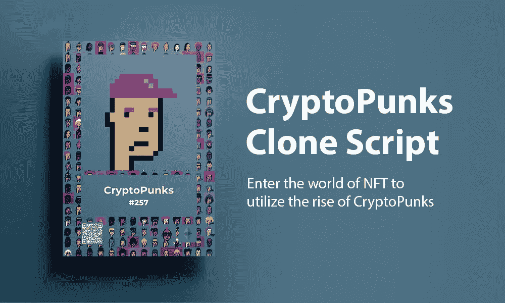

# 密码朋克克隆脚本-进入 NFT 的世界，利用密码朋克的崛起

> 原文：<https://medium.com/geekculture/cryptopunks-clone-script-enter-the-world-of-nft-to-utilize-the-rise-of-cryptopunks-d1f623556433?source=collection_archive---------11----------------------->

CryptoPunks Clone Script — Enter the world of NFT to utilize the rise of CryptoPunks

当今世界正朝着数字化领域发展。从体育到金融行业，每个人都在接受数字化的概念。为不可替代代币铺平道路的加密货币的诞生改变了金融业。不可替代的代币通过在 NFT 市场平台上无缝交易，为企业和个人创造了巨大的收入。在市场平台上最频繁交易的不可替代的代币资产是可收集的。像 CryptoPunks 这样的像素化 NFT 在这些 NFT 收藏品中脱颖而出，在近年来最畅销的 NFT 收藏品中占据了主导地位。密码产业正以如此快的速度扩张，以至于很难预测它的未来走向。CryptoPunks 项目甚至帮助将 Punk 置于聚光灯下，这就是为什么 CryptoPunks 克隆脚本是让你不可能的梦想成真的理想方式。

# 什么是加密朋克？

密码朋克是数字领域引入的正式 NFT。它是由幼虫实验室在 2017 年开发的。国家艺术博物馆的收藏是在区块链以太坊的中心创建的。这件 NFT 收藏品真是独一无二。CryptoPunks 的主要功能元素是它的智能合约。智能合约中嵌入的代码是这款 NFT 的唯一基础。这是一个完全由代码驱动的 NFT。它最初是基于 ERC-20 令牌标准，但由于把它们变成 NFT 的行动，它实现了 ERC-721 令牌标准。crypto 朋克被描绘成一个 24/24 分辨率的艺术盒子，被独特的像素化的脸包围着。有 10，000 个加密朋克 NFT 可用。这些收藏品完美地补充了 NFT 的优点。它们是独一无二的，不能被复制或破坏。

创造朋克的创新方式是其在数字空间快速增长的主要原因。因为这些 NFT 系列是智能合同驱动的，使它们非常独特。他们包括 10，000 个智能合同供电的隐朋克收藏品，分为五个主要类别男性，女性，外星人，僵尸和猿。几乎所有的流派都受到了秘密观众的欢迎。但是外来物种是今天镇上的热门话题。两个外来物种的总成交价超过 720 万美元，而 CryptoPunks 的“covid alien”则赚了近 1170 万美元。这是自 crypto 上市以来最卖座的 CryptoPunks。

# 2022 年密码朋克的惊人统计

NFTs 和元宇宙在 2021 年很大。NFT 拉力赛仍将持续到 2022 年，而且没有减弱的迹象。

*   NFT 市场已经成长为一个价值数十亿美元的产业，许多单个的 NFT 和 NFT 收藏的售价高达数百万美元。
*   CryptoPunks 是世界上最大的 NFT 系列，累计销售额为 23.2 亿美元。
*   如今，CryptoPunk 系列的市场估值约为 30 亿美元。
*   在最贵的五大 NFT 中，CryptoPunks 有三个 NFT。《合并》以 9180 万美元的价格高居最有价值的非物质文化遗产榜首。
*   CryptoPunk 系列中最昂贵的朋克是 CryptoPunk 7523，在苏富比的一次拍卖中以 1175 万美元的价格售出。

# 最有价值的密码朋克

这里列出了最近出售的最贵的密码朋克。

# 排名第一的密码朋克 7523

亿万富翁 Shalom Mechenzie 花了 1170 万美元买下了朋克 7523，这是一个戴着金耳环、医用口罩和红色针织帽的外星人。

# #2 密码朋克 3100

另一个戴着白蓝发带的外星朋克以 758 万美元成交，成为第二贵的加密朋克。

# #3 密码朋克 7804

朋克 7804 也是一种罕见的朋克，售价为 757 万美元。

# #4 密码朋克 5217

这个朋克是一个猿人，他戴着一顶红色的针织帽和一条价值 540 万美元的金链子。

# #5 密码朋克 2140

这个朋克戴着一顶红色针织帽和别致的黑色小太阳镜，这只猿被拍卖了 560 万美元

# #6 密码朋克 7252

以 533 万美元售出

# #7 密码朋克 2338

是一个僵尸朋克卖了 450 万美元。

# 8 号密码朋克 8888

这是一个女性隐朋克，售价为 287 万美元。

# 9 号密码朋克 3831

是花了 208 万买的丧尸。

加密货币用户中也有很多价格昂贵、更受欢迎的朋克。

# 你如何通过算法生成类似 NFT 的密码朋克？

这篇文章解释了如何像 CryptoPunks 一样制作自己的 NFT 数字收藏品。像 crypto punk 这样的 NFT 市场可以通过两种方式创建，从零开始创建 NFT 集合，并为 crypto punk 提供端到端的服务。

第二种方法涉及使用脚本来开发 CryptoPunk 克隆，该克隆提供与 crypto punk 相当的功能，并提供高质量的收藏体验，同时坚持潮流中现成的平台和钱包的范围。

# 什么是 CryptoPunks 克隆脚本？

CryptoPunks 克隆脚本是一个完全现成的 NFT 市场克隆脚本，专门为 CryptoPunks 编码。使用这个[**crypto 朋克克隆脚本**](https://www.alwin.io/blog/cryptopunks-clone-script) 来启动一个部署时没有错误的 NFT 市场。发达的 NFT 市场将为最终用户提供创建、销售、列表和购买密码朋克的选择。密码朋克克隆人是一组 NFT 化身，由计算机通过算法生成，托管在区块链网络上。作为一名技术专家，你可以创建一个有吸引力的店面的市场。强大的区块链技术将使投资者能够买卖虚拟资产。除此之外，你还可以创建自己的独特的数码艺术品收藏，并将其上市出售。记住这句格言“趁太阳还亮的时候好好干”，是时候引入像 NFT 市场这样的加密朋克了。

# CryptoPunks 克隆脚本的惊人特性

*   **店面** —店面显示用户信息、价格历史和投标信息。
*   **令牌搜索** —用户可以快速方便地搜索他们选择的加密令牌。
*   **高级列表** —对于加密货币或数字代币的简单列表，列表选项是可用的。
*   **列表状态** —您可以随时查看列表状态。
*   **钱包集成—** 通过将钱包与其账户关联，个人可以存储他们的数字资产。
*   **投标选项—** 用户可以通过提供定价、投标资格等多种功能轻松投标。
*   **强大的架构** —克隆脚本构建有用于执行自动化功能的框架。
*   **评级—** 用户可以随时检查提供给特定供应商的反馈以及列表的可信度。

# CryptoPunks 克隆脚本是如何工作的？

CryptoPunks 克隆脚本背后的基本概念是资产所有权和通过以太坊区块链网络架构对它们的访问。crypto 朋克克隆脚本是一个完全可用的 NFT 集合，可以部署在以太坊区块链网络或您选择的任何其他网络之上，并根据您的需求进一步定制。

1.  NFT 托管在市场上，并显示在店面上，以及它们的价格、当前所有者和其他相关信息。
2.  用户购买 NFT 有两种选择:要么支付固定价格，要么参与拍卖。
3.  要出售 NFT，卖家必须指定 NFT 的出售价格，或者是否需要拍卖形式的出售。

# 创建一个像 CryptoPunks 这样的 NFT 市场的好处

*   具有高度独特像素化的 NFT
*   具有不可更改特性的唯一源代码。
*   分散源代码
*   多语言援助
*   极度安全
*   大自然的透明
*   平台的不可分割性。
*   互用性

# 为什么要开发像 CryptoPunks 这样的 NFT？

区块链以太坊上最新最优秀的 NFT 项目以有趣的角色为特色，被称为密码朋克。你能确定交易量吗？超过 2.5 亿美元。因此，选择 CryptoPunk 克隆脚本将是一个明智的决定，可以产生可观的收入。探索 CryptoPunks clone 的一长串有趣的改进功能，它与所有知名的 NFT 数字收藏品市场的功能相集成，以提高虚拟资产交易的性能。它还可以让你创建自己的数字作品，并将其上市销售。

# 包扎

近年来，许多艺术家和音乐家开始开发 NFTs，以使他们的工作和艺术作品更加全球化。在艺术和音乐发展的同时，NFT 数字收藏品越来越受欢迎，这给艺术家带来了巨大的利润。隐朋克收藏品作为独一无二的 NFTS 为数字资产领域做出了重大贡献。crypto 朋克克隆软件极大地提高了 NFT 数字收藏品的价值。最重要的是，与顶尖的 [**NFT 市场开发公司**](https://www.alwin.io/nft-marketplace-development) 合作开发 crypto punk 克隆脚本将确保 crypto punk 资产在您的业务中取得成功。