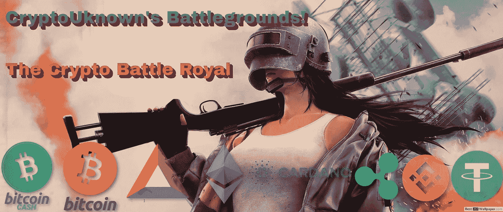
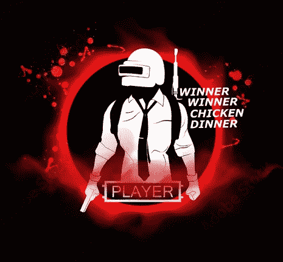
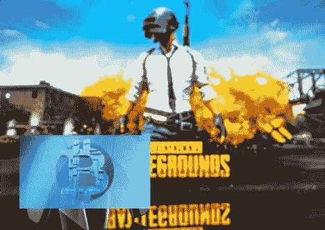
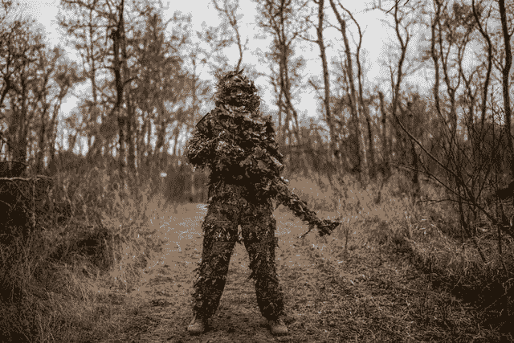
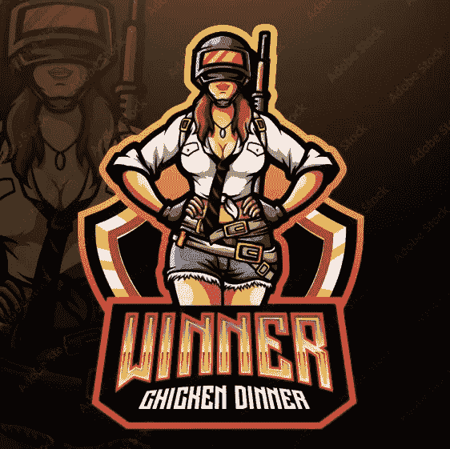

# 未知的加密战场！——皇家密码战，第一部分

> 原文：<https://medium.com/geekculture/cryptouknowns-battlegrounds-the-crypto-battle-royal-part-i-4cef445fd566?source=collection_archive---------11----------------------->

[**Source**](https://www.besthdwallpaper.com/pubg/playerunknown-s-battlegrounds-pubg-mobile-helmet-battle-girl-dt_en-US-63542.html)

太阳正在落山，又一个寒冷的冬夜正在接近波钦基村。

风猛烈地吹着，穿过树林时发出刺耳的沙沙声，让人不寒而栗。

在荒芜的埃兰格尔岛上，典型的一天即将结束。岛上各种城市和村庄的建筑阴森而危险。这里的风景解释了这个被军事实验和黑暗秘密蹂躏的地方的悲惨过去。

但这种沉默即将结束。这是另一轮皇家大密码的开始！

100 枚最勇敢的硬币和代币将很快空降到孤岛上，新一轮的战场开始了！只有一个赢家，最后一个站着的密码！

最狡猾、最具运动性、最快速、最可靠的硬币，能够克服所有障碍并消灭最后一个对手的硬币，将成为获得终极大奖的赢家！

战斗到最后，因为前 100 名最能战斗的加密货币正在全岛激烈的战斗中相互淘汰。

当我们期待在未知世界的战场上的另一个行动协议日时，兴奋正在上升！

# 规则

每个密码都是独立的。没有时间结盟，没有时间合作，不是杀人就是被杀。计时器开始计时，随着战斗的进行，气体被释放出来，地图上包含可呼吸空气的区域越来越小。该区域将迅速缩小，参赛者将不得不放弃他们的“营地”位置，并在地图上的新区域找到新的安全地点。

所有的密码战士在岛上登陆时没有装备或武器，只有他们的技能和生存本能。

他们进入建筑物，找到头盔，武器，盔甲，并在战场上更有效地战斗装备。最后站着的硬币获胜。

*Source:* [*Adobe*](https://stock.adobe.com/gr_en/images/playerunknown-s-battlegrounds-pubg-poster-and-phrase-from-the-game-winner-winner-chicken-dinner-vector-illustration-battle-royale-game-concept/242964009) *(preview),* [*Licence*](https://stock.adobe.com/gr_en/license-terms)

## 选手们正准备跳伞！

我现在宣布所有 100 名参赛者，并在我们开始前介绍他们…

哔，哔…等等..什么？

(来自无线电接收器的噪音)

女士们先生们，我深感抱歉。我刚收到一份传输。看来我宣布晚了，选手们已经跳伞了，大部分已经着陆了！秘密战场开始了！

我非常抱歉，但我将不得不跳过介绍，并开始广播现场加密皇家理由，立即。

幸运的是，我们在岛上几乎所有的地方都安装好了新的摄像机，所以我们不会错过任何精彩镜头！

# 第一轮:战斗！

我们已经看到 Cryptos 的数量在下降。我错过了一些第一次杀戮，像往常一样发生在索斯诺夫卡军事基地，那里许多“亲”硬币偏爱土地。**以太坊**，作为第一名的主要争夺者之一，在密码领域经验丰富，已经用拳头作为武器淘汰了两个“好项目”**和**海德拉，**！**

**已经剩下 95 枚硬币了，因为三名参赛者看起来都是新手，因为他们都不知道如何在深水中游泳。与此同时，另一个在秘密战场上的 noob，**草间弥生**，在试图从光滑的悬崖上滑下时，降落在山顶并自杀。**

**这些锦标赛需要经验和严格的训练，那些最近懈怠的硬币发现很难与“专业”比赛。**

**随着死亡人数的增加，所有参与者都做好了准备。一些有多年经验的加密战士降落在“废墟”上，那里可能会有一个不太动作的开始，但**莱特币**在那里猖獗，并立即降落在一个莱特币用来从竞争中消除 5 个硬币的向量上。在排除了**班科尔**、**任**、**、**、**浪**、**图**之后，莱特币现在是碎片榜的榜首！**

**Litecoin 现在独自一人在废墟的位置上，全副武装，已经装备了 3 级背心和头盔，打包了药物和能量饮料。Litecoin 似乎是一股侦察力量，也是排名第一的另一个主要竞争者！**

****

***Source:* [*Adobe*](https://stock.adobe.com/gr_en/images/december-20-2020-odessa-ukraine-white-new-playstation-5-gamepad-on-the-back-of-the-game-pubg-playerunknown-s-battlegrounds-cybersport-poster-concept/403270291?continue-checkout=1) *(preview),* [*Licence*](https://stock.adobe.com/gr_en/license-terms) *(Modified. Logo from* [*Wikipedia*](https://commons.wikimedia.org/wiki/File:Bitcoin_3d_logo.jpg)*)***

****爆头！**这就发生在乔治波尔的积木上，一颗从 *KAR98k 发射的 10 倍变焦的子弹，*穿过了一级头盔，致命的击中了 **Tron** ，砸开了它的头骨。TRX 现在被淘汰了。但是谁是凶手呢？**

**这张大头照来自战场主要景点的一个镜头。**

**目前市值和碎片数最高的加密货币，目前和永远的冠军，将带领我们度过艰难险阻的加密世界之星，14。**比特币(BTC)！！****

**比特币正在遵循它在十年的战场竞争中完善的露营和狙击策略。通常挫败对手的有利策略，因为它包含出其不意的因素。**

**但是比特币还没有完成，它现在已经陷入困境 15。**戴**当时在隔壁楼三楼露营，目前比特币正在充电。它不能停留太久，因为时间不多了，汽油也快到了。**

****比特币**已经在戴的楼里了，已经换了武器上了 8 月 A3，快速射击弹匣已经搭好，正在往二楼爬。比特币在戴站着的梯子下面停了一秒钟，听着戴用靴子发出的轻微声音，并迅速在二楼的另一边扔出一枚手榴弹，手榴弹爆炸后形成了完美的转移。**

**戴听到身后的爆炸声感到震惊，比特币立即抓住这个机会，跳上梯子，发现戴正看着身后，被爆炸弄得晕头转向。可怜的戴毫无胜算。**

****戴**瞬间被处决，比特币武器的子弹都找到了目标。**

****比特币**现在冲到戴的尸体上清理库存，并立即跳下大楼，跑着寻找一辆车运送到地图的下一部分，因为气体即将在 Georgopol 释放，所有参与者现在都应该移动到地图的中间。**

**许多新手已经是腐烂在加特卡田野里或者普利摩尔斯克和利波夫卡建筑里的尸体了。**

**圈子正在缩小，寻找新的藏身之处和制定重要战略的决定现在很少，而顶级装备现在供应不足，随机地点有限。**

****

# **第二轮——战斗！**

****

***Source:* [*Unsplash*](https://unsplash.com/photos/09y0d02zfnY)*, by* [*Anastase Maragos*](https://unsplash.com/@visualsbyroyalz)**

**本能，技能，经验，活力，运气都会为战场上剩下的硬币发挥作用！**

**到目前为止，我们已经消除了 50 个硬币和代币，还剩下 50 个。**

**第一阶段总是最血腥的，我们已经有一些最强大的秘密战士走出了秘密阵地。**波尔卡多特**、**链环、**和**卡尔达诺**并没有证明他们在这一轮有所作为。**

**币安硬币被“Yolo”买走了，要价超过了预期。在 BNB 首先淘汰了各种不知名的 cryptos(不知何故今天在百强名单上)、 **Telcoin** 、 **XDC 网**、 **Secret** 、 **Curve DAO** token、 **Celo** 之后，它试图与系绳 USDT 打一架。USDT 虽然在 BNB 的势力范围之外，但它用旗帜欺骗了它，降低了 BNB 的能见度。在一个软弱的时刻，由于犯了一个对于一枚价值相当于币安的硬币来说无法解释的错误，它向泰瑟开火了，但是 BNB 携带的 M416 突击步枪的弹匣已经空了。USDT 刚刚给了 BNB 最后一击，淘汰了另一个竞争者。带着高涨的自我，泰瑟现在正朝着幸存和到达最后的 10 个密码前进。**

**同时，回到波钦基的郊区，我们发现了另一个强大的加密战士。一些“分析师”宣称的“**失败者**”**比特币现金**似乎渴望胜利！BCH 处于巅峰状态，完全消灭任何移动的东西，已经杀死 10 个了！！**

**它可能被称为“失败者”区块链，然而，对一些观察家来说，**比特币现金**完全相反。BCH 是**争夺比特币头衔**的主要挑战者，多年来一直在为这场战役**准备**和**开发**！比特币现金横行，使用 AKM 突击步枪，已经暗杀了十个最强的对手。**

**但现在这是什么？**

**我听到很大的犬吠声还是我的耳朵欺骗了我？不要！这是狗叫声和狗叫声。不是一个，而是两个！**

**这是一场混战！柴犬在找到它的主人之前，一直在默默地移动，寻找容易杀死的猎物！Dogecoin 正在追踪它，柴犬正夹着尾巴逃跑，害怕伟大 Doge 的强大力量。**

**Doge 当然不会让柴犬逃脱，已经用几枪打伤了柴犬，但是运气很好，本来要结束战斗的最后一颗子弹，反而打中了**潘**！**

**柴犬目前躲在岩石后面，用创可贴疗伤。多吉的坏运气让它失去了一次在这个隐秘的地方消灭最大敌人的黄金机会。Doge 不敢相信柴犬是如此的幸运，并且正在尝试看看柴犬是否会犯第二个错误。**

**但是，计时器再次超时，气体被释放。所有剩下的玩家必须离开他们当前的位置，向战斗的终点靠近；波钦基周围的地区。**

****

# **第 3 轮(最后一轮):打！**

**只有 20 名玩家(硬币)留下来，因为许多人被留下来，并因无法到达地图上的安全呼吸点而死于气体窒息。一些人被已经在安全区的狙击手射杀，目标是任何晚进入的人。**

**秘密皇家战场的最后一部分开始了。**

**赢家赢家鸡肉晚餐！**

****

***Source:* [*Adobe*](https://stock.adobe.com/gr_en/search/images?k=pubg&asset_id=333878930) *(preview),* [*Licence*](https://stock.adobe.com/gr_en/license-terms)**

**下一个死的是谁？谁赢了？**

****第二部分:****

**[**加密未知的战场！——皇家密码战第二部:**](/p/5bbff5635239) **最后一战****

****

**Follow me on: ● [ReadCash](https://read.cash/@Pantera) ● [NoiseCash](https://noise.cash/u/Pantera99) ● [Medium](/@panterabch) ● [Hive](https://hive.blog/@pantera1) ● [Steemit](https://steemit.com/@pantera1) ●[Vocal](https://vocal.media/authors/pantera) ● [Minds](https://www.minds.com/pantera99/) ● [Twitter](https://twitter.com/Panterabch) ● [LinkedIn](https://www.linkedin.com/in/panterabch/) ● [email](https://read.cash/@Pantera/localcryptos-p2p-exchange-is-now-offering-bitcoin-cash-trading-06637230#bad-link)**

****备注:****

> **免责声明:本内容中发布的所有材料均用于娱乐和教育目的，并符合合理使用的准则。无意侵犯版权。如果您是或代表本文所用材料的版权所有者，并且对所述材料的使用有疑问，请发送[电子邮件](https://read.cash/@Pantera/cryptouknowns-battlegrounds-the-crypto-battle-royal-part-i-0ca762da#bad-link)。**

*****支持内容创作者。*****

**如果你喜欢这个故事，就订阅吧！**

***原载于*[*https://read . cash*](https://read.cash/@Pantera/cryptouknowns-battlegrounds-the-crypto-battle-royal-part-i-0ca762da)*。***

****