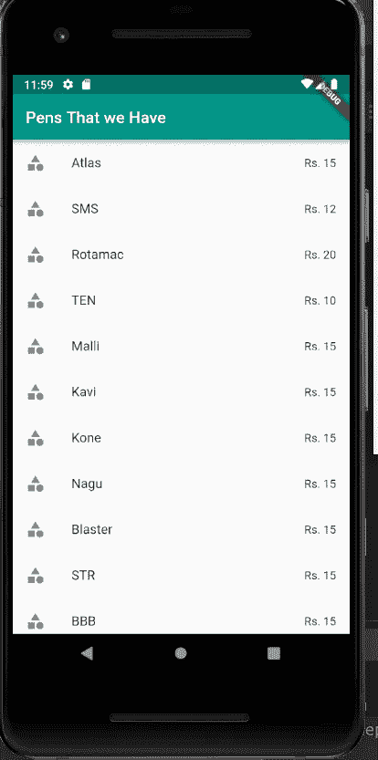
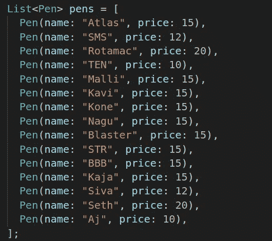
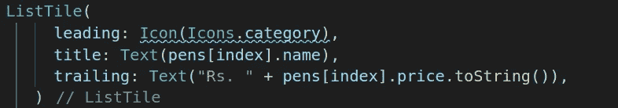
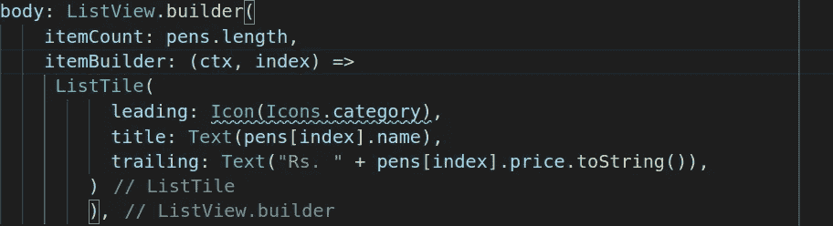
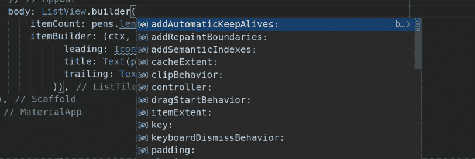
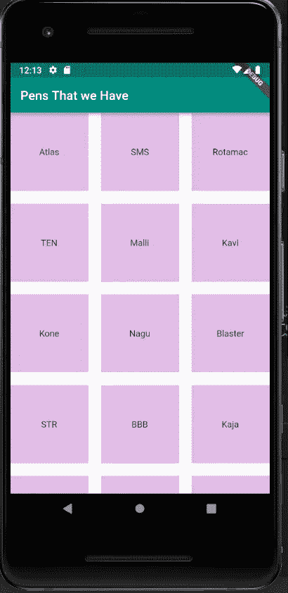
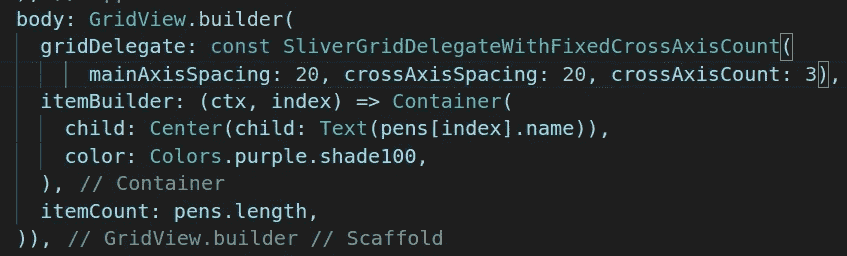
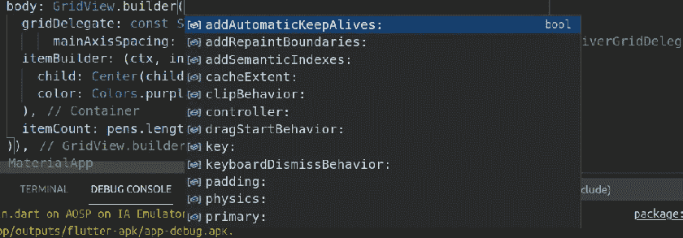

# 不要在 Flutter 中使用 ListView.builder 和 GridView.builder。(除非，你很清楚自己是做什么的。)

> 原文：<https://medium.com/geekculture/crystal-clear-idea-about-listview-builder-and-gridview-builder-1ff0238eeac7?source=collection_archive---------2----------------------->

在 Flutter 中，谁是你最亲密的伙伴或助手？在我看来，在我的 VScode 中，最好的组合是 ctrl+空格键。开发应用程序时，了解将用于分配微件的所有属性非常有用。让我们放低声音，采取更多行动。现在让我们把注意力转向我们的概念。今天我们将学习颤振中最想要的话题，一旦我们理解了这些基本原理，我们将能够在颤振中表现得更好。

# **ListView.builder**

它通过按需生成可滚动的线性小部件阵列来帮助创建一个长列表。

你现在有一个问题。如何充分利用 ListView.builder？

有一个带有文本“我们拥有的笔”的 Appbar 小部件。

这一点你已经很熟悉了，所以我就不详细介绍 Appbar 了。

ListView.builder 是在主体内创建的。

一、在创建 ListView.builder 时，必须考虑以下步骤:步骤有哪些。

1.  创建数据源
2.  将数据源转换成小部件
3.  在 ListVeibuilder 中将小部件转换为子部件

## **创建数据源**

在这里，您将收集一些笔名和价格的详细信息。
所以我决定创建一个蓝图，这意味着我要创建一个包括名字和价格的钢笔模型。

因此，使用一个模型，我将创建各种各样的笔，然后我将把它们放入一个列表并标记为“笔”

好了，我已经建立了一个数据源，这样第一步就完成了。

**2。将数据源转换成小工具**

然后我们进行第二步，将数据源转换成一个小部件。指的是你将用来显示列表每一项的 widget 的类型，最有可能在列表视图构建器内部(大部分使用 ListTile)，但这不是必须的；你可以使用容器、卡片等。

3 **。在 ListVeibuilder 中将小部件转换为子部件**

现在，我们来看最后一步，将小部件转换为 ListView.builder 中的子部件。在 ListView.builder 中，我们必须传递 **itemCount** 和 **itemBuilder** ，以及几个可选的参数。我将列表的长度作为 itemcount 的值传递。提供非空的 itemcount 可以提高[ListView]估计最大滚动范围的能力。

**itemBuilder** 应该总是返回一个非空的小部件，并在被调用时实际创建小部件实例。

在 itemsBuilder 内部，我们必须传递一个以上下文和索引作为参数的函数，并返回子窗口小部件。因此，因为我们已经创建了 ListTile 小部件，所以我将其返回，如下所示。

它包含许多项目。尽管如此，我们的应用程序是内存高效的，因为 ListView.builder 只是为那些在屏幕上可见的项目调用该方法。屏幕之外的其余项目不会加载到内存中，这样可以节省内存。

在本文的开始，我提到了 ctrl+空格键，因为没有人知道小部件的所有属性。此快捷方式将帮助您提高应用程序的效率。现在，如果我在 ListViewBuilder 小部件中按 ctrl+空格键，您将会看到这样的内容。

There are several properties available in the ListViewBuilder widget.

ListViewBuilder 小部件中有几个可用的属性。

# GridView .生成器

它类似于 ListViewBuilder。我们应该传递两个参数。

1.gridDelegate

2 .项目生成器

在 gridDelegate 中，我们通常传递 slivergriddelegatewithfixedcrosaxiscount()，它构建一个委托，该委托创建在横轴上具有固定数量的瓦片的网格布局。好的，我们可以将 mainAxisSpacing、crossAxisCount 和 crossAxisSpacing 参数发送给 slivergriddelegatewithfixedcrosaxiscount()，但它们不能是负数。slivergriddelegatewithfixedcrossAxisCount()的唯一必需属性是 crosaxiscount，它告诉我们横轴上有多少个子轴。

我们使用 crossAxisSpacing 来保持孩子之间的**社交距离**(沿横轴放置每个孩子之间的空间。)和 mainAxisSpacing(沿主轴在每个子对象之间放置空间。)

上图显示了网格视图中包含文本小部件的大量容器。

此外，我们传递 itemCount 否则，您可能会收到范围错误。

您还可以通过使用 Inkwell 小部件或 GestureDetector 来执行特定的操作，从而使子组件可点击。

我已经向您展示了如何查看我们可以访问的所有属性。
现在我们来看看一些属性。

**滚动方向:Axis.horizontal**

它将从左向右滚动。

**物理:neverscrullablescroll physics()**

它创建了阻止用户滚动的滚动物理。我们不能滚动。

**反转:真**

它将用于反转列表中的项目。

**dragstarbehavior:dragstarbehavior . down**

它将用于从底部到顶部拖动网格。

> 我希望你喜欢这个故事。如果你有任何问题或需要澄清，请在下面的评论中留下，或在 Twitter 上联系我。

— — — — — — — — —谢谢您

这里有一个到我们官方网站的链接，在这里你可以了解更多的技术和新想法。

[https://stack good . blogspot . com/2021/08/dont-use-listview builder-and . html](https://stackgod.blogspot.com/2021/08/dont-use-listviewbuilder-and.html)