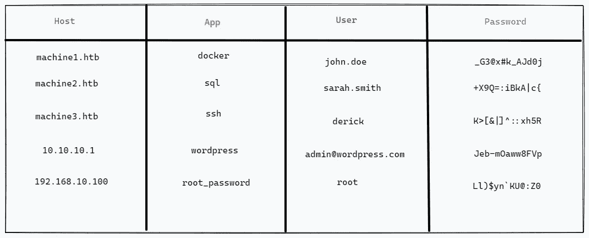

# CSG:CTFs/pentest 的证书存储

> 原文：<https://medium.com/geekculture/csg-credential-storage-for-ctf-pentests-e12d48383c8f?source=collection_archive---------18----------------------->

## 从终端简化凭证管理

H ello，世界！我最近写完了一个工具的第一个版本，我称之为`csg`，它是“带 Go 的凭证存储”的缩写。`csg`允许您集中存储您在 CTFs/Pentests 期间获得的证书，以便更快地访问和管理它们。在本文中，我将做一个快速演示…