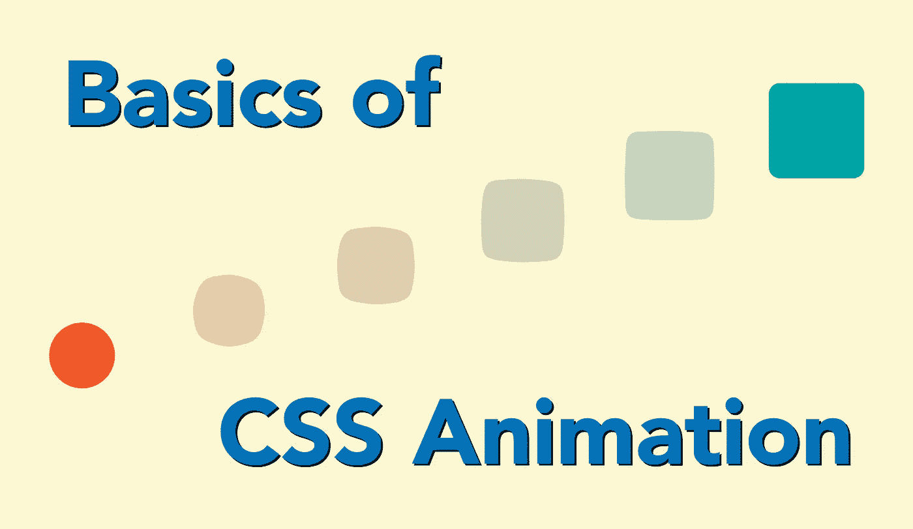

# CSS 动画基础

> 原文：<https://medium.com/geekculture/css-animations-can-add-some-polish-and-shine-to-website-1cd5c864b9ea?source=collection_archive---------54----------------------->

CSS 动画可以给网站增添一些光彩。它们还可以为用户提供一些关于用户界面的视觉反馈。尽管在网站的关键方面使用 CSS 动画有一些问题——特别是在使用 CSS 动画会影响可访问性的地方——但如果小心使用，它们可以以一些非常吸引人的方式增强网站。



Basics of CSS Animation

为了使用基本的 CSS 动画，理解 CSS 上下文中的[过渡](https://developer.mozilla.org/en-US/docs/Web/CSS/CSS_Transitions)、[变换](https://developer.mozilla.org/en-US/docs/Web/CSS/CSS_Transforms)和[动画](https://developer.mozilla.org/en-US/docs/Web/CSS/CSS_Animations)的概念是很重要的。这些概念支持创建简单的动画，如按钮颜色的逐渐变化，以及复杂的动画，如在屏幕上移动对象，同时改变其形状和不透明度。

# 过渡

过渡会将一个 CSS 属性的受控更改应用到另一个 CSS 属性。CSS 开发人员可以控制过渡的各个方面，包括过渡的属性、持续时间、计时功能和延迟。

转换的基本结构如下所示:

```
div {
  transition: <property> <duration> <timing-function> <delay>;
}
```

过渡的每个方面都可以单独定义。

*   **过渡延迟**:应用过渡前的等待时间
*   **过渡持续时间**:完成过渡所需的持续时间
*   **转换-属性**:转换的目标属性
*   **过渡-计时-功能**:过渡加速曲线的定义

对多个属性的更改可以单独指定，每个属性之间用逗号隔开，或者使用`all`关键字一次指向所有属性。

```
.box {
  padding: 10px;
  border: 1px solid #555;
  width: 100px;
  height: 100px;
  background-color: lightgray;
  transition: all 0.4s ease-out 0.2s;
}.box:hover {
  height: 120px;
  width: 120px;
  color: white;
  background-color: dodgerblue;
  box-shadow: 0px 0px 10px black;
}
```

在本例中，转换由`:hover`伪类选择器触发，并应用`transition: all 0.4s ease-out 0.2s;`，该选择器将在`0.4`秒内利用`ease-out`计时功能和`0.2`秒的延迟在两个状态之间转换`all`属性。

# 改变

可以对网页上的元素进行变换，包括旋转、缩放、倾斜或平移元素。默认情况下，变换应用于元素的中心，但这可以通过使用`transform-origin`属性来修改。

```
.box {
  width: 100px;
  height: 100px;
  background-color: lightgray;
  transform: rotate(45deg);
  transform-origin: top left;
}
```

`transform`属性可以接受两个值。或者是一个`<transform function>`或者是一个`none`的值。

有几种不同的*变换函数*可以应用于变换属性。一些转换函数包括:

*   **rotate()** —用于围绕 2D 平面上的固定点旋转元素
*   **scale()** —用于在 2D 平面上放大或缩小元素
*   **倾斜()** —用于倾斜 2D 平面上的元素
*   **translate()** —用于平移(或移动)2D 平面上的元素。
*   还可以使用 **translateX()** 和 **translateY()** 沿 X 轴或 Y 轴平移

# 动画

CSS 动画允许从一个 CSS 属性到另一个 CSS 属性的动画转换。这是通过定义将被动画化的样式和定义一组关键帧来完成的，这些关键帧指示动画的开始、中途点和结束状态。

要设置一个动画，第一步是使用`animation`属性来配置名称、持续时间、计时功能、延迟、迭代次数、方向、填充模式和播放状态。一旦定义了动画，就可以用`@keyframe`规则来定义动画的外观。至少需要两个关键帧，并且可以添加更多关键帧，以在序列的中间阶段提供动画的更多描述。

动画属性的配置选项可以单独定义为单独的子属性。

*   **动画名称** —指定描述动画关键帧的@keyframes at-rule 的名称。
*   **动画-持续时间**-配置动画完成一个循环所需的时间长度。
*   **动画-定时-功能** —配置动画的定时；也就是说，通过建立加速度曲线，动画如何在关键帧之间过渡。
*   **animation-delay** —配置元素加载时间和动画序列开始之间的延迟。
*   **动画-迭代-计数** —配置动画应该重复的次数；您可以指定 infinite 来无限重复动画。
*   **动画方向** —配置动画是否应该在序列的每次运行中改变方向，或者复位到起始点并重复播放。
*   **动画填充模式** —配置动画执行前后应用的值。
*   **动画播放状态** —允许您暂停和恢复动画序列。

## 基础动画

首先要做的是给动画属性添加一些值，或者作为使用`animation`属性的单个简写定义，或者作为动画子属性的单独条目。一旦定义了动画，就可以定义关键帧，应用为要动画化的元素定义的动画名称。`@keyframes`规则的选项包括使用`from`和`to`关键字来指示关键帧的开始和结束。也可以将关键帧的步长定义为从`0%`开始到`100%`的百分比，中间有许多不同百分比值的步长。

```
.box {
  /* basic styles... */ animation-name: moveBox;
  animation-duration: 3s;
  animation-timing-function: ease-out;
  animation-delay: 1s;
  animation-iteration-count: 4;
}@keyframes moveBox {
  from {
    left: 100px;
  } to {
    left: 500px;
  }
}@keyframes moveBoxAround {
  0% {
    left: 50px;
  } 50% {
    left: 1000px;
    top: 200px;
  } 100% {
    left: 50px;
  }
}
```

这个动画——应用`moveBox`动画——将盒子从左边 100 像素移动到左边 500 像素。`animation`属性可以用以下方式重写:

```
.box {
  /* animation: name | duration | easing-function | delay | iteration-count */
  animation: moveBox 3s ease-in 1s 4;
}
```

## 多个动画

可以在一个元素上运行多个动画，每个动画有一组不同的属性值和`@keyframe`规则。动画将全部应用于元素，并根据指定的值运行。

```
.box {
  /* styles for the element... */ animation-duration: 4s, 8s;
  animation-name: moveAround, fadeOut;
  animation-timing-function: linear, ease-out;
  animation-iteration-count: infinite, 1;
}@keyframes moveAround {
  0% {
    left: 20px;
    top: 20px;
  } 25% {
    left: 300px;
    top: 20px;
  } 50% {
    left: 300px;
    top: 300px;
  } 75% {
    left: 20px;
    top: 300px;
  } 100% {
    left: 20px;
    top: 20px;
  }
}@keyframes fadeOut {
  from {
    opacity: 1;
  } to {
    opacity: 0;
  }
}
```

这些动画将移动元素，其中`moveAround`动画将根据动画每个部分的百分比遍历关键帧，而`fadeOut`动画将遍历从`from`关键字开始到`to`关键字结束的关键帧。