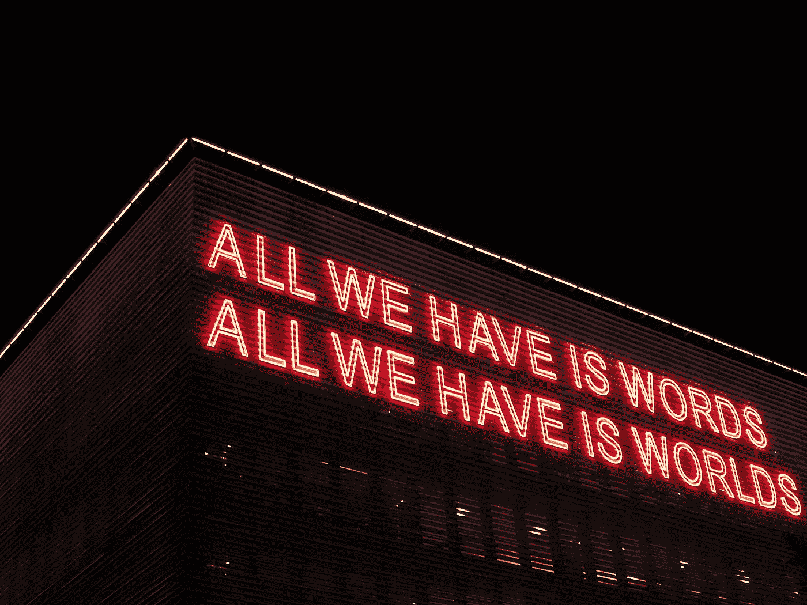

# 2021 年的 CSS 方法:当前 Web 开发状态的语义和非语义样式

> 原文：<https://medium.com/geekculture/css-approaches-for-2021-semantic-and-non-semantic-styling-for-the-current-state-of-web-development-1581916ca1c0?source=collection_archive---------5----------------------->



Photo by [Alexandra](https://unsplash.com/@alex_tsl?utm_source=unsplash&utm_medium=referral&utm_content=creditCopyText) on [Unsplash](/s/photos/words?utm_source=unsplash&utm_medium=referral&utm_content=creditCopyText)

不久前，我写了一系列关于 Web 历史和 HTML 的文章。这个系列的第二个是关于[弃用的 HTML 标签](https://msandrini.medium.com/the-history-of-deprecated-and-changed-html-tags-47cdfd2c427e)(顺便说一下，这里是第一个[和第三个](https://msandrini.medium.com/how-web-development-technology-was-shaped-524124ef9d13))。在这篇文章中，我强调，在 Web 的早期，HTML 负责功能、内容和表示。后来，遵循其他领域从计算中借鉴的惯例，我们提出了通常被称为**关注点分离**的东西。这意味着，当谈到功能时，JavaScript 接管了，对于演示，我们得到了*级联样式表*，简称 CSS。对于功能部分，分离是完全有意义的，但是表示部分似乎有一些更深入的讨论。

# 语义与非语义 CSS

当分析流行的 CSS/布局框架时，如 *Bootstrap* 或 *Tailwind CSS* ，甚至是像 *OOCSS* 这样的约定，人们可能会注意到它们并没有遵循 HTML5 的规范，即类名必须是语义性的(也就是说，类名要描述对象的角色，而不是它的视觉特征)。这从概念上回到了 HTML 将内容和表示结合在一起的地方，尽管上面所有的例子都使用了 CSS 的能力，但不管它是一个 HTML 标签还是一个 HTML 标签，它仍然是在 HTML 上编写表示的相同的概念方式。

这听起来肯定像是一种倒退，但我并不认为这一定是坏事。事实上，人们可以说这实际上是一件好事。

## 非语义 CSS 和“主题化”web 的前景

当 CSS 处于早期阶段时，一个名为 *Zen Garden* 的网站提议通过一个固定的 HTML 代码向人们展示 CSS 的威力，该代码只能通过 CSS 进行整体的可视化修改。它给人一种令人惊讶的新鲜感，当时每个前端 web 开发人员都知道这个网站，并从中获得了一定程度的影响。那个网站是展示主题化承诺的橱窗，主题化是 CSS 早期最大的卖点之一。

那时候，在简单的论坛和博客时代，对网站开发者来说，在网站上定制主题是一件非常酷的事情。在那个时候，他们通常只处理 CSS，应用于继承的 HTML，而 HTML 又呈现在后端服务器上，他们无法接触或不想接触。对于 AJAX 和单页面应用程序来说，这种情况变化很快，但是直到很久以后才普及开来。

奇怪的是，即使主题不再是一件大事，我们仍然认为它是 CSS 和语义 CSS 的最大影响点之一。也许拥有像`class="box"`这样的语义 HTML/CSS 配对可能会让人想起一个早已过去的*渴望主题的*时代，在那个时代，你能够以任何你想要的方式设计和重新设计`box`的样式，这可能是一个真正的优势。

其他因素也在最近非语义 CSS 的兴起中发挥了作用:模板结构不那么分散，更容易遍历，其方面更加集中，名称冲突基本上被消除，当涉及到颜色和尺寸时，样式可以更加标准化。

## 语义 CSS 是可读的

这并不意味着整个语义故事是一个可怕的错误。语义 CSS 仍然是官方推荐的方法，尽管主题通常不再被关注，但我们仍然有不得不改变全局布局参数的情况，比如所有链接的颜色。“纯”非语义 CSS 项目中的这种情况变成了一个真正的问题。对我来说，这种方法最大的问题是模板代码变得难以阅读。可读性总是一个问题，但是取决于你的代码库，它可能是一个决定性的因素。作为鲍勃大叔的追随者，我从来不敢低估它。

同样值得一提的是，非语义 CSS 的一个卖点——名称冲突——可以通过多种方式安全地解决，包括更具体的命名和作用域(我将在后面提到)。

## 然而，我们的实际问题是什么？

现在，在很大程度上，我们使用 HTML 和 CSS 的方式与 20 年前不同。我们现在不仅有不同的可能性，我们还有一系列非常不同的问题。

现在，为了建立我们的大规模动态网站，我们大量使用单页应用程序框架，如 *React* 、 *Vue* 和 *Angular* 等捆绑器，如 *Webpack* 和 *Parcel* ，有时还会使用新工具，如*风格的组件*。虽然我们仍然需要为用户生成尽可能小的资产，但是随着上面提到的所有可用工具，前端应用程序编码的重要方面发生了变化。现在，我们可以专注于**拥有一个可行的、可读的和高性能的代码库**，而不是花费大量时间来预先优化将直接交付给用户的资产，因为打包者会负责缩小和交付。

# 新的需求，新的方法

HTML + CSS 对是在没有像今天这样的单页应用程序框架和捆绑器的时代构思出来的，所以我们不需要觉得有任何义务将 CSS 作为一个文件或一系列文件在 HTML 模板中调用。事实上，今天大多数“索引”模板只是 JS 捆绑文件的哑调用者，该文件基本上可以做任何事情:逻辑、动态生成的 HTML 以及 CSS，它们通常经过预处理，甚至直接用 JS 代码编写( *CSS-in-JS* )。

在这种新情况下，这种语义与非语义的讨论有意义吗？我会说是的，但是部分原因是。为了设想我们想要什么，知道这个对比仍然是很重要的，但是当 CSS 的*香草*方法不再总是有意义的时候，我们可以根据情况利用许多可能更加优化的可能性。

## 快速原型

对于这些人来说，布尔玛或*引导*仍然很方便，而且，如果你不介意学习那么多课程的话，*顺风*也会很有用。不过，对我来说，这些似乎只是概念证明和需要快速制作的项目的理想选择，因为它们限制了设计师，并且可能会给代码库增加许多不必要的重量。此外，如果您发现自己在定制这些解决方案上花费了太多时间，您可以考虑以下建议。

## 较小的项目

对于这些，在类似于`.vue`文件或导入的样式文件的组件上使用限定范围的样式，以便以后捆绑在一起，这可能允许语义解决方案带来可读性，同时可以完全避免名称冲突。当您只有几个全局 CSS 定义和许多本地组件(UI 或功能组件，对于较小的项目来说不应该太重要)时，这可能是理想的。

## 更大的项目

最重要的项目通常是在框架和捆绑器之后构建的，尤其是考虑到那些工具，依靠 CSS-in-JS 库，比如 *Emotion* 和 *JSS，可能是明智的。*它们可以是更大的代码库的理想选择，因为它们将 JS 变量的全部力量借用到 CSS 中，同时能够在一个完整的优化代码管弦乐队中扮演自己的角色。不仅如此，如果与有意义的描述类一起使用，这些库还可以用于具有语义和非语义优点的方法:

```
*// ... in a separate file*
**const redText = 'color: red;'
const sidePadded = 'padding: 8px 0;'***// ... in the component file*, after imports
**const useStyles = createUseStyles(****{ myTitle: redText + sidePadded }****)****const MyTitle = () => {
  const styles = useStyles()
  return <h1 className={styles.myTitle}>...</h1>
}**
```

如果你不介意上面假想的 JSS +反应 JSX 应用程序的愚蠢，你可能会发现我们正在使用聚集在语义 CSS 属性上的非语义变量，根据设计师选择的方式，为了可读性和更好的标准化。此外，生成的代码将更容易检查，全局样式也更容易更改。当然，这意味着要和全局定义一起使用。

不管怎样，将全局定义写在项目的设计需求之上是很重要的。适用于所有事物的标准形状、颜色、字体和尺寸都需要集中在一个容易接近的地方。

最后一点，有很多关于 CSS 如何做好每一件事并且不需要任何类型的预处理，或者 CSS 变量如何是必须使用的，因为它们可以防止你重复自己(至少是太多)，但是这些评论没有抓住要点。尽管有些情况下你需要依赖 Canvas 之类的东西，但 CSS 显然是有用的，你可以让它以任何你想要的方式工作，甚至是在 1996 年左右的设置中，根本没有捆绑和结构化项目。

我们在这里的目标不应该仅仅是实现对最终用户有用的东西。无论是否遵循上述方法，目标应该是一个调整到今天重要的目标:**组织**。在一个大型的专业项目中，能够在代码库或生成的模板中找到自己的方式，在运行中轻松地调整事物，并利用 JS 的力量来增强代码的分发，这些目标更适合我们今天的工作方式。

注意到所有这些，我认为 CSS 和 HTML 在经历了如此多的适应和发展之后，可能在它们当前的大多数用例中表现不佳。如果我们有这种配对的替代品，我们在 web 开发世界会是什么样的呢？我计划在未来写更多的内容，但是我会把重点放在现在可行的事情上。