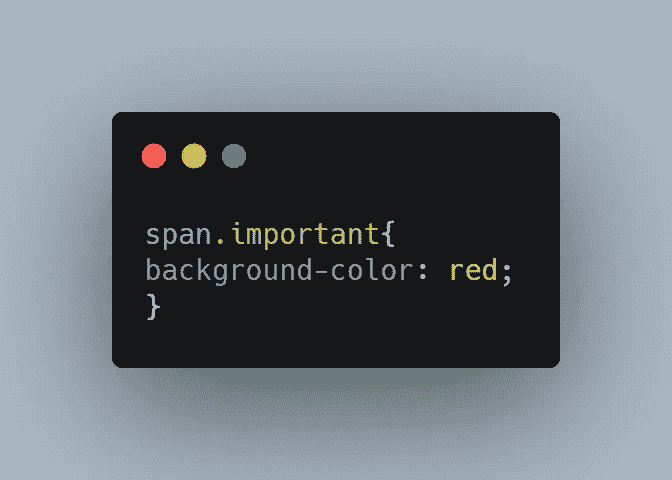

# CSS Basic:组合选择器

> 原文：<https://medium.com/geekculture/css-basic-combine-the-selectors-139ea65f11ae?source=collection_archive---------41----------------------->

## 通过组合选择器来指定目标

在本文中，我们将讨论如何组合选择器来进行更具体的选择。

源代码:

[https://www.udemy.com/course/a-complete-css-course/?coupon code = 33 a3 ECA 879 d08b 500198](https://www.udemy.com/course/a-complete-css-course/?couponCode=33A3ECA879D08B500198)

