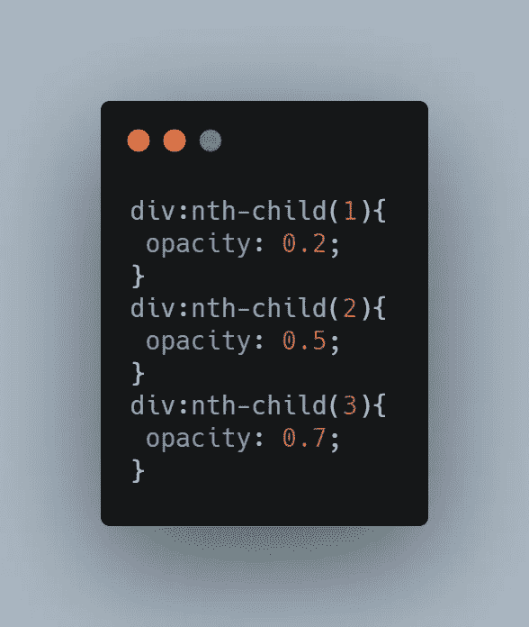

# CSS 基本:不透明度

> 原文：<https://medium.com/geekculture/css-basic-opacity-9decb852951e?source=collection_archive---------16----------------------->

## 用 CSS 不透明度和 RGBA 设置透明度

在本文中，我们将通过设置 CSS 不透明度属性和 RGBA 来讨论不透明度。

源代码: