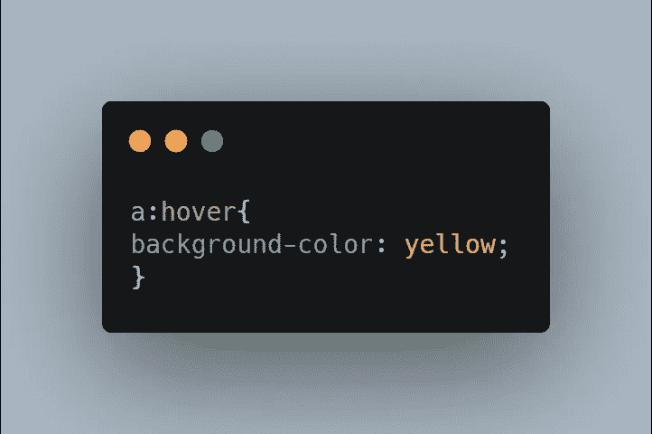

# CSS 基本:伪类

> 原文：<https://medium.com/geekculture/css-basic-pseudo-classes-8c4ee79af056?source=collection_archive---------35----------------------->

## 动态和结构化伪类

在这篇文章中，我们将介绍伪类以及如何在 CSS 中使用伪类。

伪类主要有两种类型，一种是动态伪类，另一种是结构伪类。

源代码:

[https://www.udemy.com/course/a-complete-css-course/?coupon code = 33 a3 ECA 879 d08b 500198](https://www.udemy.com/course/a-complete-css-course/?couponCode=33A3ECA879D08B500198)

