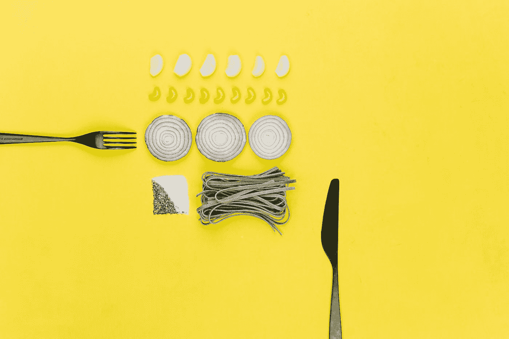

# CSS 伸缩框:在横轴上对齐项目

> 原文：<https://medium.com/geekculture/css-flex-box-align-items-on-cross-axis-ac4642337b55?source=collection_archive---------16----------------------->

## 什么是主轴和横轴？什么是对齐内容和对齐项目？

在这篇文章中，我们将讨论主轴和横轴，我们还将讨论调整内容和对齐项目。

源代码:

[https://www.udemy.com/course/a-complete-css-course/?coupon code = fc 4251 EC 8 CAD FAA 8 e 2 f 2](https://www.udemy.com/course/a-complete-css-course/?couponCode=FC4251EC8CADFAA8E2F2)

Photo by [Toa Heftiba](https://unsplash.com/@heftiba?utm_source=medium&utm_medium=referral) on [Unsplash](https://unsplash.com?utm_source=medium&utm_medium=referral)