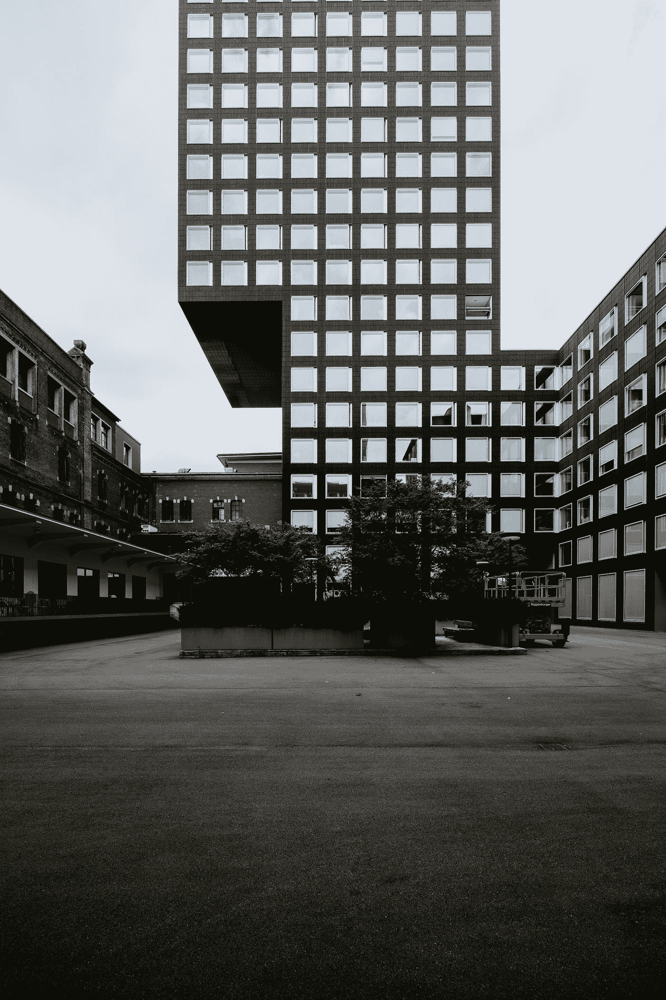

# CSS 网格:对齐和调整项目

> 原文：<https://medium.com/geekculture/css-grid-aligning-justifying-items-bfb840d9b886?source=collection_archive---------19----------------------->

## 对齐项目、对齐项目、自对齐和自对齐之间有什么区别？

在这篇文章中，我们将讨论 CSS 网格中的 align-items、justify-items、align-self 和 justify-self。

源代码:

[https://www.udemy.com/course/a-complete-css-course/?referral code = d70f 3923 ff 6501 a 398 aa](https://www.udemy.com/course/a-complete-css-course/?referralCode=D70F3923FF6501A398AA)

Photo by [Claudio Schwarz](https://unsplash.com/@purzlbaum?utm_source=medium&utm_medium=referral) on [Unsplash](https://unsplash.com?utm_source=medium&utm_medium=referral)