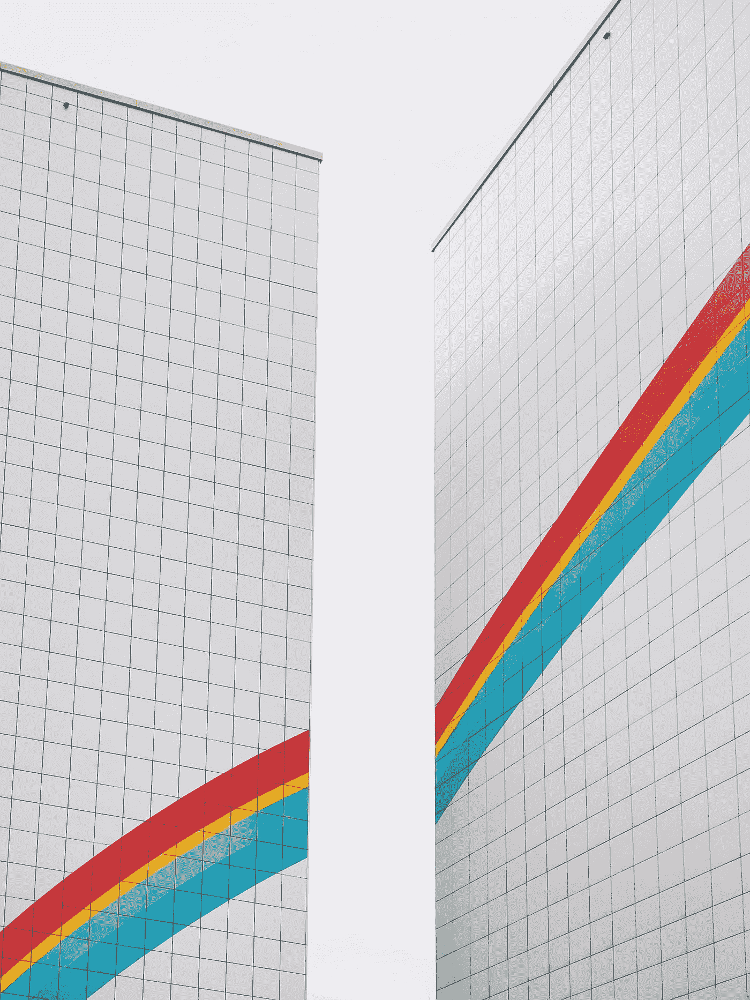

# CSS 网格:什么是 CSS 网格和列？

> 原文：<https://medium.com/geekculture/css-grid-what-is-css-grid-and-columns-78708809f46e?source=collection_archive---------12----------------------->

## 使用显示:网格和网格-模板-列

在这篇文章中，我们将谈论什么是 CSS 网格和列。Flexbox 是在一个维度(行或列)上布局项目。网格是以行和列两个维度对项目进行布局。

Photo by [Pavel Nekoranec](https://unsplash.com/@sur_le_misanthrope?utm_source=medium&utm_medium=referral) on [Unsplash](https://unsplash.com?utm_source=medium&utm_medium=referral)

源代码: