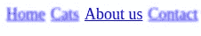
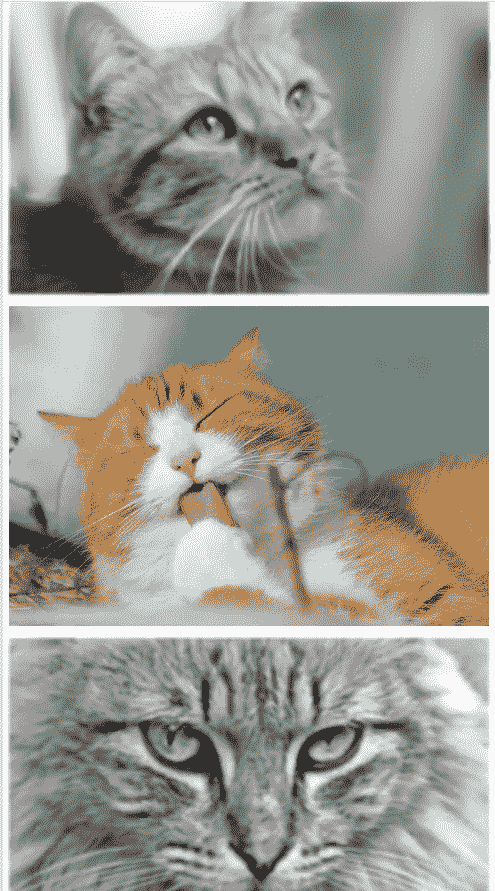
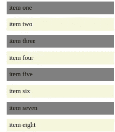
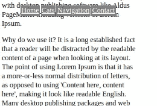

# CSS——学习新东西总是有用的。

> 原文：<https://medium.com/geekculture/css-its-always-useful-learning-something-new-2d4b4b4f58ce?source=collection_archive---------21----------------------->


CSS

当我参加训练营的时候，我并没有太关注设计方面或者 CSS。现在我有时间并且没有项目截止日期，我决定回顾一下 CSS 是如何工作的。我接受了这个建议，从普通的 CSS 开始，而不是像 Bootstrap 这样更复杂的框架。我发现了一些让我印象深刻的事情，我很乐意在下面分享它们。

# CSS 过滤器

CSS 滤镜允许你改变图像和文本，而不需要单独修改它们，你可以用滤镜改变颜色，模糊，增加不透明度和其他非常有趣的事情。我发现用在菜单和图库中特别有意思。

假设我有一个列表形式的简单菜单。



Menu using blur filter in CSS

超文本标记语言

```
<header><ul><li><a href=”index.html”>Home</a></li><li><a href=”cats.html”>Cats</a></li><li><a href=”#”>About us</a></li><li><a href=”#”>Contact</a></li></ul></header>
```

一旦我添加了下面的 CSS，我就可以模糊菜单项，当我把鼠标悬停在它们上面时，就可以让它们重新聚焦。

半铸钢ˌ钢性铸铁(Cast Semi-Steel)

```
li a{float: left;margin: 1px;padding: 2px;color:blue;filter: blur(0.8px);font-size: large;}li a:hover {filter: blur(0px);}
```

菜单可能不太需要它，但我喜欢它的模糊功能，它对画廊这样的东西会更好。

你可以在下面看到 2 张图片，它们代表了一个简单的由 3 只猫组成的图库。所有的图像都有些模糊和灰暗，但是当你将鼠标悬停在一个图像上时，你可以看到它的颜色和清晰度。


Greyed out blurred images



Hover effect on the middle image

超文本标记语言

```
<div class=gallery><p></p><p></p><p></p></div>
```

半铸钢ˌ钢性铸铁(Cast Semi-Steel)

```
.gallery img {filter: blur(2px) grayscale(1);}.gallery img:hover{filter: blur(0px);}
```

# CSS:n-child()选择器

当使用 Excel 时，我喜欢使用表格，因为它使计算更容易，还因为它的视觉效果可以更好地表现表格线条。

n-child()选择器允许选择作为其父元素的第 n 个子元素的每一个元素，而不管其类型如何。n 可以是数字、关键字或公式。这将在菜单或列表中派上用场。您可以使用此选择器将列表中每个奇数项的背景设置为灰色。



List where each odd line has grey background

超文本标记语言

```
<ol><li>item one</li><li>item two</li><li>item three</li><li>item four</li><li>item five</li><li>item six</li><li>item seven</li><li>item eight</li></ol>
```

半铸钢ˌ钢性铸铁(Cast Semi-Steel)

```
li:nth-child(odd){background:grey ;}
```

# 粘性导航

如果你不得不在页面上滚动，但是你希望你的导航总是在页面的顶部，有一个很好的新值叫做 sticky。

它实际上是把元素粘在你想要的地方。尽管有一件重要的事情需要记住，一个元素将只能粘在它的父元素覆盖的区域上。因此，您需要确保粘性元素在容器中才能工作。



Navigation sticks to the top, but moves on text when you scroll

超文本标记语言

```
<body class=”content”><nav class=”navbar”><ul><li><a href=”index.html”>Home</a></li><li><a href=”cats.html”>Cats</a></li><li><a href=”navigation.html”>Navigation</a></li><li><a href=”#”>Contact</a></li></ul></nav><h1>This is practice site</h1><p>Other text</p></body>
```

半铸钢ˌ钢性铸铁(Cast Semi-Steel)

```
.navbar{position: sticky;top: 10px;}
```

在 CSS 中发现新事物很有趣，我会继续学习更多。

请在以下社交网络上查看我，我很乐意收到您的来信！——[*LinkedIn*](https://www.linkedin.com/in/nick-solonyy/)*，* [*GitHub*](https://github.com/nicksolony) ， [*脸书*](https://www.facebook.com/nick.solony) *。*