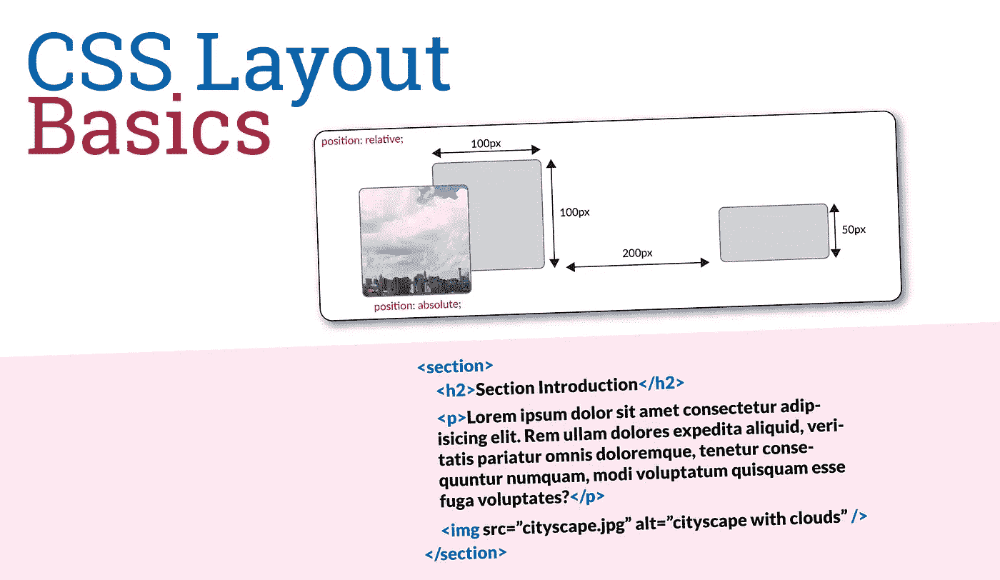
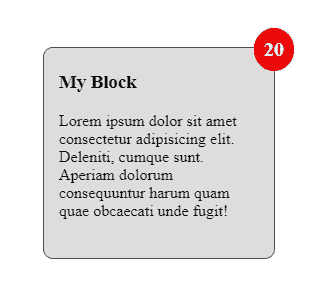
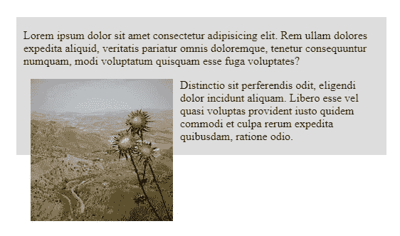
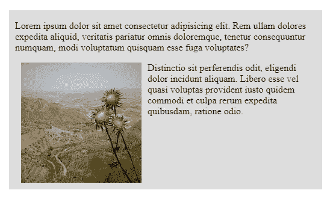

# CSS 布局基础

> 原文：<https://medium.com/geekculture/css-layout-basics-3d706ca67c52?source=collection_archive---------35----------------------->

随着 CSS 的发展，已经添加了新的强大功能来控制布局，包括 Flexbox 和 CSS 网格布局。然而，像定位、浮动和多列布局这样的老布局技术仍然非常有用，应该成为 CSS 开发人员的武器库的一部分。Flexbox 和 CSS 网格布局非常适合处理站点范围的布局，但并不总是处理复杂布局需求的最佳选择。在这里，我想到了一些东西，比如一个放在角落里的警徽。掌握文档流的一些基础知识也很重要，这可能会使不知道默认行为或不同定位属性如何协同工作和/或彼此之间的关系的开发人员出错。



CSS Layout Basics

# 正常流量

布局的浏览器控制也被称为**正常流程**，并且确定元素如何在网页内显示以及如何与其他元素的布局和定位相关。理解正常流程有助于理解为什么网站上的元素有不同的布局，以及可以修改哪些属性来改变正常流程。

正常流程的一个重要方面是元素是否紧挨着其他元素流动——保持在同一行——称为`inline`显示。或者它们是否会占用一整行的空间，这就是所谓的`block`元素。

例如，`<div>`、`<p>`和`<li>`等元素是块元素，它们将占据整个页面，并将后续元素推到页面流中的新行。

相比之下，`<strong>`、`<em>`和`<span>`等元素是行内元素，在页面上的同一行中彼此相邻。

# 配置

在没有干预的情况下，元素将遵循正常流程，但是可以通过使用`position`属性将元素从正常流程中移除。此属性使得重写元素流的默认行为成为可能。`position`属性可用的值有`static`、`relative`、`absolute`、`fixed`或`sticky`。

## 静态

position 属性的默认行为是静态的。这将在文档流中按正常位置排列元素。

## 亲戚

通过将 position 属性的值指定为 relative，元素将可以基于使用`top`、`bottom`、`left`或`right`属性进行重新定位。提供给元素位置的值将根据它在正常流中的位置来移动它。此外，元素将向指定的定位值的相反方向移动。例如，如果`bottom`位置的值为`100px`，该元素将从底部向上移动 100 像素。

## 绝对的

通过给 position 属性指定一个绝对值，元素将从正常流中取出，并根据`top`、`bottom`、`left`或`right`属性的值进行定位。该元素也相对于其包含元素绝对定位，但仅当包含元素(或另一个祖先)的位置被显式定义为除`static`之外的位置时。这是很重要的一点，因为除非包含元素指定了非静态位置，否则元素将绝对参照根页面元素进行定位。以下面的代码为例。`<span class='views'>`元素应位于`<div>`元素的右上角。这是通过指定 div 的相对位置和 span 的绝对位置(带有 top 和 right 属性)来实现的。

```
<div class="my-block">
  <h3>My Block</h3>
  <p>Lorem ipsum dolor sit amet consectetur adipisicing elit. Deleniti, cumque sunt. Aperiam dolorum consequuntur harum quam quae obcaecati unde fugit!</p>
  <span class="block-views">20</span>
</div>.my-block {
  height: 200px;
  width: 200px;
  background-color: #ddd;
  border: 1px solid #555;
  padding: 5px 15px;
  border-radius: 10px;
  position: relative;
}.views {
  padding: 10px;
  background-color: red;
  font-weight: bold;
  font-size: 20px;
  color: white;
  border-radius: 100%;
  position: absolute;
  top: -20px;
  right: -20px;
}
```

结果如下所示:



Positioning with position: absolute

## 固定的；不变的

定义为`fixed`的位置的行为与绝对定位的元素完全一样，只是该元素相对于其最近的定位祖先或初始包含块(如果没有定位祖先)保持固定。

## 粘的

定义为`sticky`的位置作为相对和固定定位元素的混合。位置为 sticky 的元素将随着元素流移动，直到它到达由`top`、`bottom`、`left`或`right`定义的阈值位置。此时，该元素将表现得像一个固定位置的元素。

## z 指数

当使用大多数定位选项定位元素时，会出现元素重叠并放置在彼此下方或上方的情况。为了控制元素的堆叠顺序，可以使用`z-index`属性。默认情况下，元素的 z 索引为 0，通过给定一个大于 0 的值，可以使元素在堆叠顺序中显示得更高。重叠时，z 索引高于其他元素的元素将出现在它们的“顶部”。

# 漂浮物

对于元素周围应该有文本内容流动的情况，浮动会很有用。浮动的一个问题是控制内容如何正确地围绕它流动，特别是当浮动被应用到像`<div>`这样的容器元素时。这可以通过“clearfix”或者使用`display: flow-root` css 规则来完成。

## Clearfix

传统上，使用浮动的问题是浮动的元素总会溢出它的容器，导致不令人满意的显示，如下所示。

```
<section class="my-section">
  <p>Lorem ipsum dolor sit amet consectetur adipisicing elit. Rem ullam dolores expedita aliquid, veritatis pariatur omnis doloremque, tenetur consequuntur numquam, modi voluptatum quisquam esse fuga voluptates?</p>
  
  <p>Distinctio sit perferendis odit, eligendi dolor incidunt aliquam. Libero esse vel quasi voluptas provident iusto quidem commodi et culpa rerum expedita quibusdam, ratione odio.</p>
</section>.my-section {
  background-color: #ddd;
  padding: 1px 10px;
  width: 500px;
}.my-section img {
  float: left;
  margin: 0 10px 10px;
}
```



Float without a clearfix applied

为了纠正这个问题，引入了一个名为 **clearfix hack** 的工具来强制容器元素将自身扩展到浮动内容之外。下面的 CSS 完成了这项任务。

```
.clearfix::after {
  content: '';
  clear: both;
  display: table;
}
```

一旦应用，结果显示会得到改善。



Float with clearfix applied

处理这个问题的一个更现代的方法是使用`display: flow-root;`属性，这将产生与 clearfix hack 相同的结果。

# 多列

多列布局属性提供了按列数或宽度将内容拆分成列的能力。浏览器将计算每一列应该如何划分，在`column-count`的情况下它将占据多少空间，或者在`column-width`的情况下它将创建多少列。

```
.container-1 {
  column-count: 3;
}.container-2 {
  column-width: 300px;
}
```

也可以使用`column-gap`添加列间距，使用`column-rule`在列之间放置垂直标尺来设置列样式。

```
.container-2 {
  column-gap: 2rem;
  column-rule: 1px solid #ddd;
}
```

通过添加`column-span`属性，可以使一个元素跨越布局的列。该值应该设置为`all`，以便元素跨越布局的所有列。

```
.container-1 h3 {
  column-span: all;
}
```

有些情况下，列布局会将一个元素的内容从一列分割到下一列。这有时会导致不期望的外观，尤其是当元素应用了视觉样式时。为了避免这种情况，属性`break-inside`和`page-break-inside`可以用来告诉浏览器阻止这种行为。

```
.container-3 p {
  break-inside: avoid;
  page-break-inside: avoid;
}
```