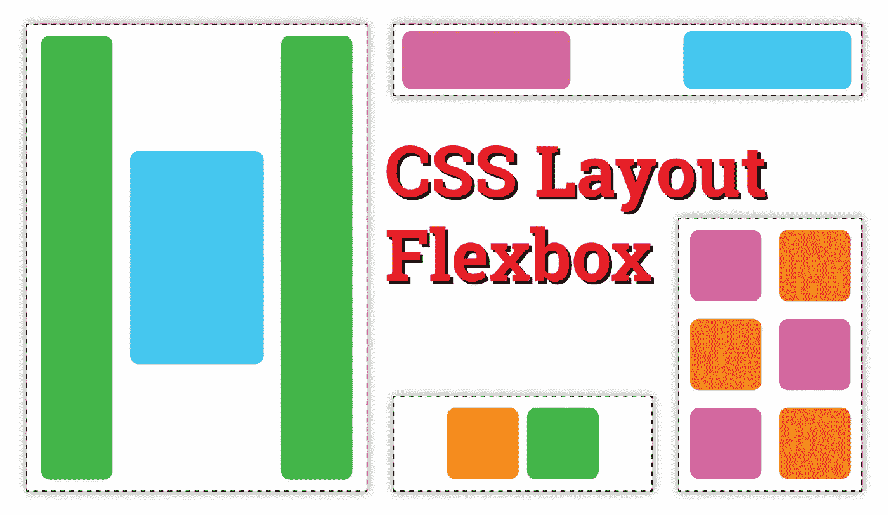
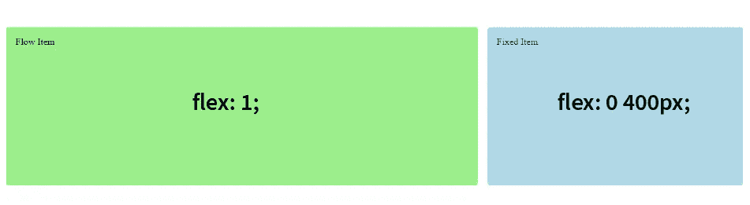
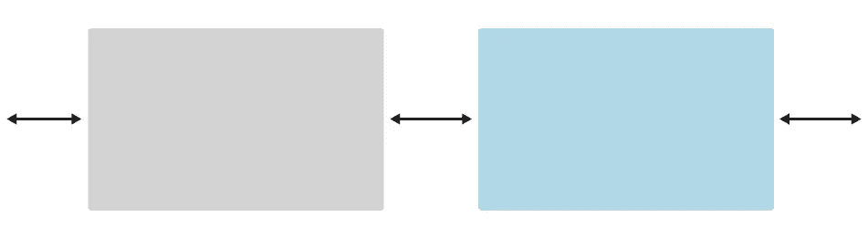
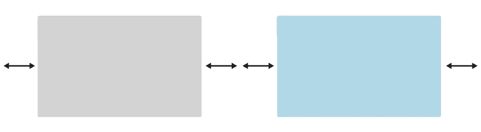

# CSS 布局 Flexbox

> 原文：<https://medium.com/geekculture/css-layout-flexbox-60c89a0963c3?source=collection_archive---------22----------------------->

创建具有正常流程、定位和浮动的布局是可能的，但对开发人员来说不是非常用户友好。这就是 flexbox 的用武之地。使用 flexbox 可以构建比仅仅使用普通流程、定位和浮动更复杂的布局。Flexbox 允许开发人员管理复杂的布局，如垂直和水平对齐，并获得对布局元素的间距和大小的精确控制。



CSS Layout — Flexbox

# 灵活模型

Flexbox 基于几个关键概念的使用而构建。

*   **Flex 容器** —应用了`display: flex`，是包含 flexbox 布局显示的所有元素的父元素。
*   **主轴** —沿柔性项目布局的方向运行，并有一个主起点和主终点作为轴的起点和终点。
*   **横轴**-垂直于主轴运行，轴的起点和终点有一个十字起点和十字终点。
*   **Flex Items** —布置在 Flex 容器内的元素称为 Flex Items。

# 履行

为了指定一个 flex 容器，元素使用 css 条目`display: flex`。

父容器或 flex 容器还指定 flex 容器是否将使用`row`或`column`布局。这是使用`flex-direction`属性完成的。

```
<div class="my-container">
  
  <p>Lorem, ipsum dolor sit amet consectetur adipisicing elit. Esse facilis provident culpa eos sed sunt voluptates.</p>
</div>.my-container {
  display: flex;
  flex-direction: row;
}
```

## 包装弹性项目

Flex 项目将显示为一行或一列，并根据需要使用尽可能多的空间将所有项目放入该行。当项目很少时，这种方式可以正常工作，但是当项目开始溢出它们的容器或者页面显示超出浏览器的最大宽度时，就会出现问题。为了处理这种情况，有一个名为`flex-wrap`的属性可以将内容包装在一个对于容器的高度或宽度来说太大的 flex 容器中。

```
.my-container {
  display: flex;
  flex-direction: row;
  flex-wrap: wrap;
}
```

## 柔性方向和柔性缠绕的简写

`flex-direction`和`flex-wrap`的简写都是`flex-flow`，其用法如下:

```
.my-container {
  display: flex;
  flex-flow: row wrap;
}
```

## 弹性项目

要控制 flex 项目的大小，可以使用应用于 flex 项目的`flex`属性。

```
article {
  flex: 1;
}
```

上面的代码告诉每个 flex 项占用轴上剩余的空间来填充整个轴。这个属性也叫做`flex-grow`。

每个 flex 项目也可以被给定一个最小的占用空间。这被称为`flex-basis`属性。它可以与 flex-grow 结合使用:

```
article {
  flex: 1 300px;
}
```

这段代码告诉浏览器给每个`article`元素一个最少 300px 的空间，然后按照简写的 flex-grow 部分的指定划分剩余的空间，直到所有的容器空间都被占用。以下示例显示了两个具有弹性定义的弹性项目。左边的项目有`flex: 1;`，它指示项目占用 flex 容器中的可用空间。右边的项目有`flex: 0 400px;`，指示该项目至少占用 400px，不额外占用空间。在这两个定义之间，我们看到了下面的结果。



Example of Flexbox flow

还有一个名为`flex-shrink`的附加属性，它是 flex 简写的一部分，如下所示:`flex: 1 1 300px`。此属性定义伸缩项目在必要时应如何收缩。

## 垂直和水平对齐

Flexbox 有几种不同的方法来对齐内容。容器级别的对齐是通过使用`justify-content`和`align-items`属性来完成的。Justify-Content 将设置伸缩项沿主轴的对齐方式。Align-Items 将设置 flex 项目沿横轴的对齐方式。

```
.my-container {
  display: flex;
  flex-flow: row wrap;
  justify-content: center;
  align-items: flex-start;
}
```

调整内容的选项包括:`center`、`space-between`、`space-evenly`、`space-around`、`flex-start`或`flex-end`。

## 一些例子


Example of Space Between



Example of Space Evenly



Example of Space Around

对齐项目的选项包括:`flex-start`、`flex-end`、`center`、`stretch`和`baseline`。

要覆盖 flex 容器设置的对齐属性，可以在 flex 项目上设置属性`align-self`。这将专门为 flex 项设置对齐方式，使其与容器中的其他项分开。

## 命令

默认情况下，flex 项目根据它们在代码流中的外观进行排序。可以使用`order`属性改变 flex 项目的顺序。默认情况下，每个项目的订单值为 0。要将一个项目移动到一组弹性项目的结束位置，顺序值必须是大于 0 的数字。要将一个项目移动到一组弹性项目的起始位置，顺序值必须是一个小于 0 的数字。

```
article {
  order: -1; /* moves to the start of a group */
}
```

# 资源

有许多关于 Flexbox 的好资源。也许最有帮助和最常被引用的资源是 CSS-Tricks 的 Flexbox 完全指南。本指南通过许多优秀的可视化示例全面介绍了 Flexbox。另一个有用的资源是关于 Flexbox 基本概念的 [MDN 指南，其中包括一些测试您技能的学习活动。有助于学习 flexbox 和乐趣的资源是](https://developer.mozilla.org/en-US/docs/Web/CSS/CSS_Flexible_Box_Layout/Basic_Concepts_of_Flexbox) [Flexbox Froggy](https://flexboxfroggy.com/) 。