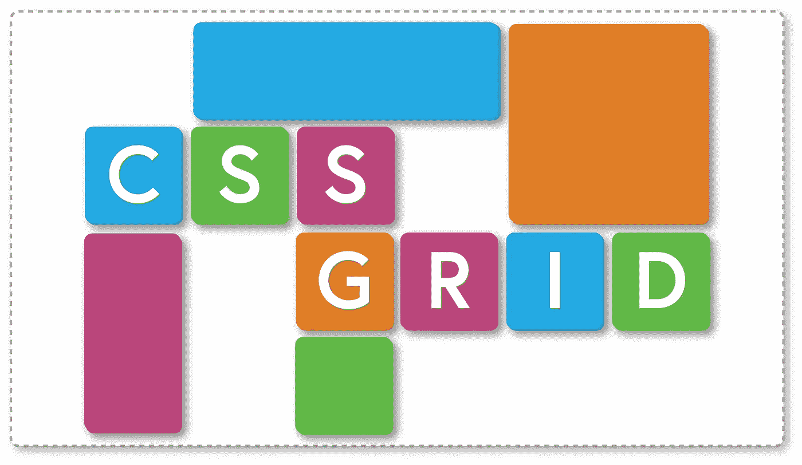
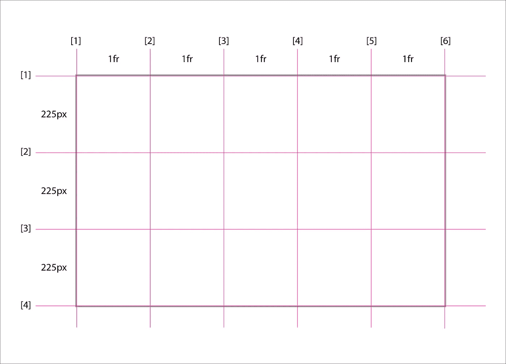

# CSS 布局网格

> 原文：<https://medium.com/geekculture/css-layout-grid-512b44c39137?source=collection_archive---------50----------------------->

构建网页最具挑战性的方面之一是管理布局。HTML 和 CSS 提供了几种不同的方法来控制布局。布局选项包括使用普通流、浮动、多栏布局、flexbox 和 CSS 网格。为了允许更复杂的布局， [CSS Grid](https://developer.mozilla.org/en-US/docs/Web/CSS/grid) 的目标是通过给开发者更多的控制网页上元素的布局和排列来向前迈进一大步。



CSS Layout Grid

# 丰富的学习资源

有几个非常有用的资源可以用来学习 CSS Grid。这里有一个帮助我学习 CSS 网格的资源的快速概要。

*   [网格完整指南](https://css-tricks.com/snippets/css/complete-guide-grid/) — CSS-Tricks
*   [学习 CSS 网格](https://learncssgrid.com/)
*   [CSS 中的网格](https://cssreference.io/css-grid/)
*   [网格备忘单](https://yoksel.github.io/grid-cheatsheet/)

布局的视觉示例

*   [网格布局的可视备忘单](https://grid.malven.co/)
*   [CSS 布局](https://csslayout.io/)

交互式网格构建工具

*   [Layoutit！](https://grid.layoutit.com/)
*   [Griddy——学习 CSS 网格](https://griddy.io/)
*   [CSS 网格生成器](https://cssgrid-generator.netlify.app/)

乐趣和游戏——学习 CSS 网格

*   [格子花园](https://cssgridgarden.com/)

# 设置网格

CSS Grid 的工作原理是使用`display: grid`属性创建一个网格容器。网格容器的直接子容器称为网格项目。

使用 CSS Grid 的一个基本特性是设置要在网格中使用的列和行。这是通过`grid-template-columns`和`grid-template-rows`属性完成的。建立网格有许多不同的方法。

假设我们想要一个有五列的网格。有几种方法可以设置它。为了构建列，我们将使用`grid-template-columns`属性。要创建五列，需要为每列添加五个值。

```
.container {
  display: grid;
  grid-template-columns: 20rem 100px auto 30% 25em;
}
```

如代码示例所示，可以使用不同的度量单位添加尺寸，包括`px`、`em`、`rem`、`%`和`auto`。CSS Grid 还引入了一个新的单位，`fr`，意思是分数单位。这是通过根据输入的值为网格指定大小，并根据分数单位分割剩余空间来实现的。

```
.container {
  display: grid;
  grid-template-columns: 15rem 1fr 2fr;
}
```

在上面的例子中，`15rem`被赋值，剩余空间在两列之间划分，第二列从 3 个单元中得到`1fr`，最后一列从 3 个单元中得到`2fr`。

列的概念同样适用于行。添加`grid-template-rows`属性允许显式创建网格行。

```
.container {
  display: grid;
  grid-template-columns: 15rem 1fr 2fr;
  grid-template-rows: 20rem 400px;
}
```

这一添加在网格中建立了两个显式行。行大小由单位定义。这段代码创建了一个 3 列 2 行的网格，总共创建了 6 个网格单元。现在是内容流入网格的时候了。

```
<div class="container">
  <h1>Title</h1>
  <p>Lorem ipsum dolor sit amet consectetur adipisicing elit. Dolor, totam.</p>
  
  <h4>Image subtitle</h4>
  <p>Velit dolor unde explicabo illum ipsa temporibus, hic sed error.</p>
  <div>Additional content</div>
</div>
```

上面的 HTML 包含一个用作网格容器的`<div class="container">`。div 的 6 个直接子元素是网格项。因为只有 6 项，每一项都适合上面 CSS 代码中定义的 6 个网格单元。但是，如果添加了另一个网格项，现在总共会有 7 个子元素。在这种情况下，CSS Grid 会自动创建一个新行来包含这个元素。新行构成了所谓的隐式网格——自动添加到网格中，尽管没有明确定义。

在某些情况下，开发人员不知道一个网格到底需要多少行——例如，在重复或自动生成内容的情况下。在这些情况下，可以利用`grid-auto-columns`和`grid-auto-rows`属性。这些属性为隐式创建的列和行设置了预先确定的大小。

在许多情况下，一个`grid-template-columns`和`grid-template-rows`属性将包含多个相同值的条目。为了让开发人员不必重复编写相同的值，CSS grid 有一个`repeat()`特性，可以最小化额外的编写。例如，要创建一个有五个大小相等的列的网格，可以使用下面的代码:`grid-template-columns: repeat(5, 1fr);`。

另一个经常出现的问题是，显式调整大小的列或行有时对于其内容来说太小，这会导致内容溢出网格项。对于这种情况，CSS Grid 提供了一个`minmax()`函数。这允许创建一个应该使用的最小值和一个最大值，以说明需要超过指定最小值的空间的内容。例如，使用下面的:`grid-template-rows: minmax(200px, 500px);`一个网格行将被调整到`200px`，除非它的内容更大，在这种情况下，它将增长到最大`500px`以允许更多的内容。另一个变体可以是:`grid-template-rows: minmax(200px, auto);`。这里，一行的大小至少为`200px`，并根据需要使用`auto`关键字增长。

另一个有用的特性是能够在列和/或行之间添加间隙。这是通过`column-gap`、`row-gap`和简写`gap`属性完成的。

```
.container {
  column-gap: 2rem;
  row-gap: 4px;
  /* OR */
  gap: 4px 2rem; /* row column */
}
```

# 使用网格

网格项流入网格的方式是，第一个子项将从第一列和第一行开始填充网格单元格。每个后续项目将被放置在第一行的下一个网格单元中。一旦沿第一行填充了所有的网格单元，下一项将占据第一列和第二行中的网格单元的空间。这些项目将继续流入网格，直到所有的项目都被放置。

有几种不同的方法来控制网格项目在网格中占据空间的方式和位置。一种方法是利用行名来告诉网格项在列和行上的开始和结束位置。

```
.container {
  display: grid;
  grid-template-columns: 1fr 1fr 1fr 1fr 1fr;
  grid-template-rows: 225px 225px 225px;
  gap: 10px;
}
```

考虑上面的网格。它有五列，每列为一个`1fr`单元，有三行，每一行的尺寸都为`225px`。这就建立了一个总共有 15 个网格单元的 5x3 网格。当用上面的代码创建每个列和行时，从 1 开始自动创建行名，一直到列或行的末尾。

```
.container {
  display: grid;
  grid-template-columns: 1fr 1fr 1fr 1fr 1fr;
  grid-template-rows: 225px 225px 225px;
  gap: 10px;
}
```

比如上面 CSS 创建的网格，轨迹线自动创建成这样:`[1] 1fr [2] 1fr [3] 1fr [4] 1fr [5] 1fr [6];`。这意味着第一个网格单元占据从 1 到 2 或等于 1fr 的列空间。这些行遵循相同的逻辑。



Grid Construction and Lines

每一行都可以使用自定义的行名，如下所示。

```
.container {
  display: grid;
  grid-template-columns: [one] 1fr [two] 1fr [three] 1fr [four] 1fr [five] 1fr [six];
  grid-template-rows: [one] 225px [two] 225px [three] 225px [four];
  gap: 10px;
}
```

这些行名，无论是自动创建的还是用户定义的，都可以用来控制网格项目在网格中的位置。例如，grid 容器有一个直接子容器`<h1>Title</h1>`，默认情况下，它占据位于网格第一列第一行的网格单元。通过使用网格项目上的`grid-column`和`grid-row`属性，可以明确地告诉网格项目占用这个空间。

```
.container h1 {
  grid-column: 1 / 2;
  grid-row: 1 / 2;
}
```

同样的事情可以用用户定义的行名来表示，如下所示:

```
.container h1 {
  grid-column: one / two;
  grid-row: one / two;
}
```

网格项目可以占据网格中的多个网格单元。例如，要使`<h1>`占据整个第一行，可以使用下面的代码。

```
.container h1 {
  grid-column: one / six;
}
```

在这种情况下，没有必要为`grid-row`声明一个值，因为默认情况下该项会填充一行。编写同样内容的另一种方式是指出一个项目应该跨越多少列或多少行。

```
.container h1 {
  grid-column: span 5;
}
```

最后，存在这样的情况，HTML 中存在网格项，但是没有被特别指定在网格中的位置，属性`grid-auto-flow`可以用于指示当网格被填充时，项应该首先被放置在`row`或`column`上。与行和列相结合的另一个选项是`dense`，它允许在网格中填充项目，这些项目可能会按照正常顺序移动位置，以填充网格中的空白。

# 定位和对齐

CSS Grid 允许在网格中定位网格项目时有很大的灵活性。使用`grid-area`属性，可以指定一个条目应该放在网格的哪个位置。有两种主要方法可以做到这一点。首先，可以使用开始和结束的列号和行号或命名行来放置网格项。考虑下面定义的网格:

```
.container {
  display: grid;
  grid-template-columns: repeat(4, 1fr);
  grid-template-rows: repeat(4, 100px);
  gap: 5px;
}
```

此网格将创建一个四列四行的网格。如果我们想获取一个项目，并让它占据两列三行，可以使用`grid-area`属性以及遵循模式的列号和行号:`grid-area: <row-start> / <column-start> / <row-end> / <column-end>`来完成。

```
.item-5 {
  grid-area: 2 / 2 / 5 / 4;
}
```

将网格项分配到网格上某个位置的另一种方法是使用网格容器的`grid-template-areas`属性定义的网格区域名称。例如，在下面的网格中，有几个名为的模板区域对应于定义的模板列和行，包括占据整个顶行的标题区域。

```
.container {
  display: grid;
  grid-template-columns: repeat(4, 1fr);
  grid-template-rows: repeat(4, 100px);
  grid-template-areas:
    'header header header header'
    'sidebar main main main'
    'sidebar main main main'
    'footer footer footer footer';
  gap: 5px;
}
```

若要指定网格项应占据命名区域的整个空间，应将以下属性和值应用于网格项。

```
.item-1 {
  grid-area: header;
}
```

CSS Grid 提供了许多不同的方法来对齐网格，网格中的项目，甚至单个的网格项目。

在网格的总尺寸小于网格容器尺寸的情况下，可以使用属性`justify-content`和`align-content`。属性`justify-content`的使用适用于行轴，属性`align-content`的使用适用于列轴。

`justify-content`和`align-content`的可用值包括:`start`、`end`、`center`、`stretch`、`space-around`、`space-between`、`space-evenly`。

`justify-content`和`align-content`的一个简写属性是`place-content`，它将在一个声明中设置这两个属性。可以如下使用:`place-content: <align-content> <justify-content>`。如果只声明了一个值，它将应用于两个属性。

```
.container {
  place-content: space-between center;
}
```

属性`justify-items`和`align-items`将把对齐应用到它们各自网格单元中的所有项目。`justify-items`和`align-items`的可用值包括:`start`、`end`、`center`和`stretch`。`justify-items`和`align-items`的一个简写属性是`place-items`，它将在一个声明中设置这两个属性。可以如下使用:`place-items: <align-items> <justify-items>`。如果只声明了一个值，它将应用于两个属性。

```
.container {
  place-items: start center;
}
```

有些情况下，有必要更改一个或多个独立于整个网格的单独网格项目的对齐方式。这可以通过属性`justify-self`和`align-self`来完成。属性会将对齐方式应用于各个网格单元格中的特定项。`justify-self`和`align-self`的可用值包括:`start`、`end`、`center`和`stretch`。`justify-self`和`align-self`的一个简写属性是`place-self`，它将在一个声明中设置这两个属性。可以如下使用:`place-self: <align-self> <justify-self>`。如果只声明了一个值，它将应用于两个属性。

```
.item-1 {
  place-self: end end;
}
```